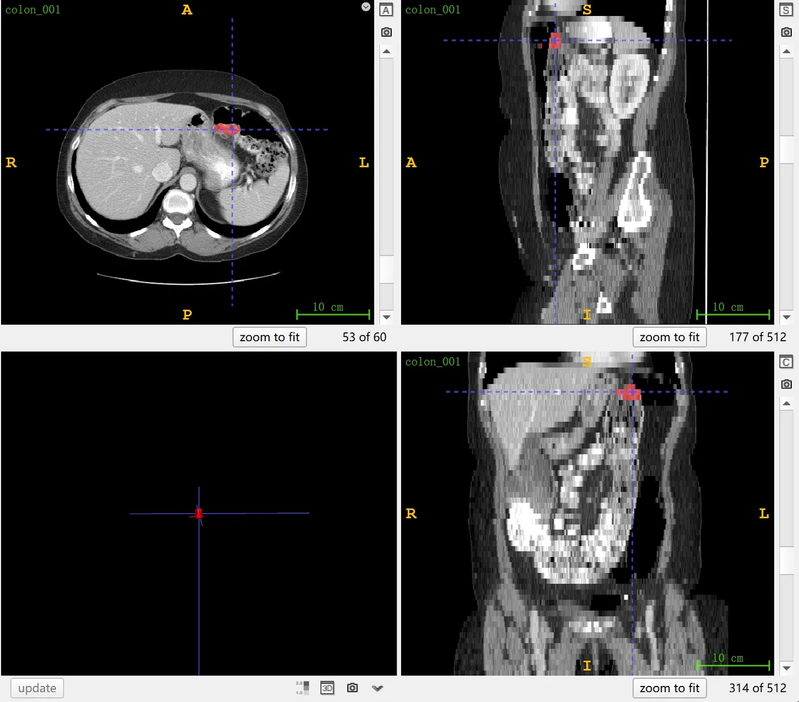

# MSD Colon Cancer

<div align="center">
    <a href="https://github.com/openmedlab/"></a>
</div>
<p style="text-align:center;font-size:10px;"><em></em></p>

## Dataset Information

The MSD Colon Cancer dataset is Task 10 in the Medical Segmentation Decathlon (MSD), aiming to segment colon tumors from CT images. MSD selected this dataset due to the challenges posed by the heterogeneous appearance of the tumors and the difficulty of annotation. The dataset comprises venous phase CT scans of 190 patients undergoing surgery for primary colon cancer, divided into 126 training cases and 64 test cases by the officials. Test results can be submitted on the official website for evaluation.

Primary colon cancer is a malignancy originating from the epithelial cells of the colon mucosa and is one of the most common cancers worldwide. Such tumors are typically caused by a combination of genetic factors, environmental influences, and lifestyle choices, and can lead to clinical symptoms like bowel obstruction and bleeding. On CT images, primary colon cancer may appear as localized thickening of the colon wall, irregular texture, or abnormal invasion of adjacent tissues. Diagnosis usually involves a combination of clinical presentation, radiographic examination, and histopathological findings. Treatment varies based on the stage and location of the tumor and may include surgical resection, chemotherapy, radiotherapy, or targeted therapy. Surgical resection is often the preferred treatment for primary colon cancer, and CT scans play a critical role in determining the precise location of the tumor, assessing the presence of distant metastases, and evaluating the effectiveness of treatment.

## Dataset Meta Information

| Dimensions | Modality | Task Type | Anatomical Structures          | Anatomical Area | Number of Categories | Data Volume | File Format |
|------------|----------|-----------|--------------------------------|----------------|----------------------|-------------|-------------|
| 3D         | CT       | Segmentation | colon tumors | abdomen               | 1                    | 190         | .nii.gz     |


### Resolution Details

| Dataset Statistics | spacing (mm)    | size            |
|--------------------|-----------------|-----------------|
| min                | (0.54, 0.54, 1.3)             | (512, 512, 37)     |
| median             | (0.78, 0.78, 5.0)          | 	(512, 512, 95) |
| max                | (0.98, 0.98, 7.5)            | (512, 512, 729) |

Number of 2D slices: 13,486 (based on 126 training set statistics)

## Label Information Statistics

| Organ | Colon Tumor |
| --- | --- |
| Number of Cases | 126 |
| Coverage | 100% |
| Minimum Volume (cm³) | 1 |
| Median Volume (cm³) | 22 |
| Maximum Volume (cm³) | 468 |

## Visualization

<div align="center">
    <a href="https://github.com/openmedlab/"></a>
</div>
<p style="text-align:center;font-size:10px;"><em> ITK-SNAP Visualization. Red: colon tumors.</em></p>

## File Structure

The official file structure provided is as follows. It contains three main folders: `imagesTr`, `labelsTr`, and `imagesTs`, which are used to store training images, training labels, and test images, respectively. In addition, there is a file named `dataset.json`, responsible for storing metadata of the dataset, such as modality and categories.

``` 
Task10_Colon
│
├── imagesTr
│   ├── colon_001.nii.gz
│   └── ...
├── labelsTr
│   ├── colon_001.nii.gz
│   └── ...
├── imagesTs
│   ├── colon_003.nii.gz
│   └── ...
└── dataset.json
```

## Authors and Institutions

Amber Simpson (Memorial Sloan Kettering Cancer Center, USA)


## Source Information

Official Website: http://medicaldecathlon.com/

Download Link: https://drive.google.com/drive/folders/1HqEgzS8BV2c7xYNrZdEAnrHk7osJJ--2?usp=sharing

Article Address: https://www.nature.com/articles/s41467-022-30695-9, https://arxiv.org/abs/1902.09063

Publication Date: 2019-02.

## Citation

``` 
@article{antonelli2022medical,
  title={The Medical Segmentation Decathlon},
  author={Antonelli, Michela and Reinke, Annika and Bakas, Spyridon and others},
  journal={Nature Communications},
  year={2022}, 
  doi={10.1038/s41467-022-30695-9}
}

@misc{simpson2019large,
      title={A large annotated medical image dataset for the development and evaluation of segmentation algorithms}, 
      author={Amber L. Simpson and Michela Antonelli and Spyridon Bakas and Michel Bilello and Keyvan Farahani and Bram van Ginneken and Annette Kopp-Schneider and Bennett A. Landman and Geert Litjens and Bjoern Menze and Olaf Ronneberger and Ronald M. Summers and Patrick Bilic and Patrick F. Christ and Richard K. G. Do and Marc Gollub and Jennifer Golia-Pernicka and Stephan H. Heckers and William R. Jarnagin and Maureen K. McHugo and Sandy Napel and Eugene Vorontsov and Lena Maier-Hein and M. Jorge Cardoso},
      year={2019},
      eprint={1902.09063},
      archivePrefix={arXiv},
      primaryClass={cs.CV}
}
```

Original introduction article is [here](https://zhuanlan.zhihu.com/p/665665083).