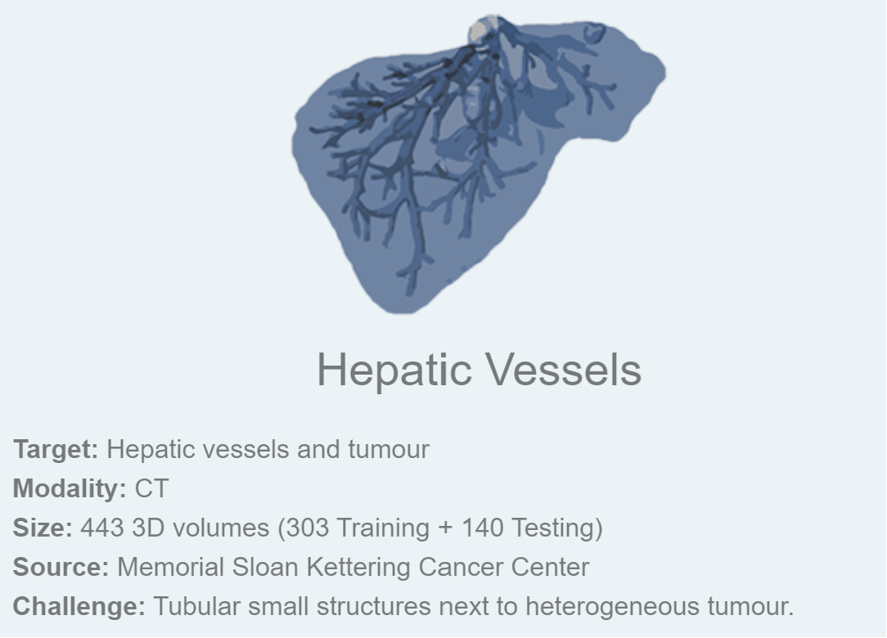
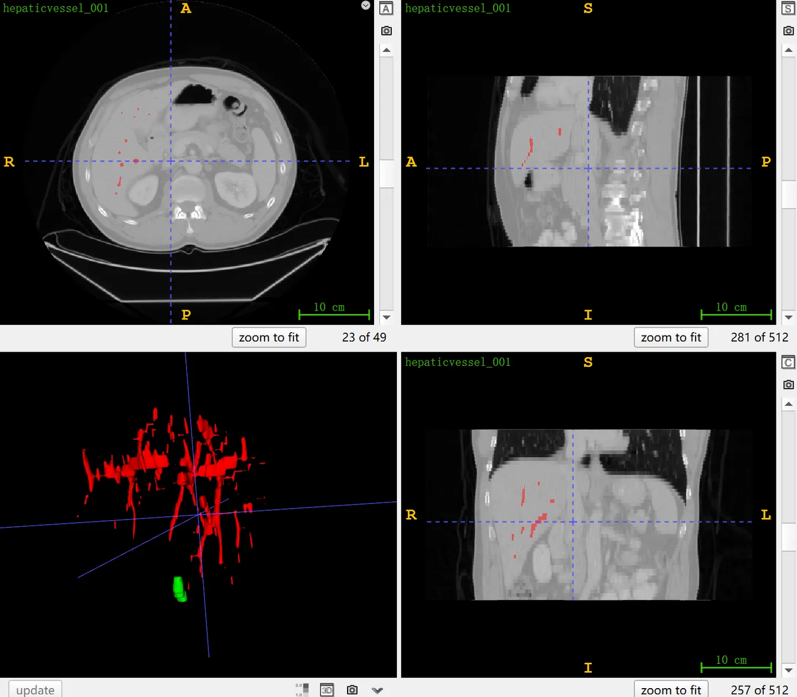

# MSD Hepatic Vessel

<div align="center">
    <a href="https://github.com/openmedlab/"></a>
</div>
<p style="text-align:center;font-size:10px;"><em></em></p>

## Dataset Information

The **MSD Hepatic Vessel dataset** is Task08 in the Medical Segmentation Decathlon (MSD), with the objective of segmenting hepatic vessels and tumors from liver CT scans. The dataset was chosen for MSD due to the adjacent nature of the hepatic vessels and heterogeneous tumors, which are tubular and interconnected. It contains 443 cases of 3D CT data, divided into 303 cases for the training set and 140 cases for the testing set. Results for the testing set can be submitted on the official website for evaluation. This dataset is one of the rare ones that provide annotations for hepatic vessels, and accurately depicting hepatic vessels plays a crucial role in computer-assisted diagnosis, treatment, and surgical planning. This is especially important during partial hepatectomy or liver transplantation surgeries, where ensuring sufficient blood supply to the remaining tissue is key to the success of the surgery. It is worth noting that some subsequent research work (Xu et al., MICCAI 2021) considers the image annotation quality of this dataset to be low, with approximately 65.5% of the vessel pixels not being marked and 8.5% of the pixels being mislabeled as vessels.


## Dataset Meta Information

| Dimensions | Modality | Task Type | Anatomical Structures          | Anatomical Area | Number of Categories | Data Volume | File Format |
|------------|----------|-----------|--------------------------------|-----------------|----------------------|-------------|-------------|
| 3D         | CT       | Segmentation | liver blood vessels, liver tumors | abdomen       | 2                    | 443        | .nii.gz     |


### Resolution Details

| Dataset Statistics | spacing (mm)     | size            |
|--------------------|------------------|-----------------|
| min                | (0.57, 0.57, 0.80)              | (512, 512, 24)     |
| median             | (0.80, 0.80, 5.0)           | (512, 512, 49) |
| max                | (0.97, 0.97, 8.0)              | (512, 512, 181) |

Number of 2D slices: 21120 (based on 303 training set statistics).

## Label Information Statistics

| Anatomical Structure | Hepatic Vessel | Hepatic Tumor |
|----------------------|-----------------------|----------------------|
| Number of Cases      | 303                   | 303                  |
| Coverage             | 100%                  | 100%                 |
| Min Volume (cm³)     | 6                     | 0.2                  |
| Median Volume (cm³)  | 37                    | 32                   |
| Max Volume (cm³)     | 113                   | 2123                 |


## Visualization

<div align="center">
    <a href="https://github.com/openmedlab/"></a>
</div>
<p style="text-align:center;font-size:10px;"><em> ITK-SNAP Visualization.</em></p>

## File Structure

The official file structure provided is as follows. It contains three main folders: `imagesTr`, `labelsTr`, and `imagesTs`, which are used to store training images, training labels, and test images, respectively. In addition, there is a file named `dataset.json`, responsible for storing metadata of the dataset, such as modality and categories.

``` 
Task08_HepaticVessel
│
├── imagesTr
│   ├── hepaticvessel_001.nii.gz
│   └── ...
├── labelsTr
│   ├── hepaticvessel_001.nii.gz
│   └── ...
├── imagesTs
│   ├── hepaticvessel_003.nii.gz
│   └── ...
└── dataset.json
```

## Authors and Institutions

Amber Simpson (Memorial Sloan Kettering Cancer Center, USA)


## Source Information

Official Website: http://medicaldecathlon.com/

Download Link: https://drive.google.com/drive/folders/1HqEgzS8BV2c7xYNrZdEAnrHk7osJJ--2?usp=sharing

Article Address: https://www.nature.com/articles/s41467-022-30695-9, https://arxiv.org/abs/1902.09063

Publication Date: 2019-02.

## Citation

``` 
@article{antonelli2022medical,
  title={The Medical Segmentation Decathlon},
  author={Antonelli, Michela and Reinke, Annika and Bakas, Spyridon and others},
  journal={Nature Communications},
  year={2022}, 
  doi={10.1038/s41467-022-30695-9}
}

@misc{simpson2019large,
      title={A large annotated medical image dataset for the development and evaluation of segmentation algorithms}, 
      author={Amber L. Simpson and Michela Antonelli and Spyridon Bakas and Michel Bilello and Keyvan Farahani and Bram van Ginneken and Annette Kopp-Schneider and Bennett A. Landman and Geert Litjens and Bjoern Menze and Olaf Ronneberger and Ronald M. Summers and Patrick Bilic and Patrick F. Christ and Richard K. G. Do and Marc Gollub and Jennifer Golia-Pernicka and Stephan H. Heckers and William R. Jarnagin and Maureen K. McHugo and Sandy Napel and Eugene Vorontsov and Lena Maier-Hein and M. Jorge Cardoso},
      year={2019},
      eprint={1902.09063},
      archivePrefix={arXiv},
      primaryClass={cs.CV}
}
```

Original introduction article is [here](https://zhuanlan.zhihu.com/p/662354003).