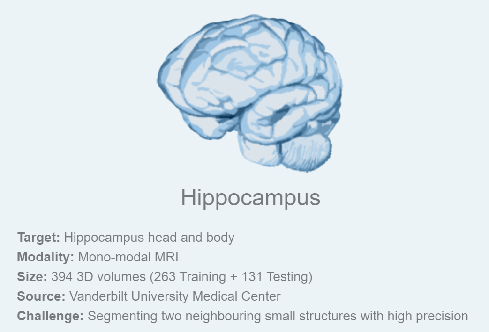
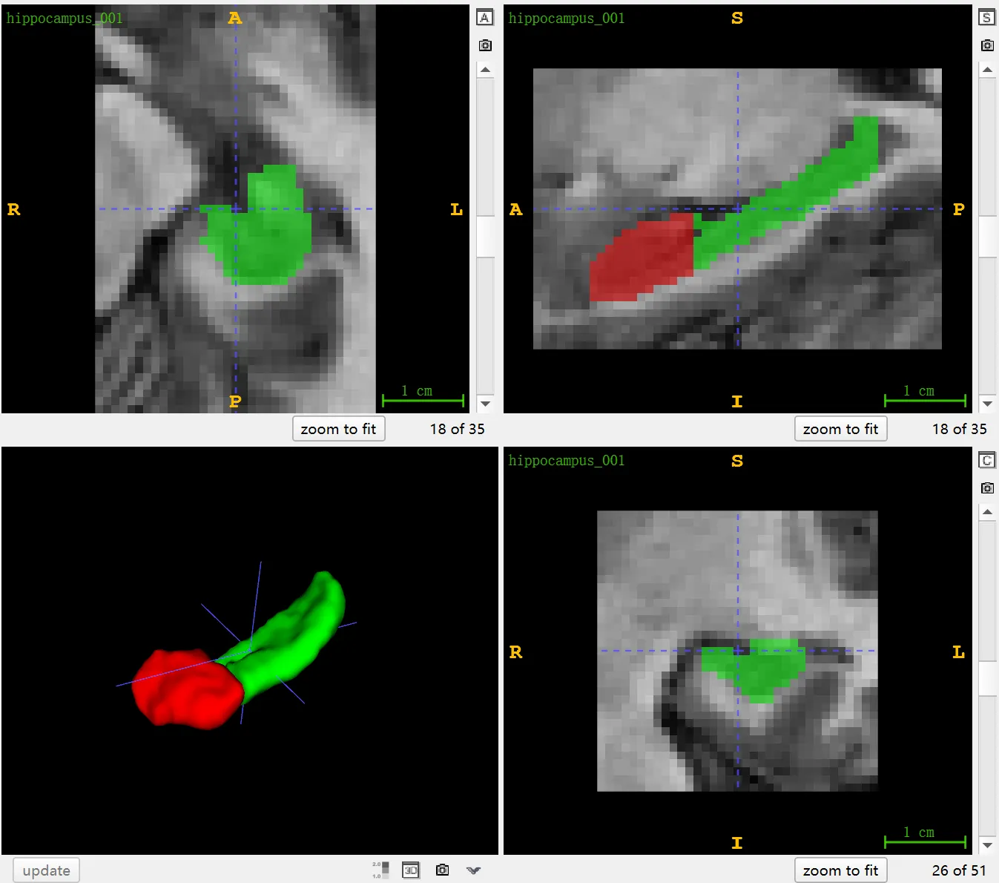

# MSD Hippocampus

<div align="center">
    <a href="https://github.com/openmedlab/"></a>
</div>
<p style="text-align:center;font-size:10px;"><em></em></p>

## Dataset Information

The MSD Hippocampus dataset is Task04, the fourth subtask, of the Medical Segmentation Decathlon (MSD), which aims to segment the hippocampal region from single-modality MR images. MSD selected this dataset due to the challenge of "high-precision segmentation of two adjacent small structures". The dataset includes MR images of 394 patients, officially divided into 263 training cases and 131 test cases, with the test cases available for submitting segmentation results for evaluation via the official website. Notably, the actual downloaded training set contains 260 cases, and the test set contains 130 cases.

The hippocampus is a key structure in the brain, playing a critical role in functions such as memory formation, spatial navigation, and emotion processing. The hippocampus can be divided into anterior and posterior parts based on its anatomical location, with functional differences reflected in their respective unique cognitive and emotional processing capabilities. The anterior hippocampus is more involved in emotional responses and specific types of memory processing, such as episodic memory, while the posterior hippocampus is more related to spatial memory and navigational functions. In clinical diagnosis and neurological disease research, accurate segmentation of these two parts is crucial. Using Magnetic Resonance Imaging (MRI) technology, not only can the overall structure of the hippocampus be clearly observed, but the specific functions of its anterior and posterior parts can also be analyzed in detail. This is vital for the study and treatment of diseases related to hippocampal dysfunction, such as Alzheimer's disease and epilepsy. Through precise segmentation and analysis of different parts of the hippocampus, doctors and researchers can gain a deeper understanding of the pathogenesis of these diseases and develop more effective diagnostic and treatment strategies.

## Dataset Meta Information

| Dimensions | Modality | Task Type | Anatomical Structures         | Anatomical Area | Number of Categories | Data Volume | File Format |
|------------|----------|-----------|-------------------------------|-----------------|----------------------|-------------|-------------|
| 3D         | MR       | Segmentation | Hippocampus | Head            | 1                    | 394         | .nii.gz     |

Number of 2D slices: 9,279 (based on the calculation of 260 training cases).

### Resolution Details

| Dataset Statistics | spacing (mm)     | size            |
|--------------------|------------------|-----------------|
| min                | (1.0, 1.0, 1.0)              | (31, 40, 24)     |
| median             | (1.0, 1.0, 1.0)           | (35, 50, 36) |
| max                | (1.0, 1.0, 1.0)              | (43, 59, 47) |

## Label Information Statistics

```markdown
| Segmentation Class | Anterior | Posterior |
|--------------------|----------------------|----------------------|
| Case Count         | 260                  | 260                  |
| Detection Rate     | 100%                 | 100%                 |
| Min Volume (cm³)   | 1.05                 | 0.99                 |
| Median Volume (cm³)| 1.72                 | 1.58                 |
| Max Volume (cm³)   | 2.59                 | 2.17                 |
```

## Visualization

<div align="center">
    <a href="https://github.com/openmedlab/"></a>
</div>
<p style="text-align:center;font-size:10px;"><em> ITK-SNAP Visualization. Red: Anterior part of the hippocampus, Green: Posterior part of the hippocampus.</em></p>

## File Structure

The file structure provided by the official source is as follows. It contains three main folders: `imagesTr`, `labelsTr`, and `imagesTs`, which are used to store training images, training labels, and test images, respectively. In addition, there is a file named `dataset.json` that stores the metadata of the dataset, such as modalities and categories.

```
Task04_Hippocampus
│
├── imagesTr
│   ├── hippocampus_001.nii.gz
│   └── ...
├── labelsTr
│   ├── hippocampus_001.nii.gz
│   └── ...
├── imagesTs
│   ├── hippocampus_002.nii.gz
│   └── ...
└── dataset.json
```

## Authors and Institutions

Bennett Landman(Vanderbilt University, United States)


## Source Information

Official Website: http://medicaldecathlon.com/

Download Link: https://drive.google.com/drive/folders/1HqEgzS8BV2c7xYNrZdEAnrHk7osJJ--2

Article Address: https://www.nature.com/articles/s41467-022-30695-9, https://arxiv.org/abs/1902.09063

Publication Date: Feburary, 2019.

## Citation

``` 
@article{antonelli2022medical,
  title={The Medical Segmentation Decathlon},
  author={Antonelli, Michela and Reinke, Annika and Bakas, Spyridon and others},
  journal={Nature Communications},
  year={2022}, 
  doi={10.1038/s41467-022-30695-9}
}

@misc{simpson2019large,
      title={A large annotated medical image dataset for the development and evaluation of segmentation algorithms}, 
      author={Amber L. Simpson and Michela Antonelli and Spyridon Bakas and Michel Bilello and Keyvan Farahani and Bram van Ginneken and Annette Kopp-Schneider and Bennett A. Landman and Geert Litjens and Bjoern Menze and Olaf Ronneberger and Ronald M. Summers and Patrick Bilic and Patrick F. Christ and Richard K. G. Do and Marc Gollub and Jennifer Golia-Pernicka and Stephan H. Heckers and William R. Jarnagin and Maureen K. McHugo and Sandy Napel and Eugene Vorontsov and Lena Maier-Hein and M. Jorge Cardoso},
      year={2019},
      eprint={1902.09063},
      archivePrefix={arXiv},
      primaryClass={cs.CV}
}
```

Original introduction article is [here](https://zhuanlan.zhihu.com/p/667516333).