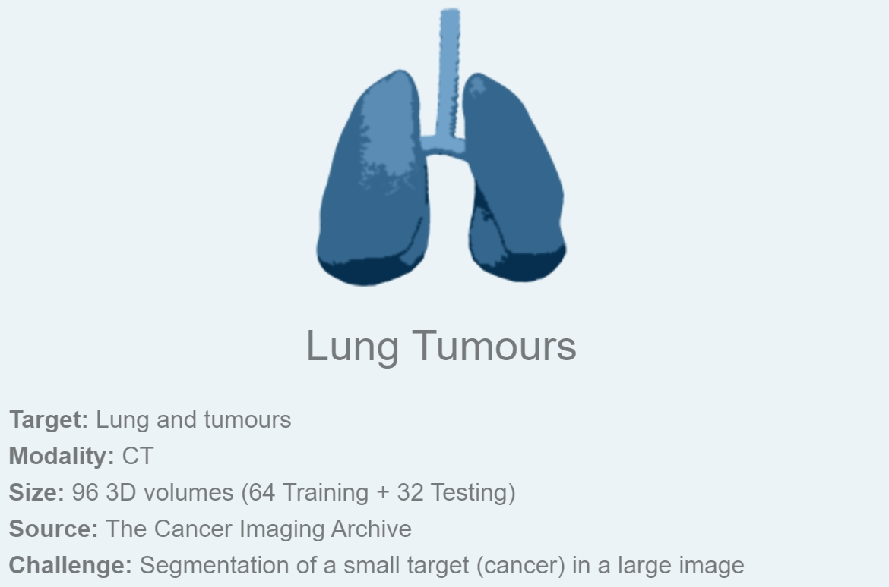
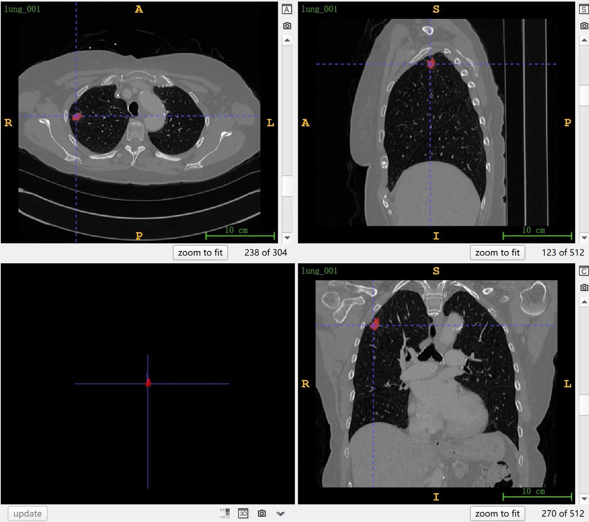

# MSD Lung Tumours

<div align="center">
    <a href="https://github.com/openmedlab/"></a>
</div>
<p style="text-align:center;font-size:10px;"><em></em></p>

## Dataset Information

The MSD Lung Tumours dataset is Task06, the 6th subtask in the Medical Segmentation Decathlon (MSD), aimed at segmenting lung tumors from CT images. The reason MSD selected this dataset is to "segment small targets within a large background." The dataset includes thin-section CT scans of 96 patients with non-small cell lung cancer, officially divided into 64 cases for the training set and 32 cases for the test set, with the test set available for online submission of segmentation results through the official website. It is worth noting that we actually downloaded 63 cases for the training set.

Non-small cell lung cancer (NSCLC) is the most common type of lung cancer, accounting for about 85% of lung cancer cases, including subtypes such as squamous cell carcinoma, adenocarcinoma, and large cell carcinoma. Compared to small cell lung cancer, NSCLC generally grows more slowly and has a more diverse range of treatments, usually depending on the specific type of tumor, its stage of development, and the overall health condition of the patient. CT scans play a crucial role in the diagnosis and treatment of NSCLC. They provide detailed information about tumor size, shape, and location, helping doctors determine the precise stage of the lesion and guide surgical and radiotherapy plans. Furthermore, CT imaging is essential for monitoring the tumor's response to treatment and detecting recurrences or metastases.

## Dataset Meta Information

| Dimensions | Modality | Task Type | Anatomical Structures | Anatomical Area | Number of Categories | Data Volume | File Format |
|------------|----------|-----------|-----------------------|-----------------|--------------------|-------------|-------------|
| 3D         | CT       | Segmentation | Lung Cancer           | Chest           | 1                  | 96          | .nii.gz     |


### Resolution Details

| Dataset Statistics | spacing (mm)     | size            |
|--------------------|------------------|-----------------|
| min                | (0.60, 0.60, 0.63)              | (512, 512, 112)     |
| median             | (0.79, 0.79, 1.2)           | (512, 512, 252) |
| max                | (0.98, 0.98, 2.5)              | (512, 512, 636) |

## Label Information Statistics

| Category       | Lung Tumor  |
|----------------|-------------|
| Number of Cases| 63          |
| Detection Rate | 100%        |
| Minimum Volume | 0.7 cm³     |
| Median Volume  | 5 cm³       |
| Maximum Volume | 370 cm³     |

## Visualization

<div align="center">
    <a href="https://github.com/openmedlab/"></a>
</div>
<p style="text-align:center;font-size:10px;"><em> ITK-SNAP Visualization. Red: Tumour.</em></p>

## File Structure

The official file structure is provided as follows. It contains three main folders: imagesTr, labelsTr, and imagesTs, which are used to store training images, training annotations, and test images, respectively. In addition, there is a file named dataset.json that stores the metadata of the dataset, such as modalities and categories.

``` 
Task06_Lung
│
├── imagesTr
│   ├── lung_001.nii.gz
│   └── ...
├── labelsTr
│   ├── lung_001.nii.gz
│   └── ...
├── imagesTs
│   ├── lung_002.nii.gz
│   └── ...
└── dataset.json
```

## Authors and Institutions

Keyvan Farahani (National Institutes of Health (NIH), USA)

## Source Information

Official Website: http://medicaldecathlon.com/

Download Link: https://drive.google.com/drive/folders/1HqEgzS8BV2c7xYNrZdEAnrHk7osJJ--2

Article Address: https://www.nature.com/articles/s41467-022-30695-9, https://arxiv.org/abs/1902.09063

Publication Date: February, 2019.

## Citation

``` 
@article{antonelli2022medical,
  title={The Medical Segmentation Decathlon},
  author={Antonelli, Michela and Reinke, Annika and Bakas, Spyridon and others},
  journal={Nature Communications},
  year={2022}, 
  doi={10.1038/s41467-022-30695-9}
}

@misc{simpson2019large,
      title={A large annotated medical image dataset for the development and evaluation of segmentation algorithms}, 
      author={Amber L. Simpson and Michela Antonelli and Spyridon Bakas and Michel Bilello and Keyvan Farahani and Bram van Ginneken and Annette Kopp-Schneider and Bennett A. Landman and Geert Litjens and Bjoern Menze and Olaf Ronneberger and Ronald M. Summers and Patrick Bilic and Patrick F. Christ and Richard K. G. Do and Marc Gollub and Jennifer Golia-Pernicka and Stephan H. Heckers and William R. Jarnagin and Maureen K. McHugo and Sandy Napel and Eugene Vorontsov and Lena Maier-Hein and M. Jorge Cardoso},
      year={2019},
      eprint={1902.09063},
      archivePrefix={arXiv},
      primaryClass={cs.CV}
}
```

Original introduction article is [here](https://zhuanlan.zhihu.com/p/665638206).