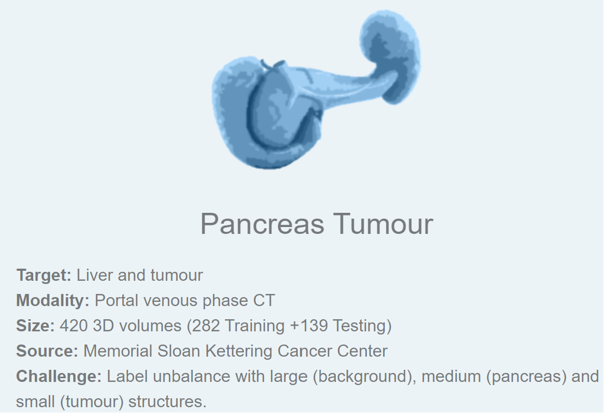
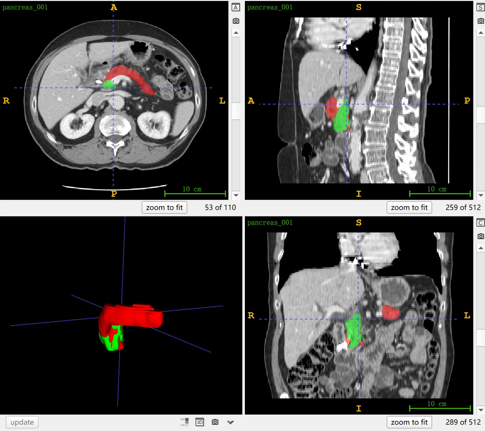

# MSD Pancreas Tumour

<div align="center">
    <a href="https://github.com/openmedlab/"></a>
</div>
<p style="text-align:center;font-size:10px;"><em></em></p>

## Dataset Information

The **MSD Pancreas Tumor dataset**, also known as Task07 in the Medical Segmentation Decathlon (MSD), focuses on segmenting the pancreas and tumors from CT images. This dataset was chosen for the MSD challenge because it presents a label imbalance issue, including large (background), medium (pancreas), and small (tumor) structures. Pancreatic tumor segmentation is considered one of the two most challenging tasks in MSD, the other being colon tumor segmentation.

This dataset comprises 420 3D CT cases, divided by the organizers into 281 cases for training and 139 cases for testing. The test results can be submitted via the official website for evaluation. The dataset includes three types of pancreatic tumors: intraductal papillary mucinous neoplasms, pancreatic neuroendocrine tumors, and pancreatic ductal adenocarcinomas.

Pancreatic cancer is known for its high mortality rate and often presents with non-specific early symptoms, leading to late-stage diagnosis in many patients. The survival rate for pancreatic cancer is generally low, with a five-year survival rate typically less than 10%. The development of pancreatic cancer can be associated with various factors including genetics, inflammation, diabetes, smoking, and poor dietary habits. Early detection and diagnosis are critical for improving the survival rates of patients with pancreatic cancer, and imaging studies such as CT, MRI, and ultrasound play a central role in the early diagnosis and staging of the disease. These imaging modalities enable doctors to better understand the location, size, and potential metastasis of the tumor, leading to more appropriate treatment planning.

## Dataset Meta Information

| Dimensions | Modality | Task Type | Anatomical Structures          | Anatomical Area | Number of Categories | Data Volume | File Format |
|------------|----------|-----------|--------------------------------|-----------------|----------------------|-------------|-------------|
| 3D         | CT       | Segmentation | pancreas, pancreatic tumor | abdomen       | 2                    | 420         | .nii.gz     |


### Resolution Details

| Dataset Statistics | spacing (mm)     | size            |
|--------------------|------------------|-----------------|
| min                | (0.61, 0.61, 0.70)              | (512, 512, 37)     |
| median             | (0.80, 0.80, 2.5)           | (512, 512, 93) |
| max                | (0.98, 0.98, 7.5)              | (512, 512, 751) |

Number of 2D slices: 26,719 (based on 281 training set statistics).

## Label Information Statistics

| Organ Label      | Pancreas | Pancreas Tumor |
|------------------|-------------|------------------------|
| Number of Cases  | 281         | 281                    |
| Coverage         | 100%        | 100%                   |
| Min Volume (cm³) | 20          | 0.4                    |
| Median Volume (cm³) | 77        | 6                      |
| Max Volume (cm³) | 201         | 732                    |


## Visualization

<div align="center">
    <a href="https://github.com/openmedlab/"></a>
</div>
<p style="text-align:center;font-size:10px;"><em> ITK-SNAP Visualization. Red: pancreas, green: tumor.</em></p>

## File Structure

The official file structure provided is as follows. It contains three main folders: `imagesTr`, `labelsTr`, and `imagesTs`, which are used to store training images, training labels, and test images, respectively. In addition, there is a file named `dataset.json`, responsible for storing metadata of the dataset, such as modality and categories.

``` 
Task07_Pancreas
│
├── imagesTr
│   ├── pancreas_001.nii.gz
│   └── ...
├── labelsTr
│   ├── pancreas_001.nii.gz
│   └── ...
├── imagesTs
│   ├── pancreas_002.nii.gz
│   └── ...
└── dataset.json
```

## Authors and Institutions

Amber Simpson (Memorial Sloan Kettering Cancer Center, USA)


## Source Information

Official Website: http://medicaldecathlon.com/

Download Link: https://drive.google.com/drive/folders/1HqEgzS8BV2c7xYNrZdEAnrHk7osJJ--2

Article Address: https://www.nature.com/articles/s41467-022-30695-9, https://arxiv.org/abs/1902.09063

Publication Date: 2019-02

## Citation

``` 
@article{antonelli2022medical,
  title={The Medical Segmentation Decathlon},
  author={Antonelli, Michela and Reinke, Annika and Bakas, Spyridon and others},
  journal={Nature Communications},
  year={2022}, 
  doi={10.1038/s41467-022-30695-9}
}

@misc{simpson2019large,
      title={A large annotated medical image dataset for the development and evaluation of segmentation algorithms}, 
      author={Amber L. Simpson and Michela Antonelli and Spyridon Bakas and Michel Bilello and Keyvan Farahani and Bram van Ginneken and Annette Kopp-Schneider and Bennett A. Landman and Geert Litjens and Bjoern Menze and Olaf Ronneberger and Ronald M. Summers and Patrick Bilic and Patrick F. Christ and Richard K. G. Do and Marc Gollub and Jennifer Golia-Pernicka and Stephan H. Heckers and William R. Jarnagin and Maureen K. McHugo and Sandy Napel and Eugene Vorontsov and Lena Maier-Hein and M. Jorge Cardoso},
      year={2019},
      eprint={1902.09063},
      archivePrefix={arXiv},
      primaryClass={cs.CV}
}
```

Original introduction article is [here](https://zhuanlan.zhihu.com/p/663615985).