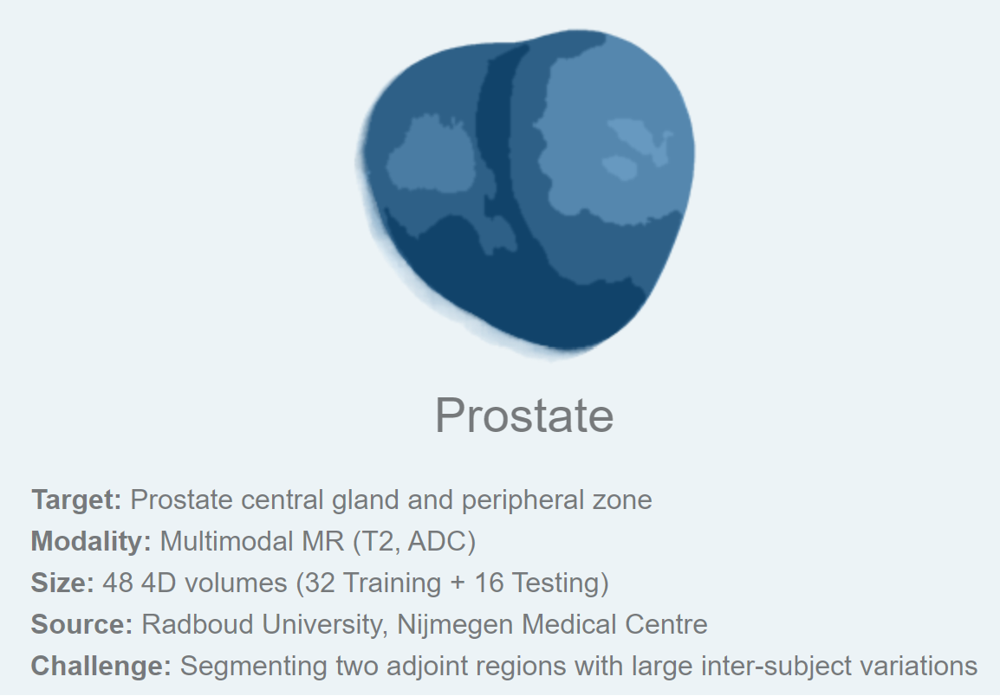
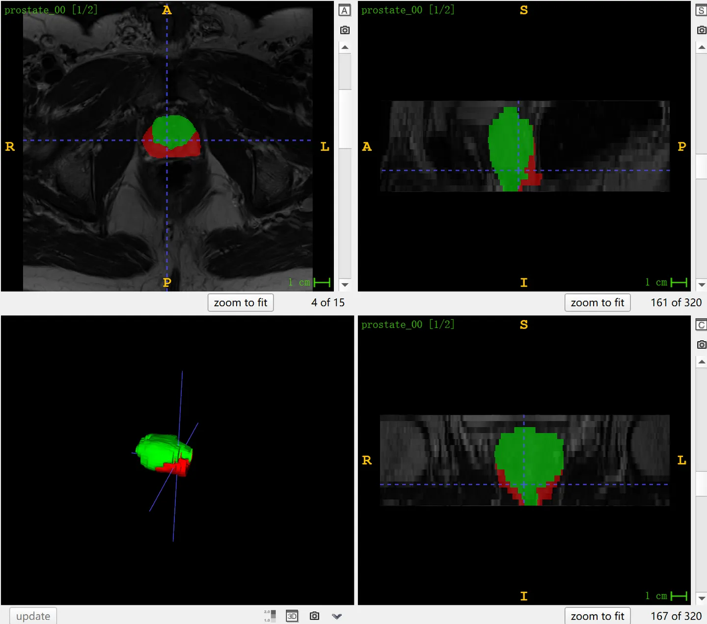

# MSD Prostate

<div align="center">
    <a href="https://github.com/openmedlab/"></a>
</div>
<p style="text-align:center;font-size:10px;"><em></em></p>

## Dataset Information

The MSD Prostate dataset is Task05 in the Medical Segmentation Decathlon (MSD), which aims to segment two regions of the prostate, the central gland and the peripheral zone, from multi-parametric MR images (T2, ADC). The reason MSD chose this dataset is due to the challenge of separating two adjacent regions that exhibit high variability across individuals. The dataset includes T2-weighted and ADC MR images of 48 patients, divided into 32 cases for the training set and 16 for the test set. The test results can be submitted on the official website for evaluation.

The prostate is part of the male reproductive system, located below the bladder with the urethra running through it, primarily functioning to produce prostatic fluid. Multi-parametric Magnetic Resonance Imaging (MRI) helps assess the anatomical structure of the prostate, including the central gland and peripheral zone. These two areas have different anatomical and physiological characteristics within the prostate. The central gland mainly contains prostatic ducts, while the peripheral zone is the most common site for prostate cancer. Segmenting these two regions allows physicians to detect and evaluate prostate diseases, such as prostate cancer, and other potential prostate health issues more accurately, enabling early diagnosis and treatment.

## Dataset Meta Information

| Dimensions | Modality | Task Type | Anatomical Structures | Anatomical Area | Number of Categories | Data Volume | File Format |
|------------|----------|-----------|-----------------------|-----------------|----------------------|-------------|-------------|
| 3D         | CT       | Segmentation | prostate              | abdomen       | 104                  | 1204        | .nii.gz     |


### Resolution Details

| Dataset Statistics | spacing (mm)     | size            |
|--------------------|------------------|-----------------|
| min                | (0.60, 0.60, 3.0)             | (256, 256, 11)     |
| median             | (0.63, 0.63, 3.6)          | (320, 320, 20) |
| max                | (0.75, 0.75, 4.0)             | (384, 384, 24) |

Number of 2D slices: 1,204 (based on 32 examples of training set statistics, 602 × 2 modalities)

## Label Information Statistics

| Organ Region | PZ (Peripheral Zone) | TZ (Transition Zone) |
|--------------|----------------------|----------------------|
| Case Count   | 30                   | 32                   |
| Percentage   | 93%                  | 100%                 |
| Min Volume (cm³) | 6                | 8                    |
| Median Volume (cm³) | 15            | 48                   |
| Max Volume (cm³) | 34               | 304                  |

## Visualization

<div align="center">
    <a href="https://github.com/openmedlab/"></a>
</div>
<p style="text-align:center;font-size:10px;"><em> ITK-SNAP Visualization. Red: peripheral zone of prostate; green: central gland of prostate. </em></p>

## File Structure

The official file structure provided is as follows. It contains three main folders: `imagesTr`, `labelsTr`, and `imagesTs`, which are used to store training images, training labels, and test images, respectively. In addition, there is a file named `dataset.json`, responsible for storing metadata of the dataset, such as modality and categories.

``` 
Task05_Prostate
│
├── imagesTr
│   ├── prostate_00.nii.gz
│   └── ...
├── labelsTr
│   ├── prostate_00.nii.gz
│   └── ...
├── imagesTs
│   ├── prostate_03.nii.gz
│   └── ...
└── dataset.json
```

## Authors and Institutions

Bram van Ginneken (Radboud University Medical Center, The Netherlands)

Geert Litjens (Radboud University Medical Center, The Netherlands)


## Source Information

Official Website: http://medicaldecathlon.com/

Download Link: https://drive.google.com/drive/folders/1HqEgzS8BV2c7xYNrZdEAnrHk7osJJ--2?usp=sharing

Article Address: https://www.nature.com/articles/s41467-022-30695-9, https://arxiv.org/abs/1902.09063

Publication Date: 2019-02.

## Citation

``` 
@article{antonelli2022medical,
  title={The Medical Segmentation Decathlon},
  author={Antonelli, Michela and Reinke, Annika and Bakas, Spyridon and others},
  journal={Nature Communications},
  year={2022}, 
  doi={10.1038/s41467-022-30695-9}
}

@misc{simpson2019large,
      title={A large annotated medical image dataset for the development and evaluation of segmentation algorithms}, 
      author={Amber L. Simpson and Michela Antonelli and Spyridon Bakas and Michel Bilello and Keyvan Farahani and Bram van Ginneken and Annette Kopp-Schneider and Bennett A. Landman and Geert Litjens and Bjoern Menze and Olaf Ronneberger and Ronald M. Summers and Patrick Bilic and Patrick F. Christ and Richard K. G. Do and Marc Gollub and Jennifer Golia-Pernicka and Stephan H. Heckers and William R. Jarnagin and Maureen K. McHugo and Sandy Napel and Eugene Vorontsov and Lena Maier-Hein and M. Jorge Cardoso},
      year={2019},
      eprint={1902.09063},
      archivePrefix={arXiv},
      primaryClass={cs.CV}
}
```

Original introduction article is [here](https://zhuanlan.zhihu.com/p/666092633).