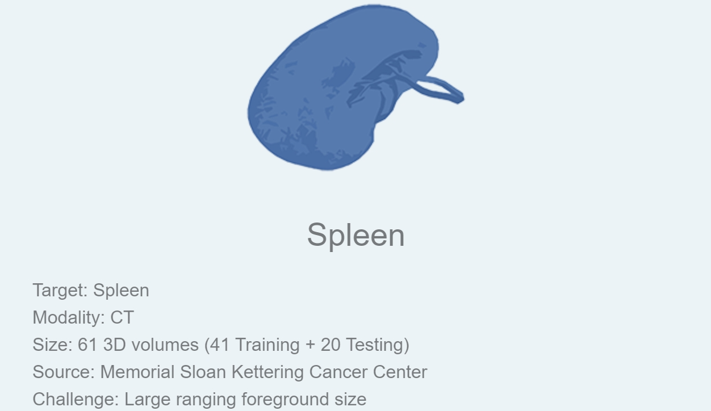
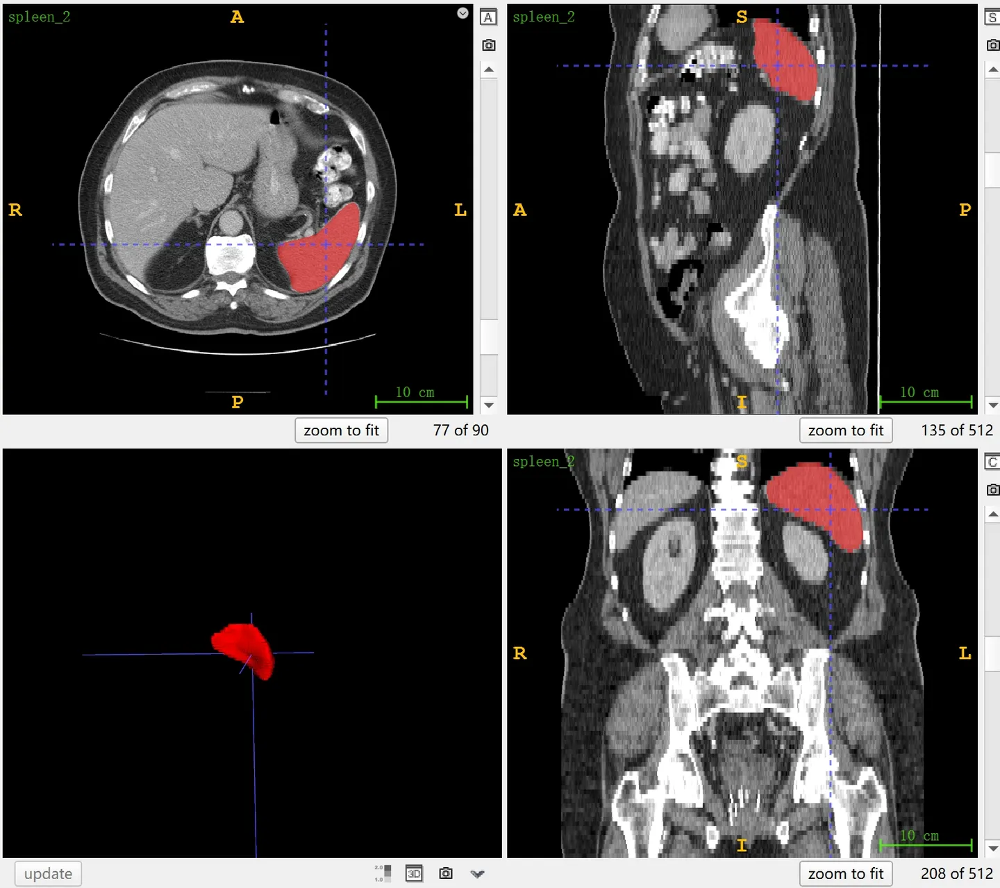

# MSD Spleen

<div align="center">
    <a href="https://github.com/openmedlab/"></a>
</div>
<p style="text-align:center;font-size:10px;"><em></em></p>

## Dataset Information

The **MSD Spleen dataset** is part of the Medical Segmentation Decathlon (MSD), designated as Task 09. It focuses on the segmentation of the spleen from CT images. The dataset was selected for its large variability in the size of the foreground structures. Comprising 61 3D portal venous phase CT scans from patients undergoing chemotherapy for liver metastases, the dataset is divided into 41 cases for training and 20 for testing. Test results can be evaluated by submitting segmentation results on the official website.

The spleen is a critical lymphatic organ involved in blood filtration and immune defense, responsible for clearing waste and pathogens from the blood and regulating the storage and release of blood cells. Diseases of the spleen may manifest in CT images as abnormal splenic enlargement or heterogeneous changes in internal density. Splenectomy, the surgical removal of the spleen, may be necessary when the spleen is severely damaged, dysfunctional, or unresponsive to treatment. Although humans can survive without a spleen, its removal decreases immune protection and increases the risk of infections.

## Dataset Meta Information

| Dimensions | Modality | Task Type | Anatomical Structures | Anatomical Area | Number of Categories | Data Volume | File Format |
|------------|----------|-----------|-----------------------|-----------------|----------------------|-------------|-------------|
| 3D         | CT       | Segmentation | Spleen                | abdomen       | 1                    | 61          | .nii.gz     |


### Resolution Details

| Dataset Statistics | spacing (mm)     | size            |
|--------------------|------------------|-----------------|
| min                | (0.61, 0.61, 1.5)              | (512, 512, 31)     |
| median             | (0.79, 0.79, 5.0)           | (512, 512, 90) |
| max                | (0.98, 0.98, 8.0)              | (512, 512, 168) |

Number of 2D slices: 26,719 (based on 41 training set statistics)

## Label Information Statistics

| Organ   | Spleen        |
|---------|---------------|
| Cases   | 41            |
| Coverage| 100%          |
| Min Volume (cm³) | 56    |
| Median Volume (cm³) | 210 |
| Max Volume (cm³) | 502    |

## Visualization

<div align="center">
    <a href="https://github.com/openmedlab/"></a>
</div>
<p style="text-align:center;font-size:10px;"><em> ITK-SNAP Visualization. Red: Spleen.</em></p>

## File Structure

The official file structure provided is as follows. It contains three main folders: `imagesTr`, `labelsTr`, and `imagesTs`, which are used to store training images, training labels, and test images, respectively. In addition, there is a file named `dataset.json`, responsible for storing metadata of the dataset, such as modality and categories.

``` 
Task09_Spleen
│
├── imagesTr
│   ├── spleen_2.nii.gz
│   └── ...
├── labelsTr
│   ├── spleen_2.nii.gz
│   └── ...
├── imagesTs
│   ├── spleen_1.nii.nii.gz
│   └── ...
└── dataset.json
```

## Authors and Institutions

Amber Simpson (Memorial Sloan Kettering Cancer Center, USA)


## Source Information

Official Website: http://medicaldecathlon.com/

Download Link: https://drive.google.com/drive/folders/1HqEgzS8BV2c7xYNrZdEAnrHk7osJJ--2?usp=sharing

Article Address: https://www.nature.com/articles/s41467-022-30695-9, https://arxiv.org/abs/1902.09063

Publication Date: 2019-02.

## Citation

``` 
@article{antonelli2022medical,
  title={The Medical Segmentation Decathlon},
  author={Antonelli, Michela and Reinke, Annika and Bakas, Spyridon and others},
  journal={Nature Communications},
  year={2022}, 
  doi={10.1038/s41467-022-30695-9}
}

@misc{simpson2019large,
      title={A large annotated medical image dataset for the development and evaluation of segmentation algorithms}, 
      author={Amber L. Simpson and Michela Antonelli and Spyridon Bakas and Michel Bilello and Keyvan Farahani and Bram van Ginneken and Annette Kopp-Schneider and Bennett A. Landman and Geert Litjens and Bjoern Menze and Olaf Ronneberger and Ronald M. Summers and Patrick Bilic and Patrick F. Christ and Richard K. G. Do and Marc Gollub and Jennifer Golia-Pernicka and Stephan H. Heckers and William R. Jarnagin and Maureen K. McHugo and Sandy Napel and Eugene Vorontsov and Lena Maier-Hein and M. Jorge Cardoso},
      year={2019},
      eprint={1902.09063},
      archivePrefix={arXiv},
      primaryClass={cs.CV}
}
```

Original introduction article is [here](https://zhuanlan.zhihu.com/p/664964546).