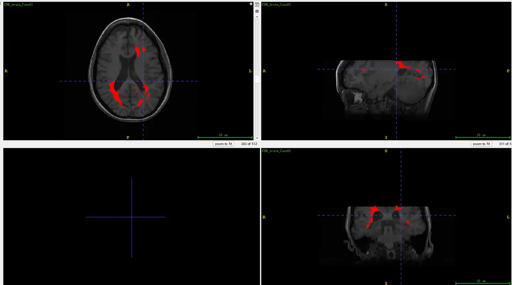

# MSseg08

<div align="center">
    <a href="https://github.com/openmedlab/"></a>
</div>
<p style="text-align:center;font-size:10px;"><em></em></p>

## Dataset Information

The MSseg08 dataset is an MRI-based dataset for the segmentation of multiple sclerosis (MS) lesions, created as part of a challenge at MICCAI 2008. The dataset consists of 51 cases in total, with 20 cases in the training set (including both images and labels) and 31 cases in the validation set (providing images only). The objective of this challenge is to compare 3D segmentation techniques for MS lesions. The competition accepts general lesion segmentation methods specifically designed for MS lesion segmentation, with the requirement that the algorithms must be fully automated. The performance of these MS lesion segmentation methods will be evaluated using a series of comprehensive metrics.

The MRI data used for MS lesion segmentation in this challenge were provided by Boston Children's Hospital and the University of North Carolina (UNC). The UNC cases were acquired using a Siemens 3T Allegra MRI scanner, with a slice thickness of 1 mm and an in-plane resolution of 0.5 mm. To simplify the segmentation process, all data have been rigidly registered to a common reference frame and resampled into isotropic voxel spacing using B-spline interpolation. The preprocessed data is stored in NRRD format, which includes an ASCII-readable header file and a separate uncompressed raw image data file.

## Dataset Meta Information

| Dimensions | Modality | Task Type    | Anatomical Structures      | Anatomical Area | Number of Categories | Data Volume | File Format |
|------------|----------|--------------|----------------------------|-----------------|----------------------|-------------|-------------|
| 3D         | MRI      | Segmentation | Multiple sclerosis lesions | Head            | 1                    | 51          | .nhdr, .raw |


### Resolution Details

| Dataset Statistics | spacing (mm)     | size             |
|--------------------|------------------|------------------|
| min                | (0.5, 0.5, 0.5)  | (512, 512, 512)  |
| median             | (0.5, 0.5, 0.5)  | (512, 512, 512)  |
| max                | (0.5, 0.5, 0.5)  | (512, 512, 512)  |

Number of 2D slices in the dataset: 10240.

## Label Information Statistics

| Segmentation Class | ICH (Intracranial Hemorrhage) |
|--------------------|-------------------------------|
| Case Count         | 20                            |
| Detection Rate     | 100%                          |
| Min Volume (cm³)   | 0.1                           |
| Median Volume (cm³)| 4.515                         |
| Max Volume (cm³)   | 19.63                         |

## Visualization

<div align="center">
    <a href="https://github.com/openmedlab/"></a>
</div>
<p style="text-align:center;font-size:10px;"><em>Mask for multiple sclerosis lesions.</em></p>

## File Structure

The train folder contains the `nii.gz` file for training, and the test folder contains the `nii.gz` file for testing.

``` 
.
├── CHB_test1_Part1
│   ├── CHB_test1_Case01
│   │   ├── CHB_test1_Case01_FLAIR.nhdr
│   │   ├── CHB_test1_Case01_FLAIR.raw
│   │   ├── CHB_test1_Case01_T1.nhdr
│   │   ├── CHB_test1_Case01_T1.raw
│   │   ├── CHB_test1_Case01_T2.nhdr
│   │   └── CHB_test1_Case01_T2.raw
│   ├── ...
├── CHB_test1_Part2
│   ├── CHB_test1_Case07
│   │   ├── CHB_test1_Case07_FLAIR.nhdr
│   │   ├── CHB_test1_Case07_FLAIR.raw
│   │   ├── CHB_test1_Case07_T1.nhdr
│   │   ├── CHB_test1_Case07_T1.raw
│   │   ├── CHB_test1_Case07_T2.nhdr
│   │   └── CHB_test1_Case07_T2.raw
│   ├── ...
├── CHB_test1_Part3
│   ├── CHB_test1_Case13
│   │   ├── CHB_test1_Case13_FLAIR.nhdr
│   │   ├── CHB_test1_Case13_FLAIR.raw
│   │   ├── CHB_test1_Case13_T1.nhdr
│   │   ├── CHB_test1_Case13_T1.raw
│   │   ├── CHB_test1_Case13_T2.nhdr
│   │   └── CHB_test1_Case13_T2.raw
│   ├── ...
├── CHB_train_Part1
│   ├── CHB_train_Case01
│   │   ├── CHB_train_Case01_FLAIR.nhdr
│   │   ├── CHB_train_Case01_FLAIR.raw
│   │   ├── CHB_train_Case01_lesion.nhdr
│   │   ├── CHB_train_Case01_lesion.raw
│   │   ├── CHB_train_Case01_T1.nhdr
│   │   ├── CHB_train_Case01_T1.raw
│   │   ├── CHB_train_Case01_T2.nhdr
│   │   └── CHB_train_Case01_T2.raw
│   ├── ...
├── CHB_train_Part2
│   ├── CHB_train_Case06
│   │   ├── CHB_train_Case06_FLAIR.nhdr
│   │   ├── CHB_train_Case06_FLAIR.raw
│   │   ├── CHB_train_Case06_lesion.nhdr
│   │   ├── CHB_train_Case06_lesion.raw
│   │   ├── CHB_train_Case06_T1.nhdr
│   │   ├── CHB_train_Case06_T1.raw
│   │   ├── CHB_train_Case06_T2.nhdr
│   │   └── CHB_train_Case06_T2.raw
│   ├── ...
├── UNC_test1_Part1
│   ├── UNC_test1_Case01
│   │   ├── UNC_test1_Case01_FLAIR.nhdr
│   │   ├── UNC_test1_Case01_FLAIR.raw
│   │   ├── UNC_test1_Case01_T1.nhdr
│   │   ├── UNC_test1_Case01_T1.raw
│   │   ├── UNC_test1_Case01_T2.nhdr
│   │   └── UNC_test1_Case01_T2.raw
│   ├── ...
├── UNC_test1_Part2
│   ├── UNC_test1_Case08
│   │   ├── UNC_test1_Case08_FLAIR.nhdr
│   │   ├── UNC_test1_Case08_FLAIR.raw
│   │   ├── UNC_test1_Case08_T1.nhdr
│   │   ├── UNC_test1_Case08_T1.raw
│   │   ├── UNC_test1_Case08_T2.nhdr
│   │   └── UNC_test1_Case08_T2.raw
│   ├── ...
├── UNC_train_lesion_byCHB
│   ├── UNC_train_Case01
│   │   ├── UNC_train_Case01_lesion_byCHB.nhdr
│   │   └── UNC_train_Case01_lesion_byCHB.raw
│   ├── ...
│   └── UNC_train_Case10
│       ├── UNC_train_Case10_lesion_byCHB.nhdr
│       └── UNC_train_Case10_lesion_byCHB.raw
├── UNC_train_Part1
│   ├── UNC_train_Case01
│   │   ├── UNC_train_Case01_FLAIR.nhdr
│   │   ├── UNC_train_Case01_FLAIR.raw
│   │   ├── ...
│   ├── ...
│   ├── UNC_train_Case09
│   │   ├── UNC_train_Case09_FLAIR.nhdr
│   │   ├── UNC_train_Case09_FLAIR.raw
│   │   ├── ...
│   │   ├── UNC_train_Case09_T2.nhdr
│   │   └── UNC_train_Case09_T2.raw
│   └── UNC_train_Case10
│       ├── UNC_train_Case10_FLAIR.nhdr
│       ├── UNC_train_Case10_FLAIR.raw
│       ├── ...
│       ├── UNC_train_Case10_T2.nhdr
│       └── UNC_train_Case10_T2.raw
```

## Authors and Institutions

Martin Styner (University of North Carolina at Chapel Hill)

Joohwi Lee (University of North Carolina at Chapel Hill)

Brian Chin (University of North Carolina at Chapel Hill)

Matthew S. Chin (University of North Carolina at Chapel Hill)

Olivier Commowick (Boston Children's Hospital)

Hoai-Huong Tran (Boston Children's Hospital)

Valerie Jewells (University of North Carolina at Chapel Hill)

Simon Warfield (Boston Children's Hospital)

## Source Information

Official Website: http://www.ia.unc.edu/MSseg/index.html

Download Link: http://www.ia.unc.edu/MSseg/index.html

Article Address: https://www.researchgate.net/profile/Martin-Styner/publication/237785665_3D_Segmentation_in_the_Clinic_A_Grand_Challenge_II_MS_lesion_segmentation/links/02e7e528cc921cb769000000/3D-Segmentation-in-the-Clinic-A-Grand-Challenge-II-MS-lesion-segmentation.pdf

Publication Date: 2008

## Citation

``` 
@article{styner20083d,
  title={3D segmentation in the clinic: A grand challenge II: MS lesion segmentation},
  author={Styner, Martin and Lee, Joohwi and Chin, Brian and Chin, M and Commowick, Olivier and Tran, H and Markovic-Plese, Silva and Jewells, Valerie and Warfield, Simon},
  journal={MIDAS journal},
  volume={2008},
  pages={1--6},
  year={2008}
}
```

Original introduction article is [here](https://zhuanlan.zhihu.com/p/710066790).