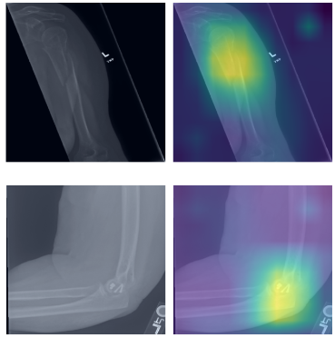
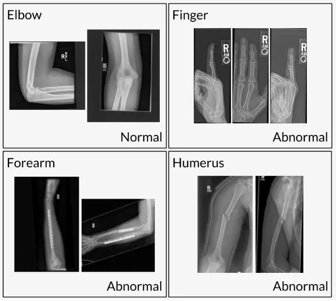

# MURA

<div align="center">
    <a href="https://github.com/openmedlab/"></a>
</div>
<p style="text-align:center;font-size:10px;"><em></em></p>

## Dataset Information

MURA is a musculoskeletal radiographic dataset that includes 14,863 studies of 12,173 patients, totaling 40,561 multi-view radiographic images. Each image is categorized into one of seven standard types of upper extremity radiographic studies: elbow, finger, forearm, hand, humerus, shoulder, and wrist. From 2001 to 2012, radiologists at Stanford Hospital manually annotated these studies during clinical radiographic interpretations, classifying them as normal or abnormal. The test set includes additional annotations by six radiologists from Stanford Hospital, covering 207 musculoskeletal studies. These radiologists reviewed and labeled each study in the test set as normal or abnormal individually using the PACS system in a clinical reading room environment. The radiologists had an average of 8.83 years of experience, ranging from 2 to 25 years. Three of these radiologists were randomly selected to create a gold standard, defined as the majority vote of these radiologists' labels.

The MURA anomaly detection task is a binary classification task where the input is an upper extremity radiographic study (containing one or more views/images), and the expected output is a binary label y ∈ {0,1}, indicating whether the study is normal or abnormal. Additionally, the MURA dataset serves as an educational tool in medical imaging, helping medical students, radiology technologists, and other learners to better understand and master the radiographic features of the musculoskeletal system, enhancing their clinical skills and diagnostic capabilities.

## Dataset Meta Information

| Dimensions | Modality | Task Type      | Anatomical Structures | Anatomical Area | Number of Categories | Data Volume | File Format |
|------------|----------|----------------|-----------------------|-----------------|----------------------|-------------|-------------|
| 2D         | X-Ray    | Classification | Musculoskeletal       | Muscle          | 2                    | 40561	      | .png        |


### Resolution Details

| Dataset Statistics | size       |
|--------------------|------------|
| min                | (512, 108) |
| median             | (488, 400) |
| max                | (512, 268) |

## Label Information Statistics

Original dataset annotation information: Each image belongs to seven standard upper limb radiographic images, including elbow, finger, forearm, hand, humerus, shoulder, and wrist.

| Study                     | Train#Normal | Train#Abnormal | Validation#Normal | Validation#Abnormal | Total     |
|---------------------------|--------------|----------------|-------------------|---------------------|-----------|
| Elbow                     | 1094         | 660            | 92                | 66                  | 1912      |
| Finger                    | 1280         | 655            | 92                | 83                  | 2110      |
| Hand                      | 1497         | 521            | 101               | 66                  | 2185      |
| Humerus                   | 321          | 271            | 68                | 67                  | 727       |
| Forearm                   | 590          | 287            | 69                | 64                  | 1010      |
| Shoulder                  | 1364         | 1457           | 99                | 95                  | 3015      |
| Wrist                     | 2134         | 1326           | 140               | 97                  | 3697      |
| **Total No. of Studies**  | **8280**     | **5177**       | **661**           | **538**             | **14656** |


The statistical results of normal and abnormal images are subject to the actual statistics of the downloaded dataset:

| Category             | train | val |
|----------------------|-------|-----|
| Normal bone X-ray    | 8280  | 661 |
| Abnormal bone X-ray  | 5177  | 538 |

## Visualization

<div align="center">
    <a href="https://github.com/openmedlab/"></a>
</div>
<p style="text-align:center;font-size:10px;"><em>Visualization results: normal elbow (upper left), abnormal fingers (upper right).</em></p>

<div align="center">
    <a href="https://github.com/openmedlab/"></a>
</div>
<p style="text-align:center;font-size:10px;"><em>Visualization results.</em></p>

## File Structure

``` 
MURA
├── images
│   ├── train
│   │   ├── xxxx.png
│   │   ├── xxxx.png
│   │   ├── .....png
│   │   ├── xxxx.png
│   ├── valid
│   │   ├── xxxx.png
│   │   ├── xxxx.png
│   │   ├── .....png
│   │   ├── xxxx.png
├── train.txt
├── val.txt
├── README.md
```

## Authors and Institutions

Pranav Rajpurkar (Stanford University)

Jeremy Irvin (Stanford University)

Aarti Bagul (Stanford Universit)

Daisy Ding (Stanford Universit)

Tony Duan (Stanford Universit)

Andrew Y. Ng (Stanford Universit)

## Source Information

Official Website: https://stanfordmlgroup.github.io/competitions/mura/

Download Link: https://tianchi.aliyun.com/dataset/92011

Article Address: https://arxiv.org/pdf/1712.06957

Publication Date: 2018

## Citation

``` 
@article{MURA
  title={MURA:LargeDatasetforAbnormalityDetectionin MusculoskeletalRadiographs},
  author = {Pranav Rajpurkar, Jeremy Irvin, Aarti Bagul, Daisy Ding, Tony Duan, Hershel Mehta, Brandon Yang, Kaylie Zhu, Dillon Laird, Robyn L. Ball, Curtis Langlotz, Katie Shpanskaya, Matthew P. Lungren, Andrew Y. Ng}
 }
```

Original introduction article is [here](https://zhuanlan.zhihu.com/p/716173309).