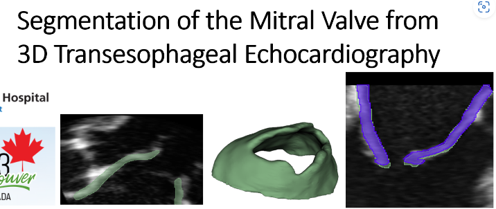
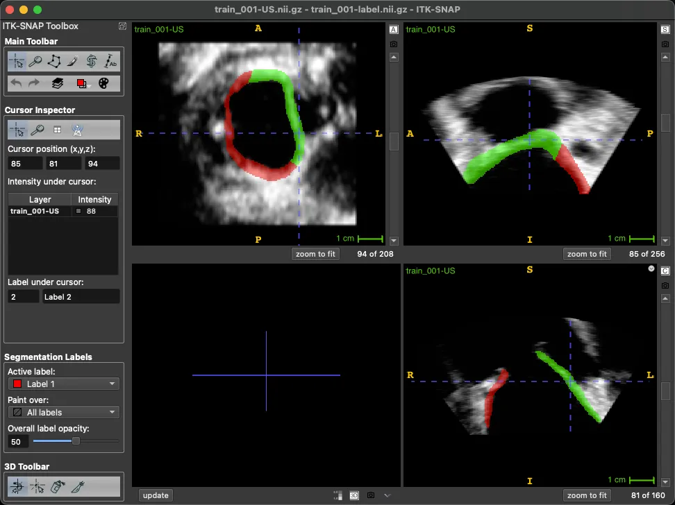

# MVSeg-3DTEE 2023

<div align="center">
    <a href="https://github.com/openmedlab/"></a>
</div>
<p style="text-align:center;font-size:10px;"><em> Ultrasound image.</em></p>

## Dataset Information

The MVSeg-3DTEE 2023 Challenge will be held at the International Conference on Medical Image Computing and Computer-Assisted Intervention (MICCAI 2023), with the aim of automatically segmenting mitral valve leaflets from single-frame three-dimensional transesophageal echocardiography (3D TEE). The data includes 105 training samples, 30 validation samples, and 40 test samples (which are not made public). The labels include 0 for the background, 1 for the posterior leaflet, and 2 for the anterior leaflet.

Mitral valve disease is a common pathological issue that occurs in about 2% of the general population but rises to 10% in those over 75 years of age. For mitral regurgitation, the preferred intervention is valve repair because patients who undergo valve repair have better outcomes compared to those who receive valve replacement. Due to the complexity of the functional and anatomical structure of mitral valve pathology, mitral valve intervention surgery is technically challenging. Repairs must be customized to the specific anatomical and pathological conditions of individual patients, requiring considerable expert training and experience. Automatic segmentation of mitral valve leaflets from three-dimensional transesophageal echocardiograms (TEE) could play a crucial role in treatment planning, as well as in the physical and computational modeling of a particular patient's valve pathology and potential repair methods. This could significantly advance personalized care and potentially impact clinical outcomes for patients receiving mitral valve interventions. To date, several teams have developed fully automatic segmentation methods, achieving an accuracy of 0.59 millimeters in mean absolute surface distance. However, no public dataset is currently available for developing and comparing these segmentation methods using common data, hence it is difficult to draw conclusions based solely on reported accuracies. The goal of the challenge is to release the first annotated dataset of three-dimensional transesophageal echocardiographic mitral valve images, to enable the broader research community to address the problem of mitral valve segmentation.

## Dataset Meta Information

| Dimensions | Modality | Task Type | Anatomical Structures          | Anatomical Area | Number of Categories | Data Volume                | File Format |
|------------|----------|-----------|--------------------------------|-----------------|----------------------|----------------------------|-------------|
| 3D         | US       | Segmentation | Mitral valve | Chest           | 2                    | train 105, val 30, test 40 | .nii.gz     |


### Resolution Details

| Dataset Statistics | spacing (mm)     | size             |
|--------------------|------------------|------------------|
| min                | (0.20, 0.30, 0.12)              | (176, 112, 208)  |
| median             | (0.37, 0.53, 0.23)           | (240, 160, 208)  |
| max                | (0.60, 0.89, 0.39)             | (336, 256, 208)  |

Number of two-dimensional slices in the data set: 21840.

## Label Information Statistics

| Category         | Anterior | Posterior |
|------------------|----------|-----------|
| Number of Cases  | 105      | 105       |
| Percentage       | 100.00%  | 100.00%   |
| Min Volume (cm³) | 1.89     | 2.54      |
| Median Volume (cm³) | 5.33     | 5.52      |
| Max Volume (cm³) | 15.04    | 10.47     |

## Visualization

<div align="center">
    <a href="https://github.com/openmedlab/"></a>
</div>
<p style="text-align:center;font-size:10px;"><em> Ultrasound image.</em></p>

## File Structure

The `train` directory contains training data labeled as `label` and `US` files, and the `val` directory contains validation data labeled as `label` and `US` files.

``` 
├── train
│   ├── train_001-label.nii.gz
│   ├── train_001-US.nii.gz
│   ├── train_002-label.nii.gz
│   ├── train_002-US.nii.gz
│   ├── train_003-label.nii.gz
│   ├── train_003-US.nii.gz
│   ├── train_004-label.nii.gz
│   ├── train_004-US.nii.gz
│   ├── train_005-label.nii.gz
│   ├── train_005-US.nii.gz
│   ├── ...
└── val
    ├── val_001-label.nii.gz
    ├── val_001-US.nii.gz
    ├── val_002-label.nii.gz
    ├── val_002-US.nii.gz
    ├── val_003-label.nii.gz
    ├── val_003-US.nii.gz
    ├── val_004-label.nii.gz
    ├── val_004-US.nii.gz
    ├── val_005-label.nii.gz
    ├── val_005-US.nii.gz
    ├──...
```

## Authors and Institutions

Patrick Carnahan (Western University, Canada)

Terry M. Peters (Western University, Canada)

Elvis C.S. Chen (Western University, Canada)


## Source Information

Official Website: https://www.synapse.org/#!Synapse:syn51186045/wiki/621356

Download Link: https://www.synapse.org/#!Synapse:syn51186045/wiki/621356

Article Address: https://ir.lib.uwo.ca/cgi/viewcontent.cgi?article=12693&context=etd

Publication Date: 2023.

## Citation

``` 
@article{carnahan2023towards,
  title={Towards Patient Specific Mitral Valve Modelling via Dynamic 3D Transesophageal Echocardiography},
  author={Carnahan, Patrick},
  year={2023}
}
```

Original introduction article is [here](https://zhuanlan.zhihu.com/p/679805858).