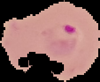
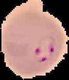

# Malaria cell image dataset

<div align="center">
    <a href="https://github.com/openmedlab/"></a>
</div>
<p style="text-align:center;font-size:10px;"><em></em></p>

## Dataset Information

The malaria cell images dataset contains 27,558 (number) pathological slice images. The dataset has two categories, with 13,779 images labeled as Parasitized and another 13,779 labeled as Uninfected. Malaria is an infectious disease caused by parasites, with nearly 200 million cases worldwide each year, of which about 400,000 people die. Each year, about 170 million people undergo light microscopy of blood films examination, which is currently the mainstream method of malaria diagnosis. In this diagnostic method, parasite counting is mostly done manually. Accurate parasite counting is very important for correct diagnosis of malaria, drug efficacy evaluation, and drug resistance testing. However, the level of microscopy diagnosis based on manual counting largely depends on the technicians' skill, experience, and concentration. To improve malaria diagnosis, the National Institutes of Health collaborated with the Mahidol-Oxford University to develop a fully automated blood film parasite detection and counting system. This system achieves rapid counting of parasites in digitized blood film images through image processing methods. To rapidly advance the application of machine learning technology in this field, the authors, in collaboration with researchers from Jawaharlal Nehru University, Mahidol University in Thailand, Oxford University in the UK, and the University of Missouri in the USA, created the malaria cell image dataset. The paper related to the dataset is indicated at the end of the text.

## Dataset Meta Information

| Dimensions | Modality | Task Type       | Anatomical Structures | Anatomical Area | Number of Categories | Data Volume | File Format |
|------------|----------|-----------------|-----------------------|-----------------|----------------------|-------------|-------------|
| 2D         | Digital Pathology Image       | Classification  | Cell                  | Tissue          | 2                    | 27558          | PNG         |


### Resolution Details

| Dataset Statistics | size        |
|--------------------|-------------|
| min                | [55,40]  |
| median             | [133,130]  |
| max                | [364,340]  |

## Label Information Statistics

|              | Image Count |
|--------------|-------------|
| Parasitized       | 13779          |
| Uninfected     | 13779          |

## Visualization

<div align="center">
    <a href="https://github.com/openmedlab/"></a>
</div>
<p style="text-align:center;font-size:10px;"><em> Parasitized example.</em></p>

<div align="center">
    <a href="https://github.com/openmedlab/"></a>
</div>
<p style="text-align:center;font-size:10px;"><em> Uninfected example.</em></p>

## File Structure

The file structure of the data set is as follows, including folders holding images of two categories.

``` 
SARS-COV-2 Ct-Scan Dataset
├── Parasitized
│   ├── C33P1thinF_IMG_20150619_114756a_cell_179.png
│   ├── C33P1thinF_IMG_20150619_114756a_cell_180.png
│   │    ...
├── Uninfected
│   ├── C1_thinF_IMG_20150604_104722_cell_9.png
│   ├── C1_thinF_IMG_20150604_104722_cell_15.png
│   │    ...
```

## Authors and Institutions

Stefan Jaeger (National Institutes of Health, USA)

Hang Yu (National Institutes of Health, USA)

Sameer Antani (National Institutes of Health, USA)

Sivaramakrishnan Rajaraman (National Institutes of Health, USA)


## Source Information

Official Website: https://lhncbc.nlm.nih.gov/LHC-research/LHC-projects/image-processing/malaria-screener.html

Download Link: https://lhncbc.nlm.nih.gov/LHC-research/LHC-projects/image-processing/malaria-datasheet.html, https://www.kaggle.com/datasets/plameneduardo/sarscov2-ctscan-dataset

Article Address: TBD

Publication Date: 2021-03-03

## Citation

``` 
@article{NIH2021,
  title={ Malaria Screener },
  author={ Stefan Jaeger, Hang Yu, Sameer Antani, Sivaramakrishnan Rajaraman, Feng Yang },
  howpublished = { \url{https://lhncbc.nlm.nih.gov/LHC-research/LHC-projects/image-processing/malaria-screener.html} },
  year={2021},
}
@misc{cell8160,
    title = { 疟疾细胞图像数据集 },
    author = { Vivian },
    howpublished = { \url{https://www.heywhale.com/mw/dataset/5d007c76e727f8002c43d2bd} },
    year = { 2019 },
}
```

Original introduction article is [here](https://zhuanlan.zhihu.com/p/679121769).