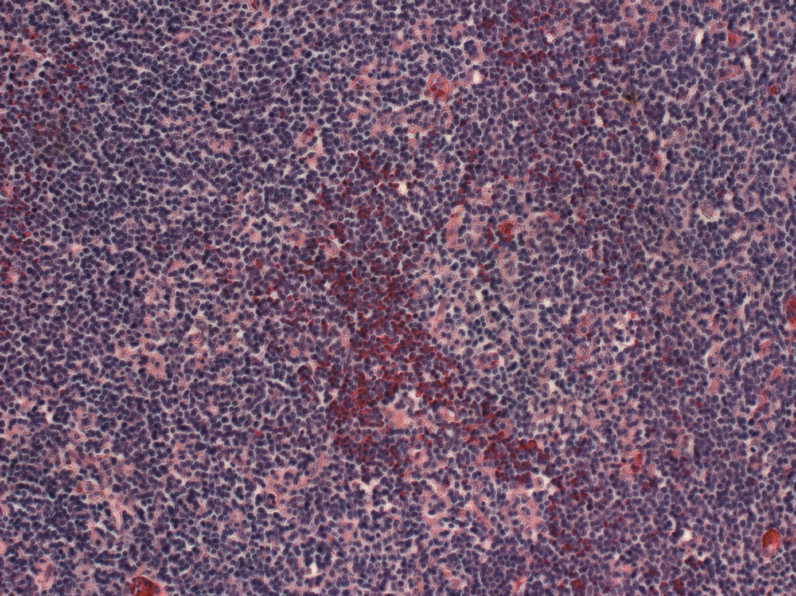
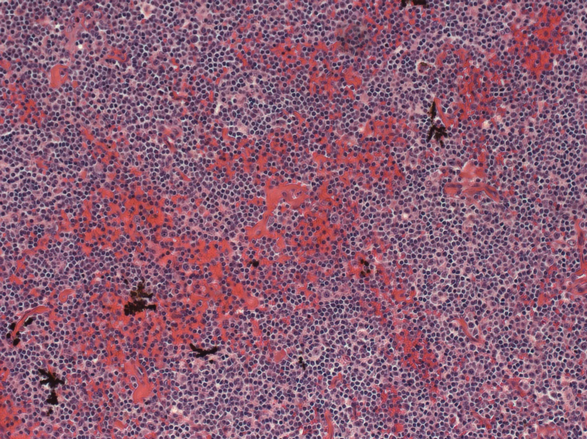
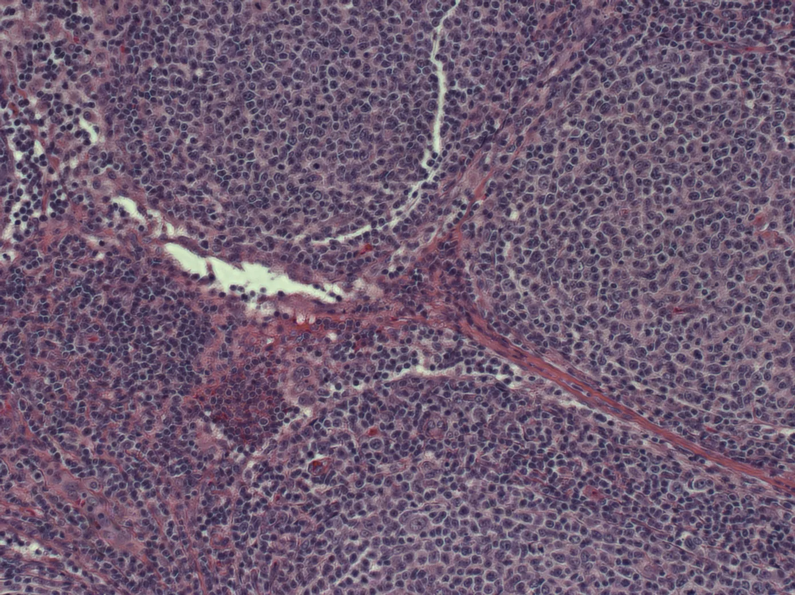
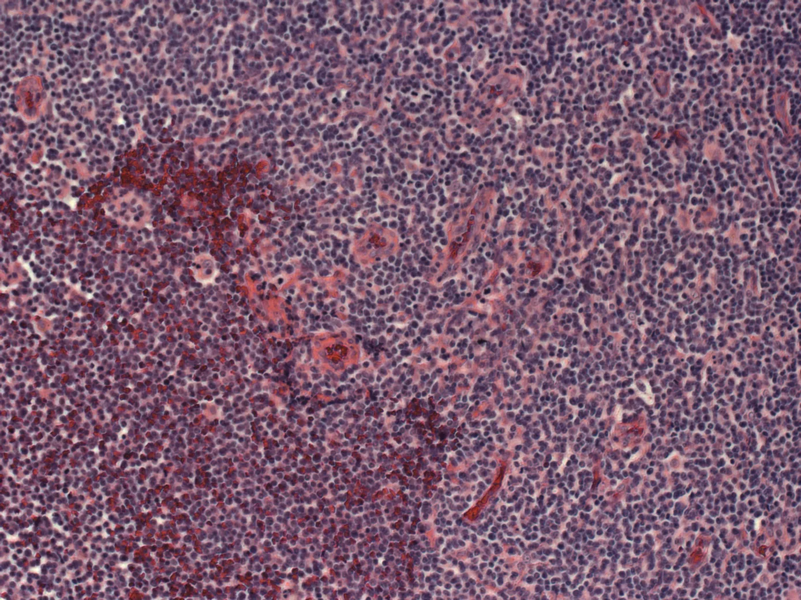

# Malignant Lymphoma Classification 

<div align="center">
    <a href="https://github.com/openmedlab/"></a>
</div>
<p style="text-align:center;font-size:10px;"><em></em></p>

## Dataset Information

Malignant lymphoma is a type of cancer affecting the lymph nodes. Clinically, there are three typical types of malignant lymphoma: CLL (Chronic Lymphocytic Leukemia), FL (Follicular Lymphoma), and MCL (Mantle Cell Lymphoma). The type of lymphoma can be distinguished through biopsies and Hematoxylin and Eosin (H&E) staining. This dataset is a collection of 2D samples prepared by multiple pathologists from different sites for the image classification task of malignant lymphoma, containing a total of 374 tif format images.

## Dataset Meta Information

| Dimensions | Modality | Task Type       | Anatomical Structures | Anatomical Area | Number of Categories | Data Volume | File Format |
|------------|----------|-----------------|-----------------------|-----------------|----------------------|-------------|-------------|
| 2D         | Pathological sections       | Classification  | Tissue                | Tissue          | 3                    | 374         | .tif        |


### Resolution Details

| Dataset Statistics | size         |
|--------------------|--------------|
| min                | [1388, 1040]   |
| median             | [1388, 1040]   |
| max                | [1388, 1040]   |

## Label Information Statistics

| Type | Count | Percentage |
|------|-------|------------|
| CLL (Chronic Lymphocytic Leukemia) | 113 | 30.2% |
| FL (Follicular Lymphoma) | 139 | 37.2% |
| MCL (Mantle Cell Lymphoma) | 122 | 32.6% |


## Visualization

<div align="center">
    <a href="https://github.com/openmedlab/"></a>
</div>
<p style="text-align:center;font-size:10px;"><em> CLL example.</em></p>

<div align="center">
    <a href="https://github.com/openmedlab/"></a>
</div>
<p style="text-align:center;font-size:10px;"><em> FL example.</em></p>

<div align="center">
    <a href="https://github.com/openmedlab/"></a>
</div>
<p style="text-align:center;font-size:10px;"><em> MCL example.</em></p>

## File Structure

The file structure of the dataset is as follows, with data divided into three different folders based on ownership: CLL, FL, and MCL.

``` 
Malignant Lymphoma Classification
├── CLL
│   ├── sj-03-476_001.tif
│   ├── sj-03-476_002.tif
│   ├── ...
├── FL
│   ├── sj-05-588-R1_001.tif
│   ├── sj-05-588-R1_002.tif
│   ├── ...
├── MCL
│   ├── sj-05-588-R1_002.tif
│   ├── sj-04-3077-R2_002.tif
│   ├── ...
```

## Authors and Institutions

Nikita V. Orlov (National Institute on Aging, National Institutes of Health DHHS, USA)

Wayne W. Chen (National Cancer Institute, National Institutes of Health DHHS, USA)

David Mark Eckley (National Institute on Aging, National Institutes of Health DHHS, USA)

Tomasz J. Macura (National Institute on Aging, National Institutes of Health DHHS, USA)

Lior Shamir (National Institute on Aging, National Institutes of Health DHHS, USA)

Elaine S. Jaffe (National Institute on Aging, National Institutes of Health DHHS, USA)

Ilya G. Goldberg (National Institute on Aging, National Institutes of Health DHHS, USA)


## Source Information

Official Website: https://www.kaggle.com/datasets/andrewmvd/malignant-lymphoma-classification

Download Link: https://www.kaggle.com/datasets/andrewmvd/malignant-lymphoma-classification/download?datasetVersionNumber=1

Article Address: https://ieeexplore.ieee.org/document/5505922

Publication Date: 2010-07-08

## Citation

``` 
@article{article,
author = {Orlov, Nikita and Chen, Wayne and Eckley, David and Macura, Tomasz and Shamir, Lior and Jaffe, Elaine and Goldberg, Ilya},
year = {2010},
month = {07},
pages = {1003-13},
title = {Automatic Classification of Lymphoma Images With Transform-Based Global Features},
volume = {14},
journal = {IEEE transactions on information technology in biomedicine : a publication of the IEEE Engineering in Medicine and Biology Society},
doi = {10.1109/TITB.2010.2050695}
}
```

Original introduction article is [here](https://zhuanlan.zhihu.com/p/659436826).