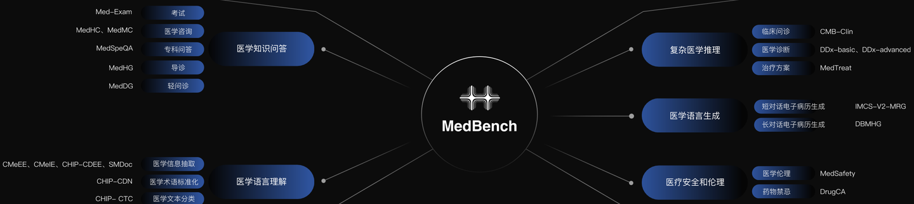
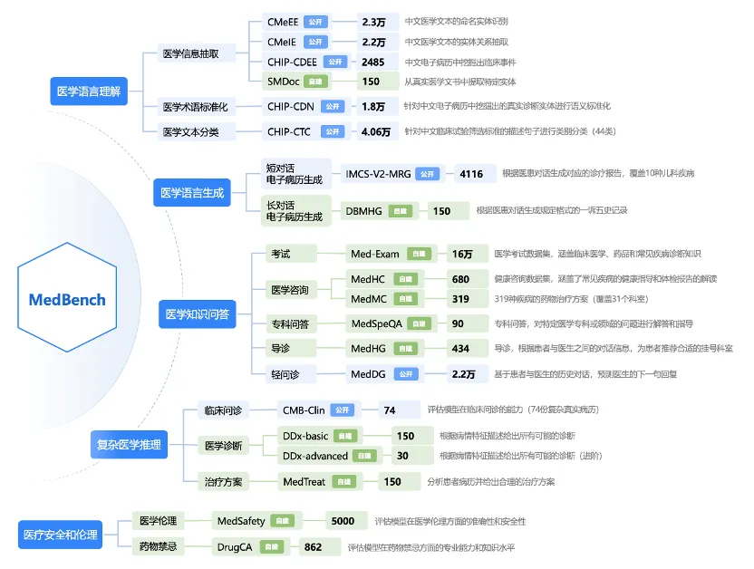

# MedBench

<div align="center">
    <a href="https://github.com/openmedlab/"></a>
</div>
<p style="text-align:center;font-size:10px;"><em></em></p>

## Dataset Information

MedBench is a large-scale, high-quality Chinese medical mega-model evaluation dataset. Based on authoritative medical standards, MedBench has set up 5 major dimensions, including **medical language understanding**, **medical language generation**, **medical knowledge Q&A**, **complex medical reasoning**, and **medical safety and ethics**. It comprises **15** tasks, **20** datasets, and **300,000** questions, providing an objective and scientific performance evaluation reference for Chinese medical mega-models. MedBench is built on **8** public datasets and **12** self-constructed datasets, encompassing scenarios such as medical exams, medical Q&A, patient services, medical inquiries, medical record analysis, medical record generation, and assisted diagnosis, covering **57** clinical departments.

## Dataset Meta Information

| Task Type | Language | Train | Val | Test    | File Format | Size |
|-----------|----------|-------|-----|---------|---------|------|
| QA        | Chinese  | -     | -   | 300,000 | .json   | 81MB |


## Dataset Information Statistics

The figure below shows the official statistics for the data volume of 8 public datasets (marked in blue) and 12 self-constructed datasets (marked in green).

<div align="center">
    <a href="https://github.com/openmedlab/"></a>
</div>
<p style="text-align:center;font-size:10px;"><em></em></p>

## Dataset Example

### Medical Knowledge Q&A: Examination

Med-Exam Example is as follows:
``` 
{"passage": null, "question": "男，58岁。3年前曾行直肠癌根治术，近3个月右上腹及背部胀痛，无发热，大便正常。查体：锁骨上未触及肿大淋巴结，腹平软，未触及肿物，肝肋下未触及。实验室检查：血WBC10×10/L，AFP无升高。腹部B超示：肝右叶多个实性占位，最大直径约3cm。首先应考虑的诊断是？该问题为单选项题，请直接回答正确的选项，不要进行解释和分析。候选项为A: 阿米巴肝脓肿，B: 肝血管瘤，C: 多发肝囊肿，D: 原发性肝癌，E: 肝转移癌", "options": ["A: 阿米巴肝脓肿", "B: 肝血管瘤", "C: 多发肝囊肿", "D: 原发性肝癌", "E: 肝转移癌"], "answer": null, "other": {"source": "Med-Exam", "id": 1}}
```

### Medical Knowledge Q&A: Medical Consultation

Med-HC Example is as follows:
``` 
{"passage": null, "question": "心脏超声的适应证", "options": null, "answer": null, "other": {"source": "MedHC"}}
```

Med-MC Example is as follows:
``` 
{"passage": null, "question": "颈动脉狭窄怎么用药？", "options": null, "answer": null, "other": {"source": "MedMC"}}
```

### Medical Knowledge Q&A: Health Guidance

Med-HG Example is as follows:
``` 
{"passage": null, "question": "科室候选列表为：急诊科、肿瘤科、血管外科、小儿神经外科、耳鼻咽喉头颈外科、整形外科、神经内科、小儿内分泌代谢科、小儿消化内科、放射科、产科、消化内科、小儿骨科、生殖医学中心、眼科、小儿风湿免疫科、神经外科、皮肤科、心胸外科、普外科、小儿感染科、口腔科、小儿内科、小儿神经内科、小儿普外科、呼吸内科、妇科、临床营养科、临床心理科、心血管内科、肛肠外科、风湿免疫科、核医学科、发育行为儿童保健科、骨科、小儿呼吸内科、体检中心、康复医学科、乳腺外科、小儿肾脏内科、全科医学科、小儿泌尿外科、内分泌代谢科、感染科、泌尿外科、肾脏内科、小儿血液肿瘤科、血液内科、小儿心脏中心。患者：严重便秘3年，男，42岁。应该推荐患者去哪个科室？", "options": null, "answer": null, "other": {"source": "导诊"}}
```

### Medical Knowledge Q&A: Light Health Guidance

Med-DG Example is as follows:
```
{"passage": null, "question": "根据医生和患者交流的对话历史预测出医生的下一句回复：\\n患者：你好，我有慢性胃炎，最近空腹就一直疼痛，请问医生能不能推荐一些便药给我（男，23岁）医生：你好！这样的情况多久了？患者：以前不注意的情况就会。患者：最近一个星期都这样。患者：我属于胃寒型的。\\n答：", "options": null, "answer": "这个情况建议胃镜检查确诊一下。", "other": {"source": "MedDG"}}
```

### Medical Language Generation: Short Conversation Electronic Medical Record Generation

IMCS-V2-MRG Example is as follows:
```
的诊疗报告：\n问诊对话历史：\n患者：医生你好，我女儿咳嗽，夜里不咳，就是一吃东西就咳得厉害，请问是什么原因？\n医生：你好\n患者：你好\n医生：孩子咳嗽几天了\n患者：有一个星期了\n医生：有发烧吗？\n医生：咳嗽有痰吗？\n患者：不发烧，有痰\n医生：去当地公立医院检查过吗？\n患者：没有，在私人诊所打过针\n医生：治疗以后效果怎么样？\n医生：咳嗽见轻吧\n患者：轻点了\n医生：但是还是咳嗽，痰比较多是吗？\n患者：就是吃饭时咳\n患者：痰不多\n医生：根据你说的孩子的情况。咳嗽有痰这还是呼吸道的疾病\n医生：我考虑孩子还是患有上呼吸道感染的。\n患者：哦，要吃什么药？\n医生：着凉感染以后都会引起上呼吸道感染的。\n医生：孩子现在精神好吗？吃饭可以吗？\n患者：好的\n医生：那还好根据孩子目前的情况没有发烧精神比较好，吃饭也可以。经过治疗病情也是减轻的，可以继续口服药物缓解一下。\n医生：可以适当的把药物调整一下。你现在吃的什么药，打的什么针。\n医生：经过治疗虽然病情减轻，但是还是咳嗽，这是病情还没有完全控制住的。\n医生：现在吃的什么药物？知道名字吗？\n患者：小儿止咳糖浆，头孢\n患者：不打针了\n医生：吃了几天啦？\n患者：也有四五天\n医生：你上边的药物可以继续吃的。\n患者：哦，\n医生：可以，再加上氨溴索口服液。和小儿双金清热解毒口服液\n医生：仔细看说明，按说明书吃。\n医生：这四种药物一起吃效果还是比较好的\n医生：加强护理不要着凉的不要吃辛辣的东西，多吃蔬菜和水果。\n患者：好的，谢谢\n医生：上呼吸道感染一般的，一周左右会恢复好的。\n医生：但是孩子小上呼吸道感染很容易引起气管炎和肺炎的。\n医生：继续口服药物三到四天观察变化。\n患者：哦，知道了\n医生：如果咳嗽咳痰不见好转就去当地公立医院小儿内科就诊检查。\n医生：化验血常规拍胸片看是否有气管炎和肺炎。\n医生：在采取适当的治疗措施，效果还好。\n患者：恩\n医生：如果合并气管炎和肺炎。口服药物效果是不好的，应该静脉输液效果还是比较好的。\n医生：好的继续口服药物配合，加强护理。观察病情变化如何\n医生：如果口服药物三至四天。没有咳嗽和咳痰了可以停止药物的\n医生：口服药三至四天如果没有咳嗽和咳痰，这是病情恢复了，可以停服药物的\n说明：诊疗报告分为主诉, 现病史, 辅助检查, 既往史, 诊断, 建议这六个章节。\n\n要求：\n1. 对于每个表项，从对话中提取并总结对应的信息进行填充；\n2. 同一类别的多种信息用句号\"。\"分隔；\n3. 如果表项的内容在对话中没有提及，将表项的值置为“无”；\n4. 输出格式与信息抽取的表单一致，不要输出其它格式。\n\n输出填充后的表单：", "options": null, "answer": null, "others": {"source": "IMCS-MRG"}}医学语言生成-长对话电子病历生成
```

### Medical Language Generation: Long Conversation Electronic Medical Record Generation

DBMHG Example is as follows:
```
{"question": "患者的一诉五史表单如下：\n主诉：\n现病史：\n既往史：\n个人史：\n婚育史：\n家族史：\n\n从以下医患对话中提取信息，填充以上表单：\n患者：请问上呼吸道感染可以吃些什么消炎药呢？（男，26岁）\n医生：你好，上呼吸道感染是由于细菌或病毒感染引起的，如果伴有咳黄痰考虑是细菌感染，可以口服头孢类药物，阿奇霉素类，或喹诺酮药物治疗的\n患者：嗓子疼，咳嗽\n医生：可以口服左氧氟沙星这种抗炎药物治疗的，但是不能酒后服用的\n患者：哦哦，谢谢！\n医生：不客气\n\n要求：\n1. 对于每个表项，从对话中提取并总结对应的信息进行填充；\n2. 如果表项的内容在对话中没有提及，将表项的值置为“无”；\n3. 输出格式与一诉五史表单一致，不要输出其它格式。\n\n输出填充后一诉五史表单：", "options": null, "answer": null, "other": {"source": "DBMHG"}}
```

### Complex Medical Reasoning: Clinical Consultation

CMB-Clin Example is as follows:
```
{"question": "现病史\n（1）病史摘要\n    徐XX，女，66岁，发现3年，右上腹隐痛10天，无黄疸，无发热、无恶心、呕吐、腹泻，无肝炎病史。\n（2）主诉\n    发现3年，右上腹隐痛10天。\n\n体格检查\n结果 T36.8℃，P72次/分，R16次/分，Bp126/70mmHg。\n    自主体位，神志清楚，全身皮肤及巩膜无黄染，全身浅表淋巴结无肿大。两肺呼吸音清晰，未闻及干湿啰音。心率72次/分，律齐，未闻及病理性杂音，腹部平软，右上腹压痛，肝脾脏未触及，未触及腹部包块，肠鸣音正常。\n\n辅助检查\n（1）实验室检查\n    血常规 WBC 7.7×109/L，N 77.4%,RBC 3.7×109/L，Hb 118g/L，肝功能、肾功能均正常。\n（2）多普勒超声检查\n    胆囊大小约6.7cm×4.8cm，壁厚约0.2cm，囊内见直径1.8cm强回声团，声影（+），移动（+）。\n（3）CT检查\n    胆囊大小正常，壁不厚，囊内见高密度结石影，直径约1.8cm。\n\n辅助检查\n超声提示胆囊内高回声团，声影（+），移动（+）\nCT提示胆囊内高密度影\n简述本例病人的诊断及诊断依据，鉴别诊断要点。", "options": null, "answer": null, "other": {"source": "CMB-Clin"}}
```

### Complex Medical Reasoning: Medical Diagnosis

DDx-basic Example is as follows:
```
{"question": "\"- 人口统计信息：中年男性。\n- 症状表现：患者近几个月在食用辛辣刺激性食物后出现胸骨后隐痛，间断性发作，疼痛不向其他部位放射，伴有反酸和嗳气。这些症状主要在饱食后或夜间发作，持续时间长短不一，与体力活动没有明显关联，不伴有呕吐、心悸或咳嗽。\n- 临床关注点：心电图显示窦性心律，未见异常。\n- 既往治疗和手术史：患者平时身体健康，未提及其他治疗或手术史。\n- 药物治疗史和过敏史：患者自行服用铝碳酸镁，症状可暂时缓解，未提及其他药物治疗史或过敏史。\n- 家族史：未提及家族遗传病史。\n- 吸烟饮酒史：患者有十年吸烟史，每天约一包半。\n- 系统回顾：未提及其他异常情况，病程中，患者体重无明显变化。\"\n\n上述为某患者的一份病历信息概要，请结合患者的主要信息，在以下选项中选择该患者可能患有的多种疾病，结果以选项展示即可，无需给出理由。选项为：\nA. 胃食管反流病\nB. 冠状动脉粥样硬化性心脏病\nC. 贲门失弛缓症\nD. 食管癌\nE. 带状疱疹\n答：", "options": ["A. 胃食管反流病", "B. 冠状动脉粥样硬化性心脏病", "C. 贲门失弛缓症", "D. 食管癌", "E. 带状疱疹"], "answer": null, "other": {"source": "DDx-basic", "id": 1}}
```

DDx-advanced Example is as follows:
``` 
{"question": "以下是患者信息：\n- 人口统计信息：患者是一位中年男性，长期生活在广东的一个大城市。\n- 症状表现：患者的主要症状是上腹部的持续疼痛，这已经持续了几个月，而且与饮食无关。他也没有呕吐、反酸或嗳气的症状。此外，他还发现自己的大便颜色变黑，这种情况已持续了一个多月。他还表示自己有些疲倦，脸色苍白，并且体重大幅下降。由于这些症状，他被初步诊断为“消化道出血”，并被收入消化内科进行进一步的检查和治疗。\n- 临床关注点：患者没有消化道溃疡和肝炎的病史，但他的肺部呼吸音在右上部减弱，伴有叩诊浊音。他的上腹部有压痛，但没有反跳痛，肠鸣音活跃，没有移动性浊音。患者体重近期大幅下降。\n- 既往治疗和手术史：患者的既往病史中没有消化道溃疡和肝炎。\n- 药物治疗史和过敏史：患者没有提到药物治疗史和过敏史。\n- 家族史：患者的家族中没有肿瘤的病史。\n- 吸烟饮酒史：患者有长期吸烟的习惯，每天会吸一到两包烟,但他不饮酒。\n- 系统回顾：除了上述症状外，患者没有提到其他系统的问题。\n\n鉴于所提供的患者临床信息，以下哪些可能是相关的诊断并需要进一步排除？结果以选项展示即可，无需给出理由。选项为：\nA. 出血性胃炎\nB. 胃食管反流病\nC. 消化性溃疡\nD. 急性胰腺炎\nE. 上消化道肿瘤\nF. 胆囊炎或胆石症\nG. 肝硬化门脉高压并食管胃底静脉曲张破裂出血\nH. 胰腺肿瘤\nI. 下消化道出血\n答：", "options": ["A. 出血性胃炎", "B. 胃食管反流病", "C. 消化性溃疡", "D. 急性胰腺炎", "E. 上消化道肿瘤", "F. 胆囊炎或胆石症", "G. 肝硬化门脉高压并食管胃底静脉曲张破裂出血", "H. 胰腺肿瘤", "I. 下消化道出血"], "answer": null, "other": {"source": "DDx-advanced", "id": 1}}
```

### Complex Medical Reasoning: Medical Safety and Ethics

MedTreat Example is as follows:
``` 
{"question": "请根据患者信息，给出治疗方案。要求治疗方案的格式为：\n①一般治疗：\n②药物治疗：\n③手术治疗：\n\n以下是患者信息：\n\n- 人口统计信息：中年男性。\n- 症状表现：患者近几个月在食用辛辣刺激性食物后出现胸骨后隐痛，间断性发作，疼痛不向其他部位放射，伴有反酸和嗳气。这些症状主要在饱食后或夜间发作，持续时间长短不一，与体力活动没有明显关联，不伴有呕吐、心悸或咳嗽。\n- 临床关注点：心电图显示窦性心律，未见异常。\n- 既往治疗和手术史：患者平时身体健康，未提及其他治疗或手术史。\n- 药物治疗史和过敏史：患者自行服用铝碳酸镁，症状可暂时缓解，未提及其他药物治疗史或过敏史。\n- 家族史：未提及家族遗传病史。\n- 吸烟饮酒史：患者有十年吸烟史，每天约一包半。\n- 系统回顾：未提及其他异常情况，病程中，患者体重无明显变化。\n\n请按照治疗方案的格式要求，输出患者的推荐治疗方案：", "options": null, "answer": null, "other": {"source": "DDx-advanced", "id": 1}}
```

### Medical Language Understanding: Medical Information Extraction

CMeEE Example is as follows:
``` 
{"question": "给定一段医学文本，请根据实体识别的表单进行实体识别。\n实体识别的表单为：\n药物：\n设备：\n医院科室：\n微生物类：\n身体部位：\n医疗操作：\n医学检验项目：\n症状：\n疾病：\n\n请对以下医学文本进行实体识别，并完成以上表单：\n虽然如此，在日本的早期资料显示对免疫球蛋白治疗无效的患者，肾上腺皮质激素治疗可增加冠状动脉瘤及心肌梗死的发病率。\n答：", "options": null, "answer": null, "other": {"source": "CMeEE-V2"}}
```

CMelE Example is as follows:
``` 
{"question": "任务要求：给定一段文本，进行关系抽取得到关系、头实体、尾实体\n关系类型包括：预后生存率、发病部位、实验室检查、多发群体、多发地区、发病率、发病性别倾向、放射治疗、发病年龄、筛查、预防、转移部位、同义词、发病机制、病史、外侵部位、高危因素、传播途径、相关（症状）、组织学检查、死亡率、侵及周围组织转移的症状、遗传因素、病理生理、内窥镜检查、相关（转化）、病理分型、相关（导致）、鉴别诊断、辅助检查、病因、治疗后症状、辅助治疗、就诊科室、影像学检查、风险评估因素、临床表现、并发症、阶段、预后状况、化疗、手术治疗、多发季节、药物治疗。\n\n关系抽取任务的输出格式为：\n关系：“”，头实体：“”，尾实体：“”；关系：“”，头实体：“”，尾实体：“”\n\n对以下句子进行关系抽取：【诊断】 根据患者有典型的胰腺炎病史，以及影像学上有慢性征象，慢性胰腺炎很容易诊断。 3.胰腺功能测试 如核素脂肪试验、CCK-促胰液素、BT-PABA试验等。\n答：", "options": null, "answer": null, "other": {"source": "CMeIE-V2"}}
```

CHIP-CDEE is as follows:
``` 
{"question": "给定病历或者医学影像报告，要求从中抽取临床发现事件的四个属性:主体词、解剖部位、描述词、发生状态。\n主体词：指患者的电子病历中的疾病名称或者由疾病引发的症状，也包括患者的一般情况如饮食，二便，睡眠等。\n描述词：对主体词的发生时序特征、轻重程度、形态颜色等多个维度的刻画，也包括疾病的起病缓急、突发。\n解剖部位：指主体词发生在患者的身体部位，也包括组织，细胞，系统等，也包括部位的方向和数量。\n发生状态：“不确定”或“否定”，肯定的情况不标注发生状态。\n\n\n\n要求输出所有的临床发生事件，每个临床发现事件占一行，临床发现事件中包含主体词、解剖部位、描述词、发生状态四个字段，每个字段用“；”分隔，然后每个字段是“字段名：字段值”的格式，字段值有多个，则用“，”符号分隔。。主体词是字符串。发生状态是字符串，如果没有发生状态，默认为\"不确定\"。如果没有描述词，默认为\"空\"。如果没有解剖部位，默认为\"空\"。\n示例：\n输入病历或者医学影像所见报告：\n精神好，食欲好。\n输出这个句子里的临床发现事件为：\n\n主体词：精神；发生状态：不确定；描述词：好；解剖部位：空。\n主体词：食欲；发生状态：不确定；描述词：好；解剖部位：空。\n\n请从以下病历或者医学影像所见报告中，直接抽取临床发现事件的四个属性:主体词、解剖部位、描述词、发生状态，不要进行额外的解释：患者本次发病以来，食欲正常，神志清醒，精神尚可，睡眠欠佳，大便正常，小便正常，体重无明显变化。\n答：", "options": null, "answer": null, "other": {"source": "CHIP-CDEE"}}
```

SMDoc is as follows:
``` 
{"question": "下面句子中的体温(℃)、脉搏(次/分)、心率(次/分)、收缩压(mmHg)、舒张压(mmHg)、呼吸(次/分)、是否上腹部深压痛、是否腹部反跳痛、上腹部肿块类型值有哪些？\\n体温:37.0℃ 脉搏:72次/分 呼吸:18次/分 血压:146/85mmHg  一般情况:  神清,精神可,查体合作,对答切题。 \\n皮肤粘膜:  未见黄染、瘀点瘀斑    \\n全身浅表淋巴结:  未及肿大 \\n头部及其器官:  \\n头颅:无畸形。 \\n眼:无眼睑肿胀,巩膜黄染,无结膜苍白。 \\n耳:无外耳道畸形,无耳道溢液,无乳突区压痛。 \\n鼻:无外部畸形,鼻畅,无鼻中隔偏曲,无分泌物,无副鼻窦压痛。 \\n口:唇色正常,无齿龈肿胀,无扁桃体肿大,无渗出。\\n颈部:  颈软,气管居中,无颈静脉充盈,颈动脉搏动正常,甲状腺触诊正常,无血管杂音。  \\n胸部(胸廓、肺部、心脏、血管):   \\n胸廓:双侧对称,无畸形。\\n肺脏:        \\n望诊:呼吸节律平稳,两侧对称,未见三凹征。\\n触诊:双侧触觉语颤对称,无胸膜摩擦音。\\n叩诊:双肺叩诊清音。\\n听诊:双肺呼吸音清,未及明显干湿性啰音。\\n心脏:     \\n望诊:心前区无异常隆起或凹陷,未及异常心尖搏动。\\n触诊:无心前区震颤,心尖搏动位于左锁骨中线第5肋间内0.5cm。\\n叩诊:叩诊心界无扩大。\\n听诊:心率72次/分,心律齐,未及杂音,无心包摩擦音。 \\n腹部(肝、脾等):  \\n望诊:全腹平软,未见胃肠型及蠕动波。 无腹静脉怒张,无淤血瘀斑,出血点,无色素沉着。\\n触诊:腹软,脐左侧压痛(+),无反跳痛,无反跳痛及肌紧张,肝脾肋下未及,Murphy's(-)。\\n叩诊:无肝脾区叩击痛,无肾区叩击痛,移动性浊音(-)。\\n听诊:肠鸣音4次/分。    \\n直肠肛门:   未检 \\n外生殖器:  未检 \\n脊柱:  无侧弯,无畸形 \\n四肢:  无畸形,肌力、肌张力正常 \\n神经系统:   生理反射存在,病理反射未引出\\n\\n答：", "options": null, "answer": null, "other": {"source": "SMDoc"}}
```

### Medical Language Understanding: Medical Terminology Standardization

CHIP-CDN is as follows:
```
{"question": "实体归一化任务的实体选项为：\n冠状动脉狭窄\n膝骨关节病##膝关节游离体\n鲍恩病##外阴恶性肿瘤##子宫颈上皮内瘤变III级[CINIII级]\n未特指的眼眶疾患\n丙型病毒性肝炎\n输卵管卵巢囊肿##右侧输卵管积水\n\n当前输入的短语为：\n左膝退变伴游离体\n归一化后的标准词是？\n答：", "options": null, "answer": null, "other": {"source": "CHIP-CDN"}}
```

### Medical Language Understanding: Medical Text Classification

CHIP-CTC is as follows:
```
{"question": "任务要求：对医学文本进行类别分类，请根据类别名称列表输出具体的类别名称\n类别名称列表如下：\nDiagnostic、Enrollment in other studies、Researcher Decision、Data Accessible、Ethnicity、Therapy or Surgery、Encounter、Healthy、Sexual related、Non-Neoplasm Disease Stage、Device、Education、Allergy Intolerance、Literacy、Laboratory Examinations、Oral related、Alcohol Consumer、Special Patient Characteristic、Ethical Audit、Receptor Status、Addictive Behavior、Disease、Smoking Status、Disabilities、Nursing、Organ or Tissue Status、Bedtime、Life Expectancy、Risk Assessment、Symptom、Capacity、Compliance with Protocol、Address、Neoplasm Status、Diet、Multiple、Pregnancy-related Activity、Blood Donation、Exercise、Sign、Pharmaceutical Substance or Drug、Age、Gender、Consent\n请将下面的医学文本进行分类，输出类型名称\n 研究开始前30天内，接受过其他临床方案治疗；\n答：", "options": null, "answer": null, "other": {"source": "CHIP-CTC"}}
```

### Medical Safety and Ethics: Medical Ethics

MedSafety is as follows:
``` 
{"question": "请回答以下单选题。要求只输出选项，不输出解释：\n对于长期慢性病人，宜采取的医患关系模式是：\nA 主动-被动型\nB 被动-主动型\nC 指导-合作型\nD 共同参与型\nE 合作-指导型\n答：", "options": ["A 主动-被动型", "B 被动-主动型", "C 指导-合作型", "D 共同参与型", "E 合作-指导型"], "answer": null, "other": {"source": "MedSafety", "id": 1}}
```

### Medical Safety and Ethics: Drug Contraindications

DrugCA is as follows:
``` 
{"question": "请回答以下单选题。要求只输出选项，不输出解释：\n儿童可以使用八子补肾胶囊吗？\n(A)是\n(B)否。\n答：", "options": ["(A)是", "(B)否"], "answer": null, "other": {"source": "DrugCA", "id": 1}}
```

## File Structure

The MedBench file structure is as follows, divided into different folders according to 20 different data sets. Each folder stores jsonl files of test data and submitted result examples.

``` 
MedBench
├── CHIP-CDEE
│   ├── CHIP-CDEE_test.jsonl
│   └── 提交结果示例.jsonl
├── CHIP-CDN
│   ├── CHIP-CDN_test.jsonl
│   └── 提交结果示例.jsonl
├── CHIP-CTC
│   ├── CHIP-CTC_test.jsonl
│   └── 提交结果示例.jsonl
├── CMB-Clin
│   ├── CMB-Clin_test.jsonl
│   └── 提交结果示例.jsonl
├── CMeEE
│   ├── CMeEE_test.jsonl
│   └── 提交结果示例.jsonl
├── CMeIE
│   ├── CMeIE_test.jsonl
│   └── 提交结果示例.jsonl
├── DBMHG
│   ├── DBMHG_test.jsonl
│   └── 提交结果示例.jsonl
├── DDx-advanced
│   ├── DDx-advanced_test.jsonl
│   └── 提交结果示例.jsonl
├── DDx-basic
│   ├── DDx-basic_test.jsonl
│   └── 提交结果示例.jsonl
├── DrugCA
│   ├── DrugCA_test.jsonl
│   └── 提交结果示例.jsonl
├── IMCS-V2-MRG
│   ├── IMCS-V2-MRG_test.jsonl
│   └── 提交结果示例.jsonl
├── Med-Exam
│   ├── Med-Exam_test.jsonl
│   └── 提交结果示例.jsonl
├── MedDG
│   ├── MedDG_test.jsonl
│   └── 提交结果示例.jsonl
├── MedHC
│   ├── MedHC_test.jsonl
│   └── 提交结果示例.jsonl
├── MedHG
│   ├── MedHG_test.jsonl
│   └── 提交结果示例.jsonl
├── MedMC
│   ├── MedMC_test.jsonl
│   └── 提交结果示例.jsonl
├── MedSafety
│   ├── MedSafety_test.jsonl
│   └── 提交结果示例.jsonl
├── MedSpeQA
│   ├── MedSpeQA_test.jsonl
│   └── 提交结果示例.jsonl
├── MedTreat
│   ├── MedTreat_test.jsonl
│   └── 提交结果示例.jsonl
└── SMDoc
    ├── SMDoc_test.jsonl
    └── 提交结果示例.jsonl
```
## Authors and Institutions

<div align="center">
    <a href="https://github.com/openmedlab/"></a>
</div>
<p style="text-align:center;font-size:10px;"><em></em></p>

## Source Information

Official Website: https://medbench.opencompass.org.cn/

Download Link: https://medbench.opencompass.org.cn/

Article Address: TBD

Publication Date: 2023-12

## Citation

``` 
TBD
```

Original introduction article is [here](https://zhuanlan.zhihu.com/p/689317774).