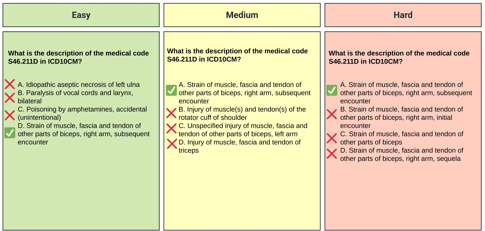

# MedConceptsQA

<div align="center">
    <a href="https://github.com/openmedlab/"></a>
</div>
<p style="text-align:center;font-size:10px;"><em></em></p>

## Dataset Information

MedConceptsQA is a dedicated open source benchmark for medical concepts question answering. 
The benchmark comprises of questions of various medical concepts across different vocabularies: diagnoses, procedures, and drugs. 
The questions are categorized into three levels of difficulty: easy, medium, and hard. 
We conducted evaluations of the benchmark using various Large Language Models. 
Our benchmark serves as a valuable resource for evaluating the abilities of Large Language Models to interpret medical codes and distinguish between medical concepts. 
Our findings showed most of the state-of-the-art CLLMs, despite being pre-trained on medical data, achieved accuracy levels close to random guessing on this benchmark. However, general-purpose models (Llama3-70B and GPT-4) outperformed CLLMs. Notably, GPT-4 exhibited the best performance, although its accuracy remained insufficient for certain datasets in our benchmark.

**Highlights:**
* MedConceptsQA is an open-source benchmark for medical concepts question answering.
* Covers three difficulty levels and includes diagnoses, procedures, and medications.
* Shows challenges Clinical LLMs face in interpreting and distinguishing medical codes.
* Most of Clinical LLMs performed similarly to random guessing on the benchmark.
* General LLMs outperformed Clinical LLMs, despite their focus is not the medical domain.


## Dataset Meta Information

| Task Type | Language       | Val | Test | File Format | Size  |
|-----------|----------------|-----|------|------------|-------|
| QA        | English | 60   | 820,000   | .arrow      | 300MB |


## Dataset Information Statistics

| Vocabulary | Level  | Number of Questions |
|------------|--------|---------------------|
| ATC        | Easy   | 6,440               |
| ATC        | Medium | 6,440               |
| ATC        | Hard   | 5,938               |
| ICD10-CM   | Easy   | 94,580              |
| ICD10-CM   | Medium | 81,757              |
| ICD10-CM   | Hard   | 88,013              |
| ICD10-PROC | Easy   | 190,987             |
| ICD10-PROC | Medium | 190,987             |
| ICD10-PROC | Hard   | 88,582              |
| ICD9-CM    | Easy   | 17,736              |
| ICD9-CM    | Medium | 17,736              |
| ICD9-CM    | Hard   | 16,858              |
| ICD9-PROC  | Easy   | 4,670               |
| ICD9-PROC  | Medium | 4,670               |
| ICD9-PROC  | Hard   | 4,438               |


## File Structure

The MedConceptsQA dataset is organized into several structured files, each containing medical question-answering instances designed for training and evaluation of models in the medical domain. Here’s a brief overview of the dataset structure:

``` 
MedConceptsQA
│
├── atc_easy
│   ├── dev-00000-of-00001.parquet
│   └── test-00000-of-00001.parquet
│
├── atc_hard
│   ├── dev-00000-of-00001.parquet
│   └── test-00000-of-00001.parquet
│
├── icd10cm_easy
│   ├── dev-00000-of-00001.parquet
│   └── test-00000-of-00001.parquet
│
├── icd10cm_hard
│   ├── dev-00000-of-00001.parquet
│   └── test-00000-of-00001.parquet
│
├── icd10proc_easy
│   ├── dev-00000-of-00001.parquet
│   └── test-00000-of-00001.parquet
│
└── icd10proc_hard
    ├── dev-00000-of-00001.parquet
    └── test-00000-of-00001.parquet
```

## Authors and Institutions

Ofir Ben Shoham (Ben-Gurion University, Israel)

Nadav Rappoport (Ben-Gurion University, Israel)

## Source Information

Official Website: https://nadavlab.github.io/MedConceptsQA-website/

Download Link: https://huggingface.co/datasets/ofir408/MedConceptsQA

Article Address: https://www.sciencedirect.com/science/article/pii/S0010482524011740

Publication Date: 09/2024. Published in the journal: _Computers and Biology in Medicine_.

## Citation

``` 
@article{SHOHAM2024109089,
    title = {MedConceptsQA: Open source medical concepts QA benchmark},
    journal = {Computers in Biology and Medicine},
    volume = {182},
    pages = {109089},
    year = {2024},
    issn = {0010-4825},
    doi = {https://doi.org/10.1016/j.compbiomed.2024.109089},
    url = {https://www.sciencedirect.com/science/article/pii/S0010482524011740},
    author = {Ofir Ben Shoham and Nadav Rappoport}
```

Original introduction article is [here](https://www.sciencedirect.com/science/article/pii/S0010482524011740).