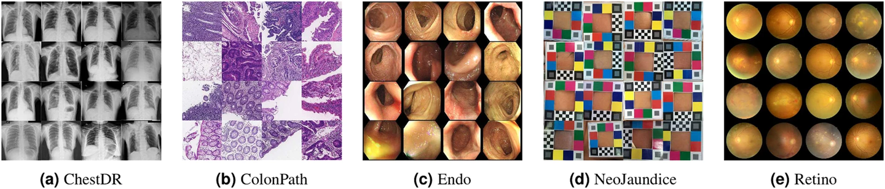
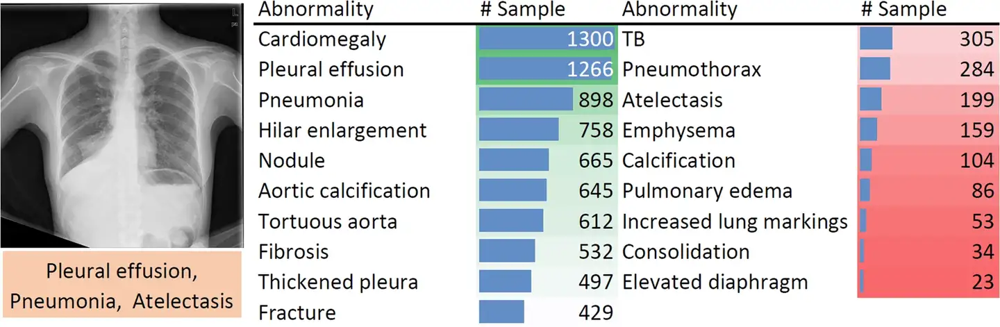
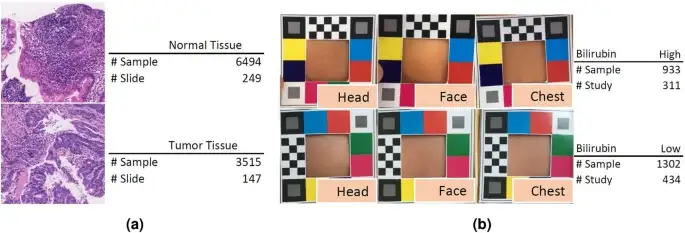
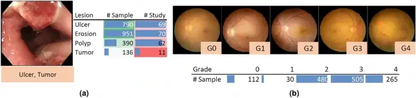

# MedFMC

<div align="center">
    <a href="https://github.com/openmedlab/"></a>
</div>
<p style="text-align:center;font-size:10px;"><em></em></p>

## Dataset Information

Foundation models are typically trained with large-scale data and have achieved tremendous success across various visual and language applications. Recent advancements have further enabled these models to efficiently adapt to downstream tasks, even with a limited number of training samples, such as in the context of learning. However, the application of this learning paradigm in medical image analysis remains limited, primarily due to the lack of publicly accessible data and benchmarks. The authors aim to explore foundation models adapted for medical image classification and introduce a new dataset and benchmark for evaluation, specifically to test the overall performance of large-scale foundation models in adapting to a range of diverse real-world clinical tasks. The authors collected five sets of medical imaging data from multiple institutions, targeting various real-world clinical tasks (totaling 22,349 images), including X-ray chest disease screening, pathological lesion tissue screening, lesion detection in endoscopic images, neonatal jaundice assessment, and diabetic retinopathy grading. Using the proposed dataset, the results of various baseline methods are presented from the perspectives of accuracy and cost-effectiveness.

<div align="center">
    <a href="https://github.com/openmedlab/"></a>
</div>
<p style="text-align:center;font-size:10px;"><em>Figure 1. Sample images of the five subsets.</em></p>

In the previous article, we introduced the three tasks involved separately.

- [MedFMC Chest](./MedFM_ChestDR2023.md)
- [MedFMC Colon](./MedFM_Colon.md)
- [MedFMC Endo](./MedFM_Endo.md)

## Dataset Meta Information

| Dimension | Modality                                                      | Task Type      | Anatomical Region                       | Number of Classes | Dataset Size | File Format |
|-----------|---------------------------------------------------------------|----------------|-----------------------------------------|-------------------|--------------|-------------|
| 2D        | X-ray, Pathology, Endoscopy, Digital Camera, Fundus Imaging   | Classification | Chest, Colon, Head, Face, Chest, Fundus | 19, 2, 2, 4, 2, 5 | 22,349       | png         |


### Resolution Details

| Dataset Statistics | size         |
|--------------------|--------------|
| min                | (567, 567)   |
| median             | (1280, 1024) |
| max                | (2953, 2965) |

## Label Information Statistics

| Name       | Modality     | Dimension | Sample Size | Image Size      | Target                | Task          | Number of Classes |
|------------|--------------|-----------|-------------|-----------------|-----------------------|---------------|-------------------|
| ChestDR    | X-ray        | 2D        | 4,848       | 2953*2, 965     | Thoracic Abnormality  | Multi-label   | 19                |
| ColonPath  | Pathology    | 2D        | 10,009      | 1024*1024       | Gastrointestinal Lesion | Binary      | 2                 |
| Endo       | Endoscopy    | 2D        | 3,865       | 1280*1024       | Colorectal Lesion     | Multi-label   | 4                 |
| NeoJaundice| Digital camera | 2D      | 2,235       | 567*567         | Neonatal Jaundice     | Binary        | 2                 |
| Retinography | 2D         | 2D        | 1,392       | 2736*1824       | Diabetic Retinopathy  | Multi-class   | 5                 |

| Dataset     | Abnormality               | Chinese Translation |
|-------------|---------------------------|---------------------|
| ChestDR     | Cardiomegaly              | 心脏扩大                |
|             | Pleural effusion          | 胸膜积液                |
|             | Pneumonia                 | 肺炎                  |
|             | Hilar enlargement         | 肺门增大                |
|             | Nodule                    | 结节                  |
|             | Aortic calcification      | 主动脉钙化               |
|             | Tortuous aorta            | 主动脉扭曲               |
|             | Fibrosis                  | 纤维化                 |
|             | Thickened oleura          | 胸膜增厚                |
|             | Fracture                  | 骨折                  |
|             | TB                        | 结核病                 |
|             | Pneumothrax               | 气胸                  |
|             | Atelectasis               | 肺不张                 |
|             | Emphysema                 | 肺气肿                 |
|             | Calcification             | 钙化                  |
|             | Pulmonary edema           | 肺水肿                 |
|             | Increased lung markings   | 肺纹理增多               |
|             | Consolidation             | 肺实变                 |
|             | Elevated diaphragm        | 膈肌升高                |
| ColonPath   | with the lesion tissue    | 含病变组织               |
|             | without the lesion tissue | 不含病变组织              |
| Endo        | ulcer                     | 溃疡                  |
|             | erosion                   | 糜烂                  |
|             | polyp                     | 息肉                  |
|             | tumor                     | 肿瘤                  |
| NeoJaundice | Jaundice                  | 新生儿黄疸               |
|             | no Jaundice               | 没有新生儿黄疸             |
| Retino      | 0: No DR                  | 无糖尿病视网膜病变           |
|             | 1: Mild                   | 轻度                  |
|             | 2: Moderate               | 中度                  |
|             | 3: Severe                 | 重度                  |
|             | 4: Proliferative DR       | 增生性糖尿病视网膜病变         |


## Visualization

<div align="center">
    <a href="https://github.com/openmedlab/"></a>
</div>
<p style="text-align:center;font-size:10px;"><em>Figure 2. Data sample and case summary from ChestDR.</em></p>

<div align="center">
    <a href="https://github.com/openmedlab/"></a>
</div>
<p style="text-align:center;font-size:10px;"><em>Figure 3. Data samples and case summaries for (a) colon pathology and (b) neonatal jaundice.</em></p>

<div align="center">
    <a href="https://github.com/openmedlab/"></a>
</div>
<p style="text-align:center;font-size:10px;"><em>Figure 4. Data samples and case summaries for (a) endoscopy and (b) retina.</em></p>

## File Structure

The dataset file structure is as follows:

``` 
data
├── ChestDR
├── Endo
├── NeoJaudice
├── ColonPath
├── Retino
```

## Authors and Institutions

DequanWang1,2,10, XiaosongWang 1,10, LilongWang1, Mengzhang Li1, Qian Da3, Xiaoqiang Liu4, XiangyuGao5, Jun Shen6, Junjun He1, Tian Shen7, Qi Duan7, Jie Zhao8, Kang Li 1,9, YuQiao1 ✉ & Shaoting Zhang1 ✉

1 Shanghai AI Laboratory, Shanghai, China.

2 Shanghai Jiaotong University, Shanghai, China.

3 Shanghai Ruijing Hospital, School of Medicine, Shanghai Jiao Tong University, Shanghai, China.

4 Shanghai Tenth People’s Hospital of Tongji University, Shanghai, China.

5 Xuzhou Central Hospital, Xuzhou, China.

6 Renji Hospital, School of Medicine, Shanghai Jiao Tong University, Shanghai, China.

7 Sensetime Research, Shanghai, China.

8 The First Afliated Hospital of Zhengzhou University, Zhengzhou, China.

9 West China Hospital, Sichuan University, Chengdu, China.

10 These authors contributed equally: Dequan Wang, Xiaosong Wang.


## Source Information

Official Website: https://github.com/wllfore/MedFMC_fewshot_baseline

Download Link: https://github.com/wllfore/MedFMC_fewshot_baseline

Article Address: https://www.nature.com/articles/s41597-023-02460-0

Publication Date: 2023-09

## Citation

``` 
@article{wang2023real,
  title={A real-world dataset and benchmark for foundation model adaptation in medical image classification},
  author={Wang, Dequan and Wang, Xiaosong and Wang, Lilong and Li, Mengzhang and Da, Qian and Liu, Xiaoqiang and Gao, Xiangyu and Shen, Jun and He, Junjun and Shen, Tian and others},
  journal={Scientific Data},
  volume={10},
  number={1},
  pages={574},
  year={2023},
  publisher={Nature Publishing Group UK London}
}
```

Original introduction article is [here](https://zhuanlan.zhihu.com/p/717723376).