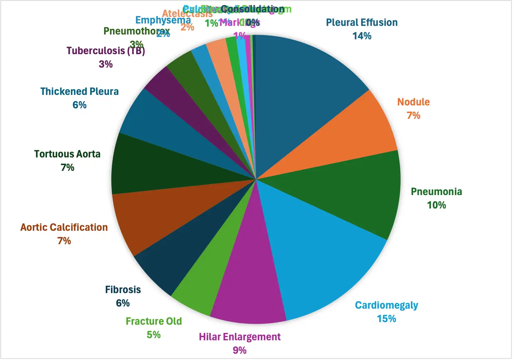
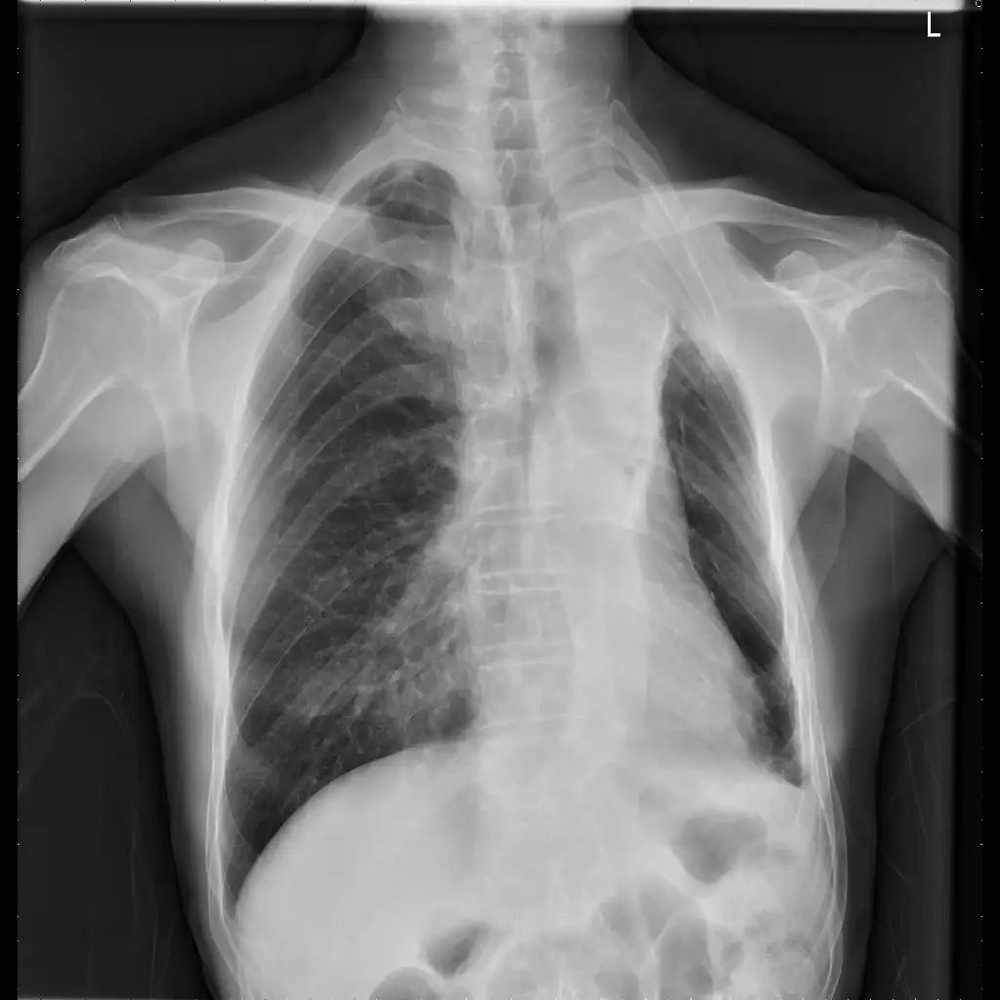

# MedFM ChestDR 2023

<div align="center">
    <a href="https://github.com/openmedlab/"></a>
</div>
<p style="text-align:center;font-size:10px;"><em></em></p>

## Dataset Information

MedFM2023 is a challenge held as part of NeurIPS 2023, aimed at promoting the application of foundational models in the field of medical image analysis, with a particular focus on one-shot or few-shot learning scenarios. This scenario simulates common clinical practice situations where only a small amount of high-quality annotated case data is available for model training and tuning, particularly for rare diseases. Traditional deep learning methods require large datasets for training, while MedFM2023 encourages participants to leverage the powerful representation learning capabilities of foundational models to quickly adapt accurate downstream task models using limited case data. This is crucial for improving the diagnostic accuracy of rare diseases.

The challenge comprises three specific application tasks:
1. Chest disease screening using chest X-ray images.
2. Tumor tissue classification using pathology slide images.
3. Lesion detection in colonoscopy images.

For these three different modality tasks, the competition provides corresponding datasets. This article introduces the MedFM ChestDR chest X-ray disease screening dataset. The introduction articles for the other two datasets are as follows:

[PlaceHolder]

[PlaceHolder]

The MedFM ChestDR dataset aims to classify **19** common chest abnormalities using chest X-ray images. This dataset includes **4,848** frontal chest X-ray images from one hospital, with **2,140** images used as the training set (including images and labels) and 2,708 images as the validation set (only including images). Additionally, there are **2,626** images from another hospital, which will be used for the final evaluation of the methods. Chest X-ray examinations are a commonly used imaging technique in routine clinical practice. Many chest diseases are reported, and further examinations are recommended for differential diagnosis. Due to the high volume and rapid turnaround required in some emergency departments, quick screening and reporting of common chest diseases can greatly improve clinical workflow efficiency.

In this task, participants are encouraged to use publicly available foundational models and adhere to the one-shot/few-shot learning setup (e.g., having only 1, 5, or 10 sample cases per disease category) to develop accurate chest disease screening methods. These methods need to classify 19 common chest abnormalities, thereby assisting clinical practitioners in quickly identifying abnormalities and enhancing efficiency.

## Dataset Meta Information

| Dimensions | Modality | Task Type      | Anatomical Structures | Anatomical Area | Number of Categories | Data Volume | File Format |
|-----------|----------|----------------|-----------------------|-----------------|----------------------|-------------|-------------|
| 2D        | X-Ray    | Classification | Lung                  | Chest           | 19                   | 4848        | PNG         |


### Resolution Details

| Dataset Statistics | size       |
|--------------------|------------|
| min                | [512,512]  |
| median             | [512,512]  |
| max                | [512,512]  |

## Label Information Statistics

| Label | Category                | Number |
|-------|-------------------------|--------|
| 0     | Pleural Effusion        | 1266   |
| 1     | Nodule                  | 655    |
| 2     | Pneumonia               | 898    |
| 3     | Cardiomegaly            | 1300   |
| 4     | Hilar Enlargement       | 758    |
| 5     | Fracture Old            | 429    |
| 6     | Fibrosis                | 532    |
| 7     | Aortic Calcification    | 645    |
| 8     | Tortuous Aorta          | 612    |
| 9     | Thickened Pleura        | 497    |
| 10    | Tuberculosis (TB)       | 305    |
| 11    | Pneumothorax            | 284    |
| 12    | Emphysema               | 159    |
| 13    | Atelectasis             | 199    |
| 14    | Calcification           | 104    |
| 15    | Pulmonary Edema         | 86     |
| 16    | Increased Lung Markings | 53     |
| 17    | Elevated Diaphragm      | 23     |
| 18    | Consolidation           | 34     |


<div align="center">
    <a href="https://github.com/openmedlab/"></a>
</div>
<p style="text-align:center;font-size:10px;"><em>Proportion of each label.</em></p>

## Visualization

<div align="center">
    <a href="https://github.com/openmedlab/"></a>
</div>
<p style="text-align:center;font-size:10px;"><em></em></p>

## File Structure

For the chest X-ray image classification task, we need to use the data from the `MedFMC_train/chest/` and `MedFMC_val/chest/` folders. The chest_train.csv file contains the filenames of the training set images and their corresponding disease labels.

``` 
MedFMC
├── MedFMC_train
│   ├── endo
│   │   ├── image
│   │   │   ├── 01D3F7A1D109A074.png
│   │   │   ├── 01D3F7C76C446D55.png
│   │   │   └── ...
│   │   └── chest_train.csv
│   ├── colon
│   │   └── ...
│   └── chest
│       └── ...
└── MedFMC_val
    ├── endo
    │   ├── image
    │   │   └── ...
    │   └── chest_val.csv
    ├── colon
    │   └── ...
    └── chest
        └── ...
```

## Authors and Institutions

The technical and clinical committee members of MedFM2023 include experts from various renowned institutions. Below is the list of members and their corresponding institutions:

**Technical Committee:**

- Dequan Wang (Shanghai Jiao Tong University, Shanghai, China)
- Xiaosong Wang (Shanghai Artificial Intelligence Laboratory, Shanghai, China)
- Mengzhang Li (Shanghai Artificial Intelligence Laboratory, Shanghai, China)
- Qi Dou (The Chinese University of Hong Kong, Hong Kong, China)
- Xiaoxiao Li (University of British Columbia, Vancouver, Canada)
- Dimitris Metaxas (Rutgers University, New Jersey, USA)
- Shaoting Zhang (Shanghai Artificial Intelligence Laboratory, Shanghai, China)

**Clinical Committee:**

- Qian Da (Ruijin Hospital, Shanghai, China)
- Fangfang Cui (The First Affiliated Hospital of Zhengzhou University, Zhengzhou, Henan, China)
- Feng Gao (The Sixth Affiliated Hospital of Sun Yat-sen University, Guangzhou, China)
- Jun Shen (Renji Hospital, Shanghai, China)
- Kang Li (West China Hospital of Sichuan University, Chengdu, China)

## Source Information

Official Website: https://medfm2023.grand-challenge.org/

Download Link: https://medfm2023.grand-challenge.org/datasets/

Article Address: https://www.nature.com/articles/s41597-023-02460-0

Publication Date: 2023-05

## Citation

``` 
@article{wang2023real,
  title={A real-world dataset and benchmark for foundation model adaptation in medical image classification},
  author={Wang, Dequan and Wang, Xiaosong and Wang, Lilong and Li, Mengzhang and Da, Qian and Liu, Xiaoqiang and Gao, Xiangyu and Shen, Jun and He, Junjun and Shen, Tian and others},
  journal={Scientific Data},
  volume={10},
  number={1},
  pages={574},
  year={2023},
  publisher={Nature Publishing Group UK London}
}
```

Original introduction article is [here](https://zhuanlan.zhihu.com/p/690587807).