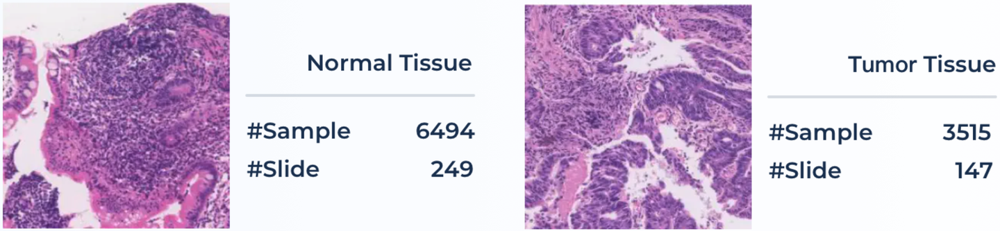
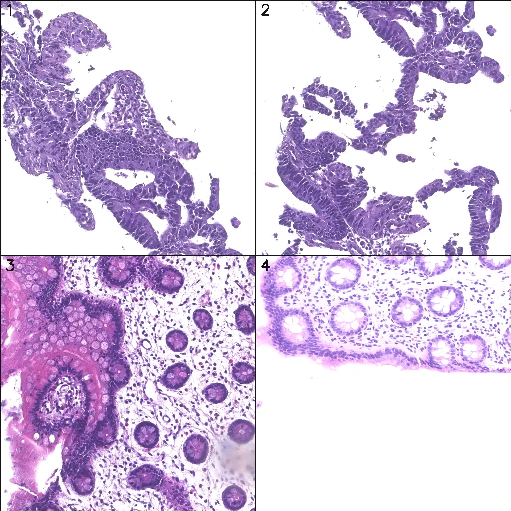

# MedFM Colon 2023

<div align="center">
    <a href="https://github.com/openmedlab/"></a>
</div>
<p style="text-align:center;font-size:10px;"><em></em></p>

## Dataset Information

MedFM2023 is a challenge held as part of NeurIPS 2023, aimed at promoting the application of foundational models in the field of medical image analysis, with a particular focus on one-shot or few-shot learning scenarios. This scenario simulates common clinical practice situations where only a small amount of high-quality annotated case data is available for model training and tuning, particularly for rare diseases. Traditional deep learning methods require large datasets for training, while MedFM2023 encourages participants to leverage the powerful representation learning capabilities of foundational models to quickly adapt accurate downstream task models using limited case data. This is crucial for improving the diagnostic accuracy of rare diseases.

The challenge comprises three specific application tasks:
1. Chest disease screening using chest X-ray images.
2. Tumor tissue classification using pathology slide images.
3. Lesion detection in colonoscopy images.

For these three different modality tasks, the competition provides corresponding datasets. This article introduces the MedFM ChestDR chest X-ray disease screening dataset. The introduction articles for the other two datasets are as follows:

- [MedFM ChestDR](./MedFM_ChestDR2023.md)
- [MedFM Endoscopy](./MedFM_Endo.md)

The goal of the **Pathological Tumor Tissue Classification (Colon)** dataset is to classify tumor tissues in pathology slides from colonoscopy images. This dataset contains 10,009 pathological tissue patches from colonoscopy images of 396 colon cancer patients, with 5,654 patches for training and 4,355 patches for validation. All patch images have a resolution of 1024x1024 pixels. These patch images were extracted using a sliding window technique (window size of 1024x1024, step size of 768) from whole slide images (WSI). They are divided into two types: positive (containing tumor tissue) and negative (no tumor tissue). Additionally, the official data includes an extra 10,650 large tissue patches from 469 patients for final model evaluation, but this part of the data has not been released yet.

In clinical diagnostics, quantifying cancer cells and their regions is an important task for pathologists, helping to detect early tumor cells from small tissue sections. Classifying pathological tissue patches can streamline the workflow of pathologists and assist them in screening for malignant cell areas on slides using a sliding window approach. Given that pathologists may need to examine hundreds of tissue slides each day, this task is time-consuming and labor-intensive. Therefore, this dataset presents a challenging task of automatically classifying pathological tissue patches, aiming to achieve automatic classification of a large number of tissue patches.

## Dataset Meta Information

| Dimensions | Modality  | Task Type      | Anatomical Structures | Anatomical Area | Number of Categories | Data Volume | File Format |
|------------|-----------|----------------|-----------------------|-----------------|----------------------|-------------|-------------|
| 2D         | Pathology | Classification | Colon                 | abdomen       | 2                    | 10009       | PNG         |


### Resolution Details

| Dataset Statistics | size         |
|--------------------|--------------|
| min                | [1024,1024]  |
| median             | [1024,1024]  |
| max                | [1024,1024]  |

## Label Information Statistics

| Label Type                        | Occurrence Count | Occurrence Percentage |
|-----------------------------------|------------------|-----------------------|
| Positive (containing tumor tissue)| 3298             | 32.9%                 |
| Negative (no tumor tissue)        | 6711             | 67.1%                 |

## Visualization

<div align="center">
    <a href="https://github.com/openmedlab/"></a>
</div>
<p style="text-align:center;font-size:10px;"><em>Images 1 and 2 are labeled as tumor, while images 3 and 4 are labeled as normal.</em></p>

## File Structure

For this task, data from the MedFMC_train/colon and MedFMC_val/colon folders should be used. The chest_train.csv file contains the filenames of the training set images and their corresponding disease labels.

``` 
MedFMC
├── MedFMC_train
│   ├── endo
│   │   └── ...
│   ├── colon
│   │   ├── image
│   │   │   ├── 2019-08974-1-5-5_2019-05-28 23_17_50-lv1-33952-9759-6526-5268p0018.png
│   │   │   ├── 2019-06-11 01_00_50-lv1-1956-12720-11095-7901p0079.png
│   │   │   └── ...
│   │   └── colon_train.csv
│   └── chest
│       └── ...
└── MedFMC_val
    ├── endo
    └── ...
    ├── colon
    │   ├── image
    │   │   └── ...
    │   └── colon_val.csv
    └── chest
        └── ...
```

## Authors and Institutions

The technical and clinical committee members of MedFM2023 include experts from various renowned institutions. Below is the list of members and their corresponding institutions:

**Technical Committee:**

- Dequan Wang (Shanghai Jiao Tong University, Shanghai, China)
- Xiaosong Wang (Shanghai Artificial Intelligence Laboratory, Shanghai, China)
- Mengzhang Li (Shanghai Artificial Intelligence Laboratory, Shanghai, China)
- Qi Dou (The Chinese University of Hong Kong, Hong Kong, China)
- Xiaoxiao Li (University of British Columbia, Vancouver, Canada)
- Dimitris Metaxas (Rutgers University, New Jersey, USA)
- Shaoting Zhang (Shanghai Artificial Intelligence Laboratory, Shanghai, China)

**Clinical Committee:**

- Qian Da (Ruijin Hospital, Shanghai, China)
- Fangfang Cui (The First Affiliated Hospital of Zhengzhou University, Zhengzhou, Henan, China)
- Feng Gao (The Sixth Affiliated Hospital of Sun Yat-sen University, Guangzhou, China)
- Jun Shen (Renji Hospital, Shanghai, China)
- Kang Li (West China Hospital of Sichuan University, Chengdu, China)

## Source Information

Official Website: https://medfm2023.grand-challenge.org/

Download Link: https://medfm2023.grand-challenge.org/datasets/

Article Address: https://www.nature.com/articles/s41597-023-02460-0

Publication Date: 2023-05

## Citation

``` 
@article{wang2023real,
  title={A real-world dataset and benchmark for foundation model adaptation in medical image classification},
  author={Wang, Dequan and Wang, Xiaosong and Wang, Lilong and Li, Mengzhang and Da, Qian and Liu, Xiaoqiang and Gao, Xiangyu and Shen, Jun and He, Junjun and Shen, Tian and others},
  journal={Scientific Data},
  volume={10},
  number={1},
  pages={574},
  year={2023},
  publisher={Nature Publishing Group UK London}
}
```

Original introduction article is [here](https://zhuanlan.zhihu.com/p/691104208).