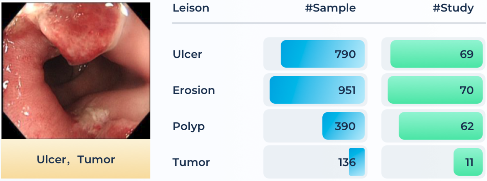
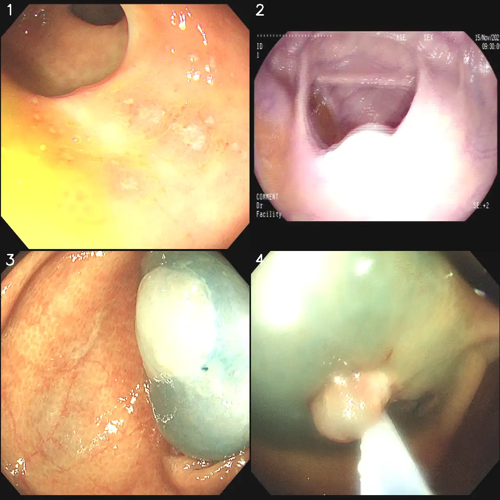

# MedFM Endoscopy 2023

<div align="center">
    <a href="https://github.com/openmedlab/"></a>
</div>
<p style="text-align:center;font-size:10px;"><em></em></p>


## Dataset Information

MedFM2023 is a challenge held as part of NeurIPS 2023, aimed at promoting the application of foundational models in the field of medical image analysis, with a particular focus on one-shot or few-shot learning scenarios. This scenario simulates common clinical practice situations where only a small amount of high-quality annotated case data is available for model training and tuning, particularly for rare diseases. Traditional deep learning methods require large datasets for training, while MedFM2023 encourages participants to leverage the powerful representation learning capabilities of foundational models to quickly adapt accurate downstream task models using limited case data. This is crucial for improving the diagnostic accuracy of rare diseases.

The challenge comprises three specific application tasks:
1. Chest disease screening using chest X-ray images.
2. Tumor tissue classification using pathology slide images.
3. Lesion detection in colonoscopy images.

For these three different modality tasks, the competition provides corresponding datasets. This article introduces the MedFM ChestDR chest X-ray disease screening dataset. The introduction articles for the other two datasets are as follows:

- [MedFM ChestDR](./MedFM_ChestDR2023.md)

- [MedFM Colonoscopy](./MedFM_Colon.md)

Lesion Detection in Colonoscopy Images (Endo) dataset aims to perform multi-class classification of four common lesion types in colonoscopy images, where an image may contain one or more labels among normal, polyp, ulcer, and bleeding. This dataset publicly provides 3,865 images, with 1,810 images for training and 2,055 images for validation. Additionally, another 2,199 colonoscopy images collected from a different hospital will be used for the final evaluation. 

Colonoscopy is the gold standard for diagnosing colorectal diseases, capable of detecting early lesions such as polyps or tumors and performing biopsies, significantly impacting patient survival rates. However, small lesions are easily missed during the examination, so automatic lesion detection in images can improve diagnostic accuracy and reduce the workload of doctors. In this task, participants need to utilize the provided foundation model and follow the one-shot/few-shot learning setup (e.g., having only 1, 5, or 10 sample cases for each lesion category) to provide accurate lesion detection and classification methods. This approach aims to correctly identify lesions in colonoscopy images as one of the four types: normal, polyp, ulcer, or bleeding. This method is expected to help clinicians more efficiently and accurately detect potential lesions during routine colonoscopy examinations.

## Dataset Meta Information

| Dimensions | Modality  | Task Type               | Anatomical Structures | Anatomical Area | Number of Categories | Data Volume | File Format |
|------------|-----------|-------------------------|-----------------------|----------------|----------------------|-------------|-------------|
| 2D         | Endoscopy | Multiple Classification | Colon                 | Abdomen        | 4                    | 3865        | PNG         |


### Resolution Details

| Dataset Statistics | size         |
|--------------------|--------------|
| min                | [1280,1024]  |
| median             | [1280,1024]  |
| max                | [1280,1024]  |

## Label Information Statistics

| Label Number | Label Type   | Occurrence Count | Occurrence Rate |
| ------------ | ------------ | ---------------- | --------------- |
| 0            | Normal       | 12520            | 41%             |
| 1            | Polyp        | 10205            | 33.3%           |
| 2            | Ulcer        | 3500             | 11.4%           |
| 3            | Bleeding     | 4387             | 14.3%           |

## Visualization

<div align="center">
    <a href="https://github.com/openmedlab/"></a>
</div>
<p style="text-align:center;font-size:10px;"><em>The label for image 1 is [0,1]; the label for image 2 is [2]; the label for image 3 is [3]; the label for image 4 is [2,3].</em></p>

## File Structure

For this task, we need to use the data from the MedFMC_train/endo and MedFMC_val/endo folders. The endo_train.csv file contains the filenames of the training set images and their corresponding disease labels.

``` 
MedFMC
├── MedFMC_train
│   ├── endo
│   │   ├── image
│   │   │   ├── 13333_2021.11_0003_55200215.png
│   │   │   ├── 13333_2021.09_0001_51688669.png
│   │   │   └── ...
│   │   └── endo_train.csv
│   ├── colon
│   │   └── ...
│   └── chest
│       └── ...
└── MedFMC_val
    ├── endo
    │   ├── image
    │   │   └── ...
    │   └── endo_val.csv
    ├── colon
    │   └── ...
    └── chest
        └── ...
```

## Authors and Institutions

The technical and clinical committee members of MedFM2023 include experts from various renowned institutions. Below is the list of members and their corresponding institutions:

**Technical Committee:**

- Dequan Wang (Shanghai Jiao Tong University, Shanghai, China)
- Xiaosong Wang (Shanghai Artificial Intelligence Laboratory, Shanghai, China)
- Mengzhang Li (Shanghai Artificial Intelligence Laboratory, Shanghai, China)
- Qi Dou (The Chinese University of Hong Kong, Hong Kong, China)
- Xiaoxiao Li (University of British Columbia, Vancouver, Canada)
- Dimitris Metaxas (Rutgers University, New Jersey, USA)
- Shaoting Zhang (Shanghai Artificial Intelligence Laboratory, Shanghai, China)

**Clinical Committee:**

- Qian Da (Ruijin Hospital, Shanghai, China)
- Fangfang Cui (The First Affiliated Hospital of Zhengzhou University, Zhengzhou, Henan, China)
- Feng Gao (The Sixth Affiliated Hospital of Sun Yat-sen University, Guangzhou, China)
- Jun Shen (Renji Hospital, Shanghai, China)
- Kang Li (West China Hospital of Sichuan University, Chengdu, China)

## Source Information

Official Website: https://medfm2023.grand-challenge.org/

Download Link: https://medfm2023.grand-challenge.org/datasets/

Article Address: https://www.nature.com/articles/s41597-023-02460-0

Publication Date: 2023-05

## Citation

``` 
@article{wang2023real,
  title={A real-world dataset and benchmark for foundation model adaptation in medical image classification},
  author={Wang, Dequan and Wang, Xiaosong and Wang, Lilong and Li, Mengzhang and Da, Qian and Liu, Xiaoqiang and Gao, Xiangyu and Shen, Jun and He, Junjun and Shen, Tian and others},
  journal={Scientific Data},
  volume={10},
  number={1},
  pages={574},
  year={2023},
  publisher={Nature Publishing Group UK London}
}
```

Original introduction article is [here](https://zhuanlan.zhihu.com/p/691146388).