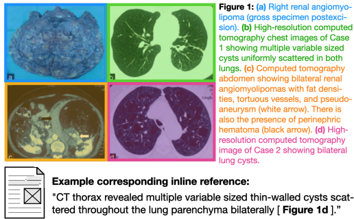
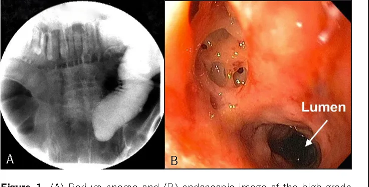

# MedICaT

<div align="center">
    <a href="https://github.com/openmedlab/"></a>
</div>
<p style="text-align:center;font-size:10px;"><em></em></p>

## Dataset Information

MedICaT is a dataset containing medical images, image captions, subfigure-subcaption annotations, and inline references. Subfigure-subcaption annotations refer to each part of a composite image and its corresponding explanation, while inline references indicate the location and content of images mentioned within the text. The images and captions in this dataset are extracted from open access biomedical papers on PubMed Central, and the corresponding citation text is derived from S2ORC. The dataset includes:

- 217K images from 131K open access biomedical papers
- 7507 subcaptions for 2069 composite images
- Inline references for about 25K images from the ROCO dataset

The goal of this dataset is to study the relationship between images and text in scientific documents, especially medical images, which are often complex, frequently contain multiple sub-images (75% of images in this dataset), and have detailed text describing their content. The uniqueness of this dataset lies in its provision of extensive subfigure-subcaption information as well as inline reference information, which can assist in understanding and retrieving medical images. Other datasets may not include these pieces of information because their purposes differ, or because acquiring these details is challenging, requiring manual annotation or automatic parsing. For instance, the ROCO dataset only includes images and captions, without subfigure-subcaption annotations and inline references. One application of the MedICaT dataset is the subfigure-subcaption alignment task, which involves identifying the subcaption corresponding to each sub-image given a composite image and its caption. This task can help improve the accuracy and efficiency of image understanding and retrieval.

## Dataset Meta Information

| Task Type | Language       | Train | Val | Test | File Format | Size |
|-----------|----------------|-------|-----|------|-------------|------|
| caption   | English | 65%   | 15% | 20%  | .png,.json   | 106G |

## Dataset Information Statistics

| Dataset Statistics      | MEDICAT |
|-------------------------|---------|
| Number of papers        | 131,410 |
| Number of figures       | 217,060 |
| Avg. figures per paper  | 1.7     |
| Avg. inline refs. per figure | 1.4 |
| Avg. caption length (tokens)  | 74.2 |
| Pct. with reference text       | 74%  |
| Avg. reference length (tokens) | 67.3 |
| Avg. Jaccard similarity btwn cap. and ref. | 23%  |
| Pct. medical figures*  | 93%    |
| Pct. with subfigures*  | 75%    |


## Dataset Example

- The MedICaT dataset consists of two folders: `images` and `annotations`. The `images` folder contains all the image files, and the `annotations` folder contains all the annotation files in JSON format. 
- Each image file is named in the format `pdf_hash_fig_key.jpg`, where `pdf_hash` is the hash value of the paper, and `fig_key` is the key value of the image to uniquely identify it. 
- The `pdf_hash` and `fig_key` in the annotation files correspond to the image files, allowing for the matching of images and their annotations.

<div align="center">
    <a href="https://github.com/openmedlab/"></a>
</div>
<p style="text-align:center;font-size:10px;"><em>57c9ad0f4aab133f96d40992c46926fabc901ffa_2-Figure1-1.png</em></p>

```
{
  "pdf_hash": "57c9ad0f4aab133f96d40992c46926fabc901ffa",
  "fig_key": "Figure1",
  "fig_uri": "2-Figure1-1.png",
  "s2_caption": "Figure 1. (A) Barium enema and (B) endoscopic image of the high-grade distal colonic obstruction caused by a 5-cm anastomotic stricture.",
  "s2orc_caption": "Figure 1. (A) Barium enema and (B) endoscopic image of the high-grade distal colonic obstruction caused by a 5-cm anastomotic stricture.",
  "s2orc_references": [
    "Computed tomography (CT) showed a distal large bowel obstruction, and a barium enema revealed a high-grade stenosis proximal to the anastomotic site in the recto-sigmoid region (Figure 1 ).",
    "Flexible sigmoidoscopy revealed a tight, fibrotic, benign-appearing anastomotic stricture 15 cm from the anal verge ( Figure 1) ."
  ],
  "radiology": false,
  "scope": true,
  "predicted_type": "Medical images",
  "oa_info": {
    "doi": "10.14309/crj.2014.54",
    "doi_url": "https://doi.org/10.14309/crj.2014.54",
    "oa": {
      "is_oa": true,
      "oa_status": "gold",
      "journal_is_oa": true,
      "journal_is_in_doaj": true,
      "license": "cc-by-nc-nd",
      "provenance": "unpaywall"
    }
  }
}
```

- `s2_caption`: The title of the image, extracted from open-access articles in PubMed Central.
- `s2orc_caption`: The caption of the image, derived from S2ORC, which may differ from `s2_caption`.
- `s2orc_references`: A list that contains the in-text references for the image, derived from S2ORC.
- `radiology`: A boolean value indicating whether the image is a radiology image.
- `scope`: A boolean value indicating whether the image is a microscopy image.
- `predicted_type`: A string representing the type of the image, such as Medical images, 3D objects, Graphs, etc.
- `oa_info`: An object that contains the open-access information for the paper, such as DOI, DOI URL, and OA status.

## File Structure

The file structure provided by the MedICaT data set is as follows. The figures folder contains images, represented by file names, and report.json is the annotation file of the image.

``` 
medicat
├── images
│   ├── {pdf_hash}_{fig_uri}.png
│   ├── ...
├── report.json
```

## Authors and Institutions

Sanjay Subramanian (Allen Institute for Artificial Intelligence, USA)

Lucy Lu Wang (Allen Institute for Artificial Intelligence, USA)

Sachin Mehta (University of Washington, USA)

Madeleine van Zuylen (Allen Institute for Artificial Intelligence, USA)

Sravanthi Parasa (Swedish Medical Group, USA)

Sameer Singh (University of California, Irvine, USA)

Matt Gardner (Allen Institute for Artificial Intelligence, USA)

Hannaneh Hajishirzi (Allen Institute for Artificial Intelligence, University of Washington, USA)


## Source Information

Official Website: https://github.com/allenai/medicat

Download Link: https://docs.google.com/forms/d/e/1FAIpQLSdB6w2HHNtD-v6SJr3wFMQl8WxR-wigrfVJPvqI-RR50miI7w/viewform

Article Address: https://arxiv.org/pdf/2010.06000.pdf

Publication Date: 2020.12.12

## Citation

``` 
@article{subramanian2020medicat,
  title={Medicat: A dataset of medical images, captions, and textual references},
  author={Subramanian, Sanjay and Wang, Lucy Lu and Mehta, Sachin and Bogin, Ben and van Zuylen, Madeleine and Parasa, Sravanthi and Singh, Sameer and Gardner, Matt and Hajishirzi, Hannaneh},
  journal={arXiv preprint arXiv:2010.06000},
  year={2020}
}
```

Original introduction article is [here](https://zhuanlan.zhihu.com/p/686222486).