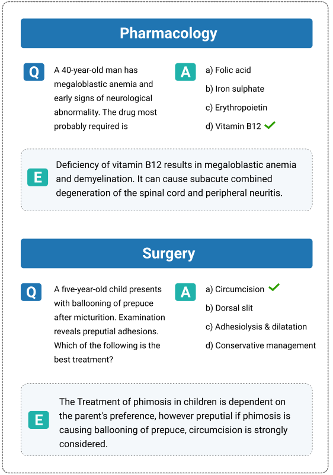
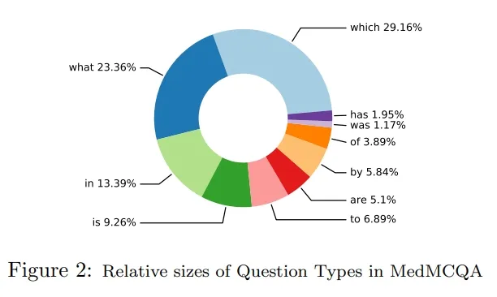
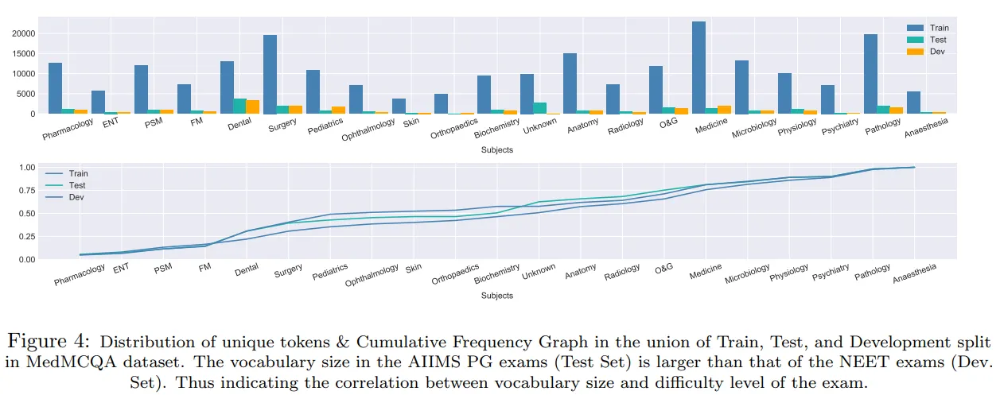

# MedMCQA

<div align="center">
    <a href="https://github.com/openmedlab/"></a>
</div>
<p style="text-align:center;font-size:10px;"><em></em></p>

## Dataset Information

The MedMCQA dataset is a large-scale multiple-choice question and answer collection designed for real-world medical entrance examination questions, summarizing more than 194,000 questions selected from the All India Institute of Medical Sciences (AIIMS) and the National Eligibility cum Entrance Test Postgraduate (NEET PG) exams in India. These questions not only cover more than 2,400 healthcare topics and 21 specialized medical subjects but are also precisely formulated with an average length of 12.77 tokens, reflecting the depth of medical theory and practical knowledge, as well as the dataset's stringent standards for quality and professional diversity.

In the structure of the dataset, each sample consists of a question text Q and a set of candidate options O, formatted as X = {Q, O}, where each question is accompanied by multiple options O = {O1, O2, ..., On}, with the challenge being to accurately select one or more correct answers from among them. Moreover, these questions require the examinees to have deep language comprehension skills and test the models on more than 10 types of reasoning abilities across a wide range of medical subjects and topics. To facilitate understanding, the dataset also includes detailed explanations for the answers to each question, further enhancing its educational and research value.

## Dataset Meta Information

| Task Type | Language       | Train | Val | Test | File Format | Size  |
|-----------|----------------|-------|-----|------|---------|-------|
| QA        | English | 182822   | 6150 | 4183  | .json   | 144MB |


## Dataset Information Statistics

<div align="center">
    <a href="https://github.com/openmedlab/"></a>
</div>
<p style="text-align:center;font-size:10px;"><em>Relative sizes of different types of questions in the MedMCQA dataset.</em></p>

- MedMCQA dataset statistics, where Q, A, E represents the Question, Answer, and Explanation, respectively.

|              | Train   | Test  | Dev   | Total   |
|--------------|---------|-------|-------|---------|
| Question #   | 182,822 | 6,150 | 4,183 | 193,155 |
| Vocab        | 94,231  | 11,218| 10,800| 97,694  |
| Max Q tokens | 220     | 135   | 88    | 220     |
| Max A tokens | 38      | 21    | 25    | 38      |
| Max E tokens | 3,155   | 651   | 695   | 3,155   |
| Avg Q tokens | 12.77   | 9.93  | 14.09 | 12.71   |
| Avg A tokens | 2.69    | 2.58  | 3.19  | 2.70    |
| Avg E tokens | 67.52   | 46.54 | 38.44 | 66.22   |


<div align="center">
    <a href="https://github.com/openmedlab/"></a>
</div>
<p style="text-align:center;font-size:10px;"><em>Distribution and cumulative frequency plots of unique words for different medical subjects in the MedMCQA dataset.</em></p>


## Dataset Example

The training set's first data entry is shown below. The key `question` corresponds to a question about the potential renal parenchymal changes due to chronic urethral obstruction caused by benign prostatic hyperplasia. The key `exp` provides a detailed explanation of the question, noting that chronic urethral obstruction can be caused by urinary stones, prostatic hyperplasia, tumors, etc., leading to hydronephrosis and gradual renal atrophy, and cites "Robbins Basic Pathology" as bibliographic support. The key `cop` indicates that the correct answer is the third option, corresponding to the key `opc`, which is Atrophy. The keys `opa` to `opd` present four answer choices for the question: Hyperplasia, Hyperophy (possibly a misspelling of hypertrophy), Atrophy, and Dyplasia (possibly a misspelling of dysplasia). The key `subject_name` indicates that the question comes from the subject of anatomy, and the key `topic_name` specifies that the question is about the urinary system.

Each question has a unique identifier, represented by the key `id`, here the value is `e9ad821a-c438-4965-9f77-760819dfa155`. Finally, the key `choice_type` explains that the question's answer type is single-choice.

``` 
{
  "question": "Chronic urethral obstruction due to benign prismatic hyperplasia can lead to the following change in kidney parenchyma",
  "exp": "Chronic urethral obstruction because of urinary calculi, prostatic hyperophy, tumors, normal pregnancy, tumors, uterine prolapse or functional disorders cause hydronephrosis which by definition is used to describe dilatation of renal pelvis and calculus associated with progressive atrophy of the kidney due to obstruction to the outflow of urine Refer Robbins 7yh/9,1012,9/e. P950",
  "cop": 3,
  "opa": "Hyperplasia",
  "opb": "Hyperophy",
  "opc": "Atrophy",
  "opd": "Dyplasia",
  "subject_name": "Anatomy",
  "topic_name": "Urinary tract",
  "id": "e9ad821a-c438-4965-9f77-760819dfa155",
  "choice_type": "single"
}
```

## File Structure

The dataset file structure is as follows: the `data` folder contains three JSON files, which are used for development (dev.json), testing (test.json), and training (train.json) respectively.

``` 
MedMCQA
│
└── data
    ├── dev.json
    ├── test.json
    └── train.json
```

## Authors and Institutions

Ankit Pal (Saama AI Research Institute, India)

Logesh Kumar Umapathi (Saama AI Research Institute, India)

Malaikannan Sankarasubbu (Saama AI Research Institute, India)

## Source Information

Official Website: https://medmcqa.github.io/

Download Link: https://drive.google.com/uc?export=download&id=15VkJdq5eyWIkfb_aoD3oS8i4tScbHYky

Article Address: https://proceedings.mlr.press/v174/pal22a.html

Publication Date: 2022-03

## Citation

``` 
@InProceedings{pmlr-v174-pal22a,
  title =          {MedMCQA: A Large-scale Multi-Subject Multi-Choice Dataset for Medical domain Question Answering},
  author =       {Pal, Ankit and Umapathi, Logesh Kumar and Sankarasubbu, Malaikannan},
  booktitle =          {Proceedings of the Conference on Health, Inference, and Learning},
  pages =          {248--260},
  year =          {2022},
  editor =          {Flores, Gerardo and Chen, George H and Pollard, Tom and Ho, Joyce C and Naumann, Tristan},
  volume =          {174},
  series =          {Proceedings of Machine Learning Research},
  month =          {07--08 Apr},
  publisher =    {PMLR},
  pdf =          {https://proceedings.mlr.press/v174/pal22a/pal22a.pdf},
  url =          {https://proceedings.mlr.press/v174/pal22a.html},
  abstract =          {This paper introduces MedMCQA, a new large-scale, Multiple-Choice Question Answering (MCQA) dataset designed to address real-world medical entrance exam questions. More than 194k high-quality AIIMS & NEET PG entrance exam MCQs covering 2.4k healthcare topics and 21 medical subjects are collected with an average token length of 12.77 and high topical diversity. Each sample contains a question, correct answer(s), and other options which requires a deeper language understanding as it tests the 10+ reasoning abilities of a model across a wide range of medical subjects & topics. A detailed explanation of the solution, along with the above information, is provided in this study.}
}
```

Original introduction article is [here](https://zhuanlan.zhihu.com/p/680084128).