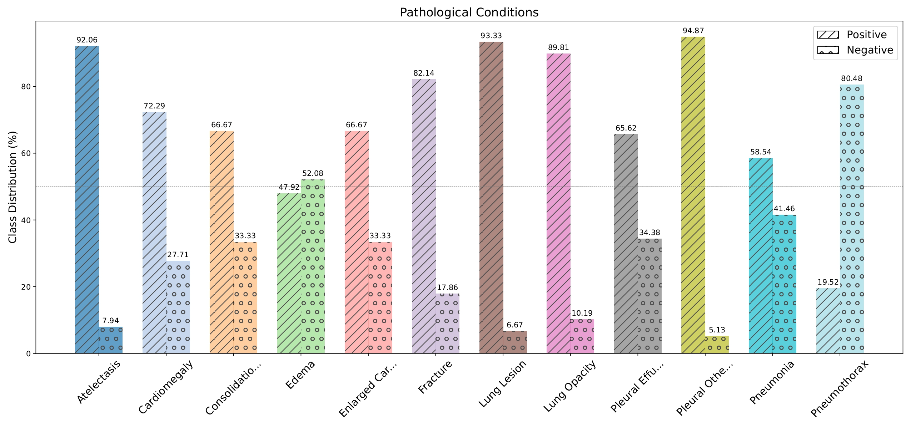

# MedPromptX-VQA

<div align="center">
    <a href="https://github.com/openmedlab/"></a>
</div>
<p style="text-align:center;font-size:10px;"><em></em></p>

## Dataset Information

MedPromptX-VQA is derived from a unified multimodal dataset, denoted as HAIM-MIMIC-MM. HAIM-MIMIC-MM is a fusion of information sourced from MIMIC-IV and MIMIC-CXR-JPG databases, meticulously curated to focus solely on patients with at least one chest X-ray procedure. HAIM-MIMIC-MM encapsulates records from 7,279 hospitalization stays, involving 6,485 distinct patients, thereby establishing a multimodal link encompassing tabular, textual and visual representations of patient health data.

## Dataset Meta Information

| Task Type | Language | Test                            | File Format | Size |
|-----------|----------|---------------------------------|-------------|------|
| VQA       | English  | 968 Image Question-Answer Pairs | .csv, .jpg  | 1.8GB |


## Dataset Information Statistics

In MedPromptX-VQA, patients are labeled with 12 pathological conditions: _Atelectasis, Cardiomegaly, Consolidation, Edema, Enlarged Cardiomediastinum, Fracture, Lung Lesion, Lung Opacity, Pleural Effusion, Pleural Other, Pneumonia and Pneumothorax_. To alleviate the challenges of limited context length and hallucination in LLMs, we transformed these labels into a binary single-label classification framework to ensure that the input fits the context length and to acquire a controlled output, rather than acquiring an open set of possible diagnoses. For each label, if a patient exhibits the condition, the corresponding label is assigned the value 1; otherwise, it is given the value 0. For this study, we specifically selected patients diagnosed with the aforementioned conditions, resulting in 968 records split into 501 positive and 467 negative samples.

The creation of MedPromptX-VQA involves three steps: (1) extraction of laboratory test results from the _chartevents_ table within the MIMIC-IV dataset, resulting in 357 features in total, (2) feature engineering, which includes identification of the most strongly correlated features in relation to the label using Pearson method, and (3) transformation of clinical charts into textual representations using comma-separated values (i.e., serialization). Finally, the dataset is structured to support the in-context learning task, where each record has interleaved image and text, encompassing both positive and negative samples of patients. The motivation for feature selection is to maintain input consistency between the few-shot data and the query sample. This means that the features present in the query sample should already be represented by the candidates, while also adhering to the context length. Hence, we set a maximum of 10 features per label.

<div align="center">
    <a href="https://github.com/openmedlab/"></a>
</div>
<p style="text-align:center;font-size:10px;"><em>Figure 1, The Positive and Negative representations for 12 pathological conditions.</em></p>

## File Structure

``` 
MedPromptX-VQA
│
├── prompt_images
│   ├── Atelectasis_p1.jpg
│   ├── Pneumothorax_p1.jpg
│   └── ...
├── prompts_multimodal.csv
│
├── prompts_image_only.csv
│
└── prompts_text_only.csv
```

## Authors and Institutions

Mai A. Shaaban (Mohamed bin Zayed University of Artificial Intelligence, United Arab Emirates)

Adnan Khan (School of Computer Science, Carleton University, Canada)

Mohammad Yaqub (Mohamed bin Zayed University of Artificial Intelligence, United Arab Emirates)

## Source Information

Official Website: https://github.com/BioMedIA-MBZUAI/MedPromptX

Article Address: https://arxiv.org/pdf/2403.15585.pdf

Publication Date: 2024-03

## Citation

``` 
@article{shaaban2024medpromptx,
      title={MedPromptX: Grounded Multimodal Prompting for Chest X-ray Diagnosis}, 
      author={Mai A. Shaaban and Adnan Khan and Mohammad Yaqub},
      year={2024},
      url={https://arxiv.org/abs/2403.15585},
}
```
