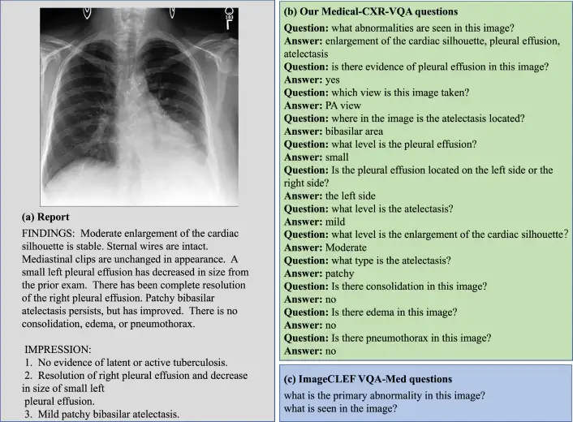
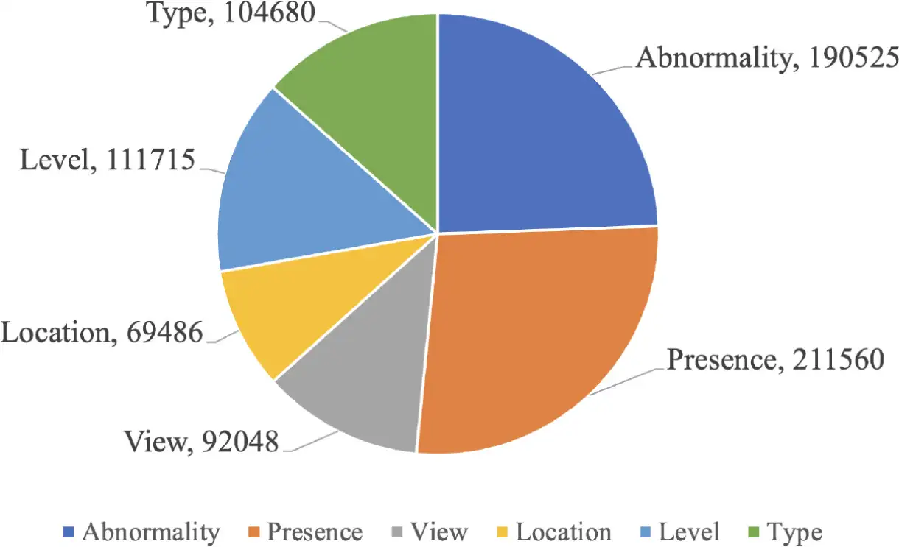
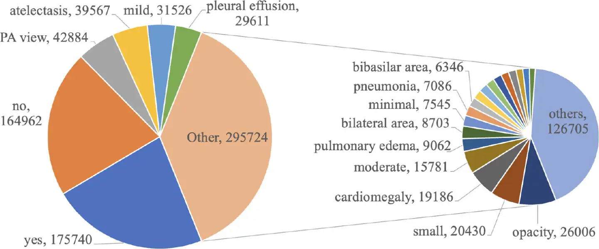

# Medical-CXR-VQA

<div align="center">
    <a href="https://github.com/openmedlab/"></a>
</div>
<p style="text-align:center;font-size:10px;"><em></em></p>

## Dataset Information

Medical Visual Question Answering (VQA) is a key task in medical multimodal large language models (LLMs), designed to answer clinically relevant questions related to input medical images. This technology has the potential to enhance the efficiency of medical professionals while alleviating the burden on public health systems, especially in resource-poor countries. However, existing medical VQA datasets are small in scale, containing only simple questions (equivalent to classification tasks), and lack semantic reasoning and clinical knowledge. The authors' previous work proposed a rule-based approach using a clinically-driven image differential VQA benchmark. However, within the same scope of information coverage, the error rate in extracting labels using the rule-based approach reached 85%. The authors trained an LLM approach to extract labels, improving accuracy by 62%. The authors also conducted a comprehensive evaluation of the labels with two clinical experts, evaluating 100 samples to help fine-tune the LLM. Based on the trained LLM model, the authors proposed a large-scale medical VQA dataset, Medical-CXR-VQA, focusing on chest X-ray images for LLMs. The questions involved include detailed information such as abnormalities, location, level, and type. Based on this dataset, the authors proposed a new VQA method by constructing three different types of relational graphs: spatial relation graph, semantic relation graph, and implicit relation graph, across image regions, questions, and semantic labels. The authors utilized graph attention to learn logical reasoning paths for different questions. These learned graph VQA reasoning paths can further be used for LLM prompt engineering and thought chains, which are crucial for further fine-tuning and training multimodal large language models. Moreover, the authors demonstrated that our method possesses evidentiality and fidelity, which are critical in the clinical field.

## Dataset Meta Information

| Type | Technique | Task       | Modality | Data Count   | Data Type      |
|------|-----------|------------|----------|--------------|----------------|
| 2D   | X-Ray     | VQA        | Brain    | 780,014      | image-text pair|


## Dataset Statistics

To advance the field of medical Visual Question Answering (VQA), the authors have constructed a VQA dataset focused on a single modality and specialized area: Medical-CXR-VQA. This VQA dataset consists of three components: images, questions, and answers. For the image set, the authors selected the large-scale MIMIC-CXR dataset (Johnson et al., 2019a), which contains 227,835 studies and 377,110 images. Each study is associated with one or more images but only one report. Based on MIMIC-CXR, MIMIC-CXR-JPG (Johnson et al., 2019b) was created to extract fourteen diagnostic labels. To provide deeper insights from the MIMIC-CXR dataset, the authors used LLMs to create an intermediate KeyInfo dataset containing more granular information. The questions and answers in the final Medical-CXR-VQA dataset were generated based on this KeyInfo dataset. The questions designed cover multiple aspects such as abnormalities, location, type, level, and view. Overall, the dataset includes 780,014 question-answer pairs, which are categorized into six types: abnormalities (190,525 pairs), location (104,680 pairs), type (69,486 pairs), level (111,715 pairs), view (92,048 pairs), and presence (211,560 pairs). The distribution of question types is shown in Figure 1. These pairs were extracted from a total of 215,547 studies, making the Medical-CXR-VQA dataset a valuable resource for researchers in the field of medical VQA. Additionally, the training/validation/testing sets are divided in an 8:1:1 ratio. Although efforts were made to mitigate data imbalance, it is noteworthy that due to the intrinsic nature of radiological reports, the answers in the VQA dataset still exhibit a long-tail distribution. The distribution of answers can be seen in Figure 2.

<div align="center">
    <a href="https://github.com/openmedlab/"></a>
</div>
<p style="text-align:center;font-size:10px;"><em>Figure 1. Distribution of question types.</em></p>

<div align="center">
    <a href="https://github.com/openmedlab/"></a>
</div>
<p style="text-align:center;font-size:10px;"><em>Figure 2. Distribution of answer types.</em></p>

Table 1. Unusual keyword variants:

| id | Abnormality names                                                                                                                                                                                                                             |
|----|-----------------------------------------------------------------------------------------------------------------------------------------------------------------------------------------------------------------------------------------------|
| 0  | pericardial effusion, pleural effusion, effusion, effusions, pleural fluid                                                                                                                                                                    |
| 1  | blunting of the costophrenic angles, blunting of the right costophrenic angle, blunting of the left costophrenic angle, blunting of the costophrenic angle, blunting of the left costodiaphragmatic, blunting of the right costodiaphragmatic |
| 2  | volume loss, collapse, atelectasis, atelectases, atelectatic changes, atelectatic change                                                                                                                                                      |
| 3  | low lung volume                                                                                                                                                                                                                               |
| 4  | cardiomegaly, heart size is enlarged, heart is enlarged, cardiac size is enlarged, cardiac silhouette is enlarged, enlargement of the cardiac silhouette, enlargement of cardiac                                                              |
| 5  | interstitial edema, interstitial pulmonary edema, dependent edema                                                                                                                                                                             |
| 6  | pulmonary edema                                                                                                                                                                                                                               |
| 7  | hiatal hernia, hiatus hernia, hernia                                                                                                                                                                                                          |
| 8  | pulmonary vascular congestion, vascular congestion, hilar congestion                                                                                                                                                                          |
| 9  | hilar congestion                                                                                                                                                                                                                              |
| 10 | pneumothorax, pneumothoraces                                                                                                                                                                                                                  |
| 11 | cardiac decompensation, chf, congestive heart failure, heart failure                                                                                                                                                                          |
| 12 | lung opacification, airspace opacities, airspace opacity, lung opacity, lung opacities                                                                                                                                                        |
| 13 | pneumonia, infection, infectious                                                                                                                                                                                                              |
| 14 | thoracolumbar scoliosis, scoliosis                                                                                                                                                                                                            |
| 15 | gastric distention                                                                                                                                                                                                                            |
| 16 | hypoxemia                                                                                                                                                                                                                                     |
| 17 | hypertensive heart disease, htn, hypertension                                                                                                                                                                                                 |
| 18 | hematoma                                                                                                                                                                                                                                      |
| 19 | tortuosity of the thoracic aorta, aorta is tortuous, tortuosity of the thoracic aorta                                                                                                                                                         |
| 20 | pulmonary contusion, contusion                                                                                                                                                                                                                |
| 21 | subcutaneous emphysema, subcutaneous air, subcutaneous gas, subcutaneous tissue                                                                                                                                                               |
| 22 | emphysema, emphysematous change                                                                                                                                                                                                               |
| 23 | granulomatous disease, granuloma                                                                                                                                                                                                              |
| 24 | calcifications, calcification, calcified                                                                                                                                                                                                      |
| 25 | pleural thickening                                                                                                                                                                                                                            |
| 26 | thymoma                                                                                                                                                                                                                                       |
| 27 | consolidation                                                                                                                                                                                                                                 |
| 28 | fractures, fracture                                                                                                                                                                                                                           |
| 29 | pneumomediastinum, mediastinal emphysema                                                                                                                                                                                                      |
| 30 | air collection                                                                                                                                                                                                                                |
| 31 | mass                                                                                                                                                                                                                                          |
| 32 | nodule, nodular density                                                                                                                                                                                                                       |
| 33 | [Missing in the list]                                                                                                                                                                                                                         |
| 34 | [Missing in the list]                                                                                                                                                                                                                         |

Table 2. Example list of all question types.

| Type        | Example                                             |
|-------------|-----------------------------------------------------|
| Abnormality | What abnormalities are seen in the image?           |
|             | What abnormalities are seen in the (location)?      |
|             | Is there any evidence of any abnormalities?         |
|             | Is this image normal?                               |
| Presence    | Any evidence of (abnormality)?                      |
|             | Is there (abnormality) in the (location)?           |
| View        | Which view is this image taken?                     |
|             | Is this PA view?                                    |
|             | Is this AP view?                                    |
| Location    | Where is the (abnormality) located?                 |
|             | Is the (abnormality) located on the left/right?     |
|             | Where is the (abnormality) in the (location)?       |
| Level       | What level is the (abnormality)?                    |
| Type        | What type is the (abnormality)?                     |


## Dataset Example

Visualization of dataset, you can use ITK-SNAP to visualize.

Take AutoPET for example:

<div align="center">
    <a href="https://github.com/openmedlab/"></a>
</div>
<p style="text-align:center;font-size:10px;"><em>Figure 3. Comparison of the Medical-CXR-VQA dataset with the existing ImageCLEF VQA-Med dataset. (a) The report corresponds to a given chest X-ray image. (b) The problem setting we constructed includes abnormality, existence, view, location, level, and type. (c) The design of the ImageCLEF VQA-MED problem is too simple.</em></p>

## File Structure

The Medical-CXR-VQA dataset is currently under review in Physionet. The authors will attach the link once it's available.

## Authors and Institutions

Xinyue Hu (The University of Texas Arlington, Arlington, 76010, TX, USA)

Lin Gu (RIKEN, Tokyo, Japan; University of Tokyo, Tokyo, Japan)

Kazuma Kobayashi (National Cancer Center Research Institute, Tokyo, Japan)

Liangchen Liu (National Institutes of Health Clinical Center, Bethesda, 20892, MD, USA)

Mengliang Zhang (The University of Texas Arlington, Arlington, 76010, TX, USA)

Tatsuya Harada (RIKEN, Tokyo, Japan; University of Tokyo, Tokyo, Japan)

Ronald M. Summers (National Institutes of Health Clinical Center, Bethesda, 20892, MD, USA)

Yingying Zhu (The University of Texas Arlington, Arlington, 76010, TX, USA)

## Source Information

Official Website: https://github.com/Holipori/Medical-CXR-VQA

Download Link: https://github.com/Holipori/Medical-CXR-VQA

Article Address: https://www.sciencedirect.com/science/article/pii/S1361841524002044

Publication Date: 2024-07

## Citation

``` 
@article{HU2024103279,
title = {Interpretable medical image Visual Question Answering via multi-modal relationship graph learning},
journal = {Medical Image Analysis},
volume = {97},
pages = {103279},
year = {2024},
issn = {1361-8415},
doi = {https://doi.org/10.1016/j.media.2024.103279},
url = {https://www.sciencedirect.com/science/article/pii/S1361841524002044},
author = {Xinyue Hu and Lin Gu and Kazuma Kobayashi and Liangchen Liu and Mengliang Zhang and Tatsuya Harada and Ronald M. Summers and Yingying Zhu},
keywords = {Visual Question Answering, Medical dataset, Graph neural network, Multi-modal large vision language model, Large Language Model, Chain of thought},
abstract = {Medical Visual Question Answering (VQA) is an important task in medical multi-modal Large Language Models (LLMs), aiming to answer clinically relevant questions regarding input medical images. This technique has the potential to improve the efficiency of medical professionals while relieving the burden on the public health system, particularly in resource-poor countries. However, existing medical VQA datasets are small and only contain simple questions (equivalent to classification tasks), which lack semantic reasoning and clinical knowledge. Our previous work proposed a clinical knowledge-driven image difference VQA benchmark using a rule-based approach (Hu et al., 2023). However, given the same breadth of information coverage, the rule-based approach shows an 85% error rate on extracted labels. We trained an LLM method to extract labels with 62% increased accuracy. We also comprehensively evaluated our labels with 2 clinical experts on 100 samples to help us fine-tune the LLM. Based on the trained LLM model, we proposed a large-scale medical VQA dataset, Medical-CXR-VQA, using LLMs focused on chest X-ray images. The questions involved detailed information, such as abnormalities, locations, levels, and types. Based on this dataset, we proposed a novel VQA method by constructing three different relationship graphs: spatial relationships, semantic relationships, and implicit relationship graphs on the image regions, questions, and semantic labels. We leveraged graph attention to learn the logical reasoning paths for different questions. These learned graph VQA reasoning paths can be further used for LLM prompt engineering and chain-of-thought, which are crucial for further fine-tuning and training multi-modal large language models. Moreover, we demonstrate that our approach has the qualities of evidence and faithfulness, which are crucial in the clinical field. The code and the dataset is available at https://github.com/Holipori/Medical-CXR-VQA.}
}
```

Original introduction article is [here](https://zhuanlan.zhihu.com/p/715817792).