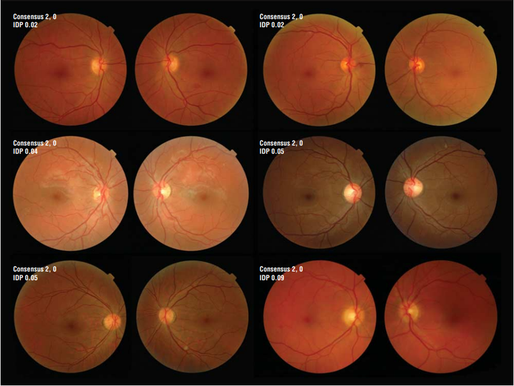

# Messidor-2

<div align="center">
    <a href="https://github.com/openmedlab/"></a>
</div>
<p style="text-align:center;font-size:10px;"><em></em></p>

## Dataset Information

The Messidor-2 dataset is specifically designed for the study of diabetic retinopathy (DR). It contains a large number of fundus images, with each examination including two images centered on the macula. The data come from two main sources: one part is the original Messidor dataset generously provided by partners of the Messidor program, and the other part consists of examinations from Brest University Hospital previously unreleased, known as Messidor-Extension. The Messidor-Original includes all paired images, totaling 529 examinations (1058 PNG images). To augment Messidor-Extension, the ophthalmology department at Brest University Hospital recruited diabetic patients between October 16, 2009, and September 6, 2010, and took photographs using the Topcon TRC NW6 non-mydriatic fundus imaging device, which has a 45-degree field of view. The Messidor-Extension only contains images centered on the macula, totaling 345 examinations (690 JPG images). In total, the Messidor-2 dataset comprises 874 examinations (1748 images).

The significance of the Messidor-2 dataset lies in its provision of a large quantity of high-quality, real-world fundus images for researchers to study and develop algorithms capable of detecting and diagnosing diabetic retinopathy. As this disease is the most common cause of blindness among diabetic complications, the development of algorithms that can accurately identify this condition is of great importance to global health.

## Dataset Meta Information

| Dimensions | Modality | Task Type      | Anatomical Structures | Anatomical Area | Number of Categories | Data Volume | File Format |
|------------|----------|----------------|-----------------------|-----------------|----------------------|-------------|------------|
| 2D         | fundus   | Classification | Eye                   | Eye             | 2                    | 1748        | png/jpg     |


### Resolution Details

| Dataset Statistics | size         |
|--------------------|--------------|
| min                | (960, 1440, 3)    |
| median             | (1335, 2006, 3)  |
| max                | (1488, 2240, 3)  |

## Label Information Statistics

| Label | Number |
|-------|--------|
| 0     | 874    |
| 1     | 874    |

## Visualization

<div align="center">
    <a href="https://github.com/openmedlab/"></a>
</div>
<p style="text-align:center;font-size:10px;"><em>Paper Visualization.</em></p>

## File Structure

The file structure of the data set is as follows. images stores images, and the annotations of train and val are given in txt format.

``` 
Messidor-2
├── images
│   ├── xxx.jpeg
│   ├── xxx.jpeg
│   │    ...
├── train.txt
├── val.txt
```

## Authors and Institutions

Etienne Decencière (MINES ParisTech)

Xiwei Zhang (MINES ParisTech)


## Source Information

Official Website: https://www.adcis.net/en/third-party/messidor2/

Download Link: https://www.adcis.net/en/third-party/messidor2/

Article Address: https://www.ias-iss.org/ojs/IAS/article/view/1155

Publication Date: 2013

## Citation

``` 
@article{abramoff2013automated,
  title={Automated analysis of retinal images for detection of referable diabetic retinopathy},
  author={Abr{\`a}moff, Michael D and Folk, James C and Han, Dennis P and Walker, Jonathan D and Williams, David F and Russell, Stephen R and Massin, Pascale and Cochener, Beatrice and Gain, Philippe and Tang, Li and others},
  journal={JAMA ophthalmology},
  volume={131},
  number={3},
  pages={351--357},
  year={2013},
  publisher={American Medical Association}
}
```

Original introduction article is [here](https://zhuanlan.zhihu.com/p/688470437).