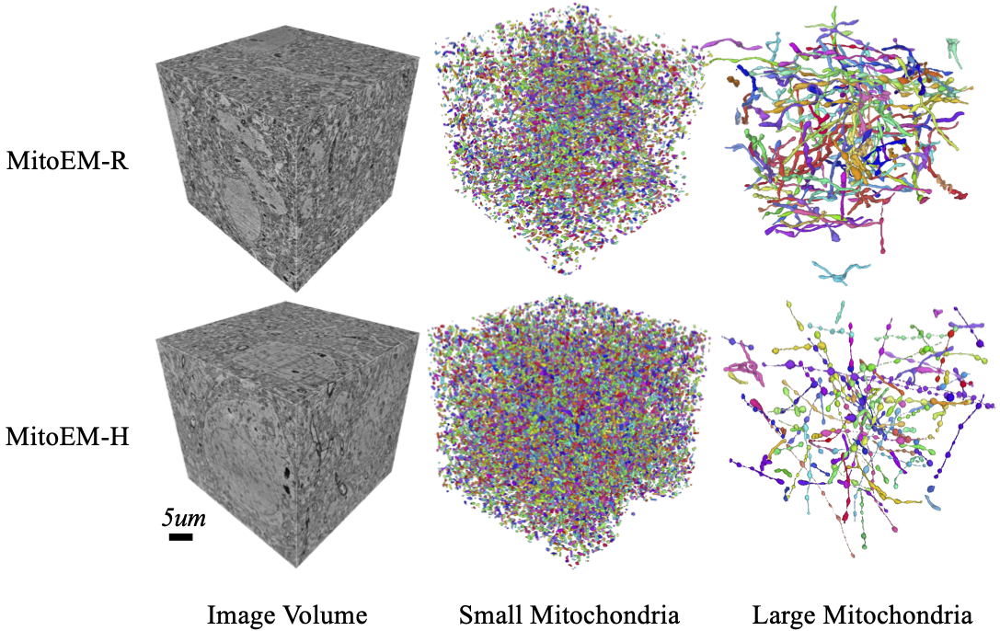
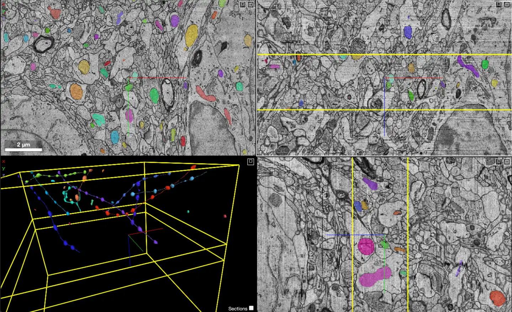

# MitoEM2021

<div align="center">
    <a href="https://github.com/openmedlab/"></a>
</div>
<p style="text-align:center;font-size:10px;"><em></em></p>

## Dataset Information

**MitoEM Challenge: Large-scale 3D Mitochondria Instance Segmentation (MitoEM2021)** is a dataset for segmenting mitochondria in the tissue pathology modality. It is part of the Grand Challenge competition. The dataset contains 2 samples in total, with 1 sample for training and 1 sample for validation. The dataset includes two sets of volume images, each measuring 30x30x30 micrometers with a resolution of 30x8x8 nanometers, derived from rat (Mito-R) and human (Mito-H) tissues. The MitoEM-H-im-pad dataset is padded to [20, 512, 512] along the z, y, and x axes. The training and validation sets (MitoEM-H-train-val-v2 and MitoEM-R-train-val-v2) contain mitochondrial instance labels for the first 500 slices, divided into a training set (0-399) and a validation set (400-499). All mitochondria instances in the annotations contain at least 2000 voxels. To ensure the dataset's high quality, users can report annotation errors by contacting the relevant personnel via email for correction.

The MitoEM dataset holds significant importance in research and applications. It provides high-resolution 3D mitochondrial images, helping scientists gain a deeper understanding of the complex morphology of mitochondria, such as instances of mitochondrial outer membrane structures (MOAS) connected by thin tubules, where multiple instances may be entangled. This dataset is not only a part of the ISBI 2021 Challenge but is also continuously open online for new submissions, encouraging more researchers to participate and advance the technology of mitochondrial instance segmentation. Researchers can use this dataset by citing the relevant papers, further promoting and refining this research area in the academic community.

## Dataset Meta Information

| Dimensions | Modality        | Task Type | Anatomical Structures | Anatomical Area | Number of Categories | Data Volume | File Format |
|------------|-----------------|-----------|-----------------------|-----------------|----------------------|-------------|-------------|
| 3D         | Histopathology  | Segmentation | Mitochondria          | Tissue          | 1                    | 2           | .nii.gz     |


### Resolution Details

| Dataset Statistics | spacing (mm)     | size              |
|--------------------|------------------|-------------------|
| min                | (1.0, 1.0, 1.0)  | (4096, 4096, 400) |
| median             | (1.0, 1.0, 1.0)  | (4096, 4096, 400) |
| max                | (1.0, 1.0, 1.0)  | (4096, 4096, 400) |

## Label Information Statistics

| Anatomical Structure      | Mitochondria |
|---------------------------|--------------|
| Number of Occurrences     | 1            |
| Percentage of Occurrences | 100%         |
| Image Volume (cm³)        | 342427.51    |

## Visualization

<div align="center">
    <a href="https://github.com/openmedlab/"></a>
</div>
<p style="text-align:center;font-size:10px;"><em></em></p>

<div align="center">
    <a href="https://github.com/openmedlab/"></a>
</div>
<p style="text-align:center;font-size:10px;"><em>The segmented content is mitochondria.</em></p>

## File Structure

Each `zip` file contains a `nii.gz` file with only two data items.

```
.
├── EM30-H-im.zip
├── EM30-H-mito-train-val-v2.zip
├── EM30-R-im.zip
└── EM30-R-mito-train-val-v2.zip
```

## Authors and Institutions

- Martin Styner (University of North Carolina at Chapel Hill)
- Joohwi Lee (University of North Carolina at Chapel Hill)
- Brian Chin (University of North Carolina at Chapel Hill)
- Matthew S. Chin (University of North Carolina at Chapel Hill)
- Olivier Commowick (Boston Children's Hospital)
- Hoai-Huong Tran (Boston Children's Hospital)
- Valerie Jewells (University of North Carolina at Chapel Hill)
- Simon Warfield (Boston Children's Hospital)

## Source Information

Official Website: https://mitoem.grand-challenge.org/

Download Link: https://mitoem.grand-challenge.org/

Article Address: https://link.springer.com/chapter/10.1007/978-3-030-59722-1_7

Publication Date: 2021

## Citation

``` 
@inproceedings{wei2020mitoem,
title={MitoEM Dataset: Large-scale 3D Mitochondria Instance Segmentation from EM Images},
  author={D. Wei, Z. Lin, D. Franco-Barranco, N. Wendt, X. Liu, W. Yin, X. Huang, A. Gupta,
 W. Jang, X. Wang,  I. Arganda-Carreras, J. Lichtman, H. Pfister},
  booktitle={International Conference on Medical Image Computing and Computer Assisted Intervention},
  year={2020}
}
```

Original introduction article is [here](https://zhuanlan.zhihu.com/p/711469559).