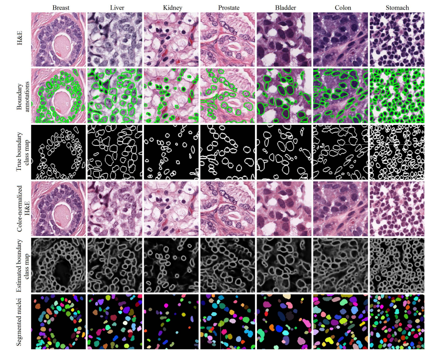

# MoNuSeg Dataset

<div align="center">
    <a href="https://github.com/openmedlab/"></a>
</div>
<p style="text-align:center;font-size:10px;"><em></em></p>

## Dataset Information

The dataset was created by downloading H&E-stained tissue images captured at a 40x magnification from the TCGA archive. H&E staining is a routine scheme to enhance the contrast of tissue sections, typically used for tumor assessment (grading, staging, etc.). Given the diversity of the appearance of cell nuclei across multiple organs and patients, as well as the richness of staining schemes used by various hospitals, this training dataset will enable the development of robust and generalizable cell nucleus segmentation technologies that are ready-to-use.

Nuclear segmentation in digital microscopic tissue images can extract high-quality features for nuclear morphometry measurements and other analyses in computational pathology. Technologies that accurately segment cell nuclei across a range of different tissue images spanning a variety of patients, organs, and disease states can greatly facilitate the development of clinical and medical research software. Once accurately segmented, nuclear morphological and appearance features, such as nuclear density, nuclear-cytoplasmic ratio, average size, and pleomorphism, can be used not only for assessing cancer grades but also for predicting treatment outcomes. Identifying different types of cell nuclei based on their segmentation can also yield information about gland shapes, for instance, which is important for cancer grading.

## Dataset Meta Information

| Dimensions | Modality            | Task Type | Anatomical Structures | Number of Categories | Data Volume         | File Format |
|------------|---------------------|-----------|-----------------------|----------------------|---------------------|-------------|
| 2D         | Pathological Images | Segmentation | Cell                         | 1                    | train: 38, test: 15 | PNG         |


### Resolution Details

| Dataset Statistics | size          |
|--------------------|---------------|
| min                | (1000, 1000)  |
| median             | (1000, 1000)  |
| max                | (1000, 1000)  |

## Label Information Statistics

| Category            | Retinal Vessel |
|---------------------|----------------|
| Number of Images    | 38             |
| Coverage Rate       | 100%           |
| Minimum Pixel Count | 105483         |
| Medium Pixel Count  | 244800         |
| Maximum Pixel Count | 399733         |

## Visualization

<div align="center">
    <a href="https://github.com/openmedlab/"></a>
</div>
<p style="text-align:center;font-size:10px;"><em> Paper Visualization.</em></p>

## File Structure

The file structure of the dataset is as follows. The MoNuSeg dataset consists of two folders: `images` and `masks`, where `images` contains the images, and `masks` contains the corresponding annotations.

``` 
MoNuSeg       
├── images            
│   ├── train
│       ├── 01.png
│       ├── 02.png
│       └──  ...
│   ├── test
│       ├── 01_test.png
│       ├── 02_test.png
│       └──  ...
├── masks            
│   ├── train
│       ├── 01.png
│       ├── 02.png
│       └──  ...
│   ├── test
│       ├── 01.png
│       ├── 02.png
│       └──  ...
```

## Authors and Institutions

Neeraj Kumar (Department of Pathology, University of Illinois at Chicago, IL, USA)

Ruchika Verma (Department of Biomedical Engineering, Case Western Reserve University Cleveland, OH, USA)

Amit Sethi (Department of Electrical Engineering, Indian Institute of Technology Bombay, India)


## Source Information

Official Website: https://monuseg.grand-challenge.org/Home/

Download Link: https://monuseg.grand-challenge.org/Data/

Article Address: https://ieeexplore.ieee.org/abstract/document/7872382

Publication Date: 2017

## Citation

``` 
@article{kumar2017dataset,
  title={A dataset and a technique for generalized nuclear segmentation for computational pathology},
  author={Kumar, Neeraj and Verma, Ruchika and Sharma, Sanuj and Bhargava, Surabhi and Vahadane, Abhishek and Sethi, Amit},
  journal={IEEE transactions on medical imaging},
  volume={36},
  number={7},
  pages={1550--1560},
  year={2017},
  publisher={IEEE}
}
```

Original introduction article is [here](https://zhuanlan.zhihu.com/p/680029542).