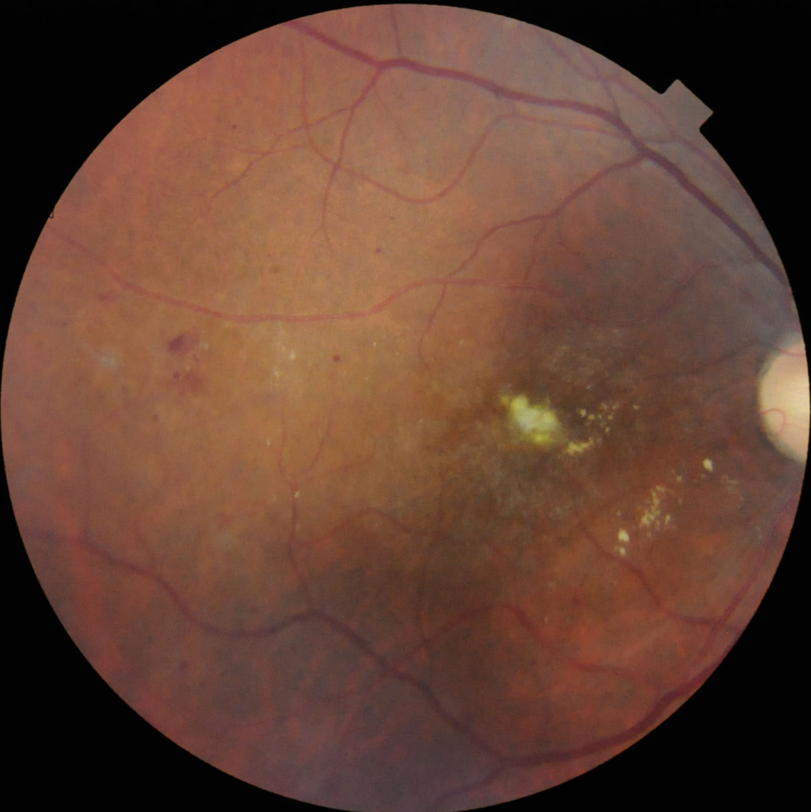
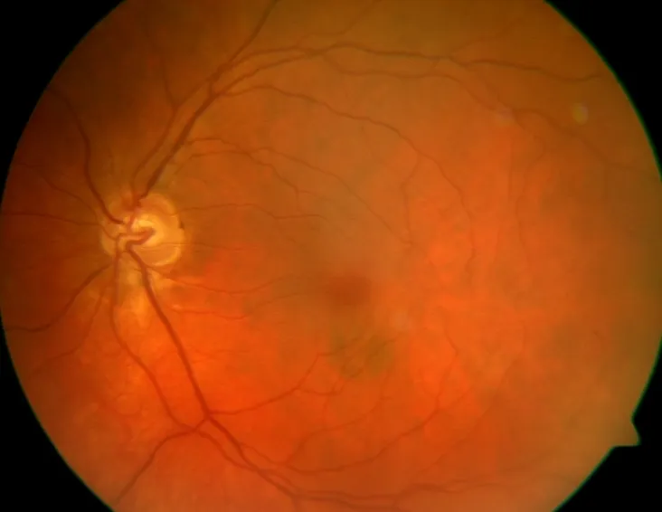
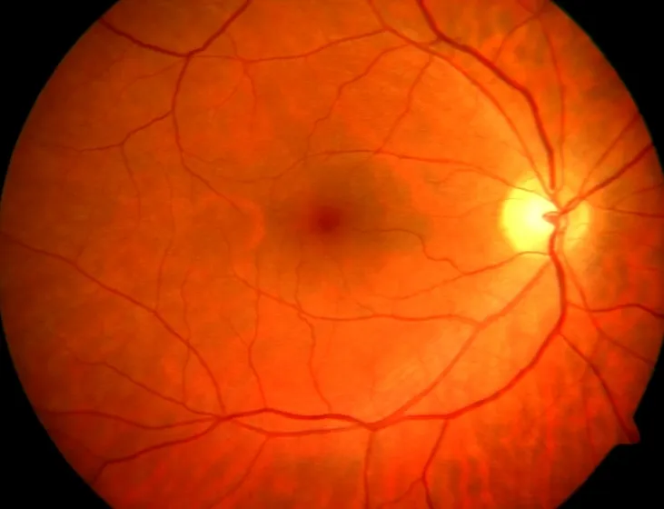
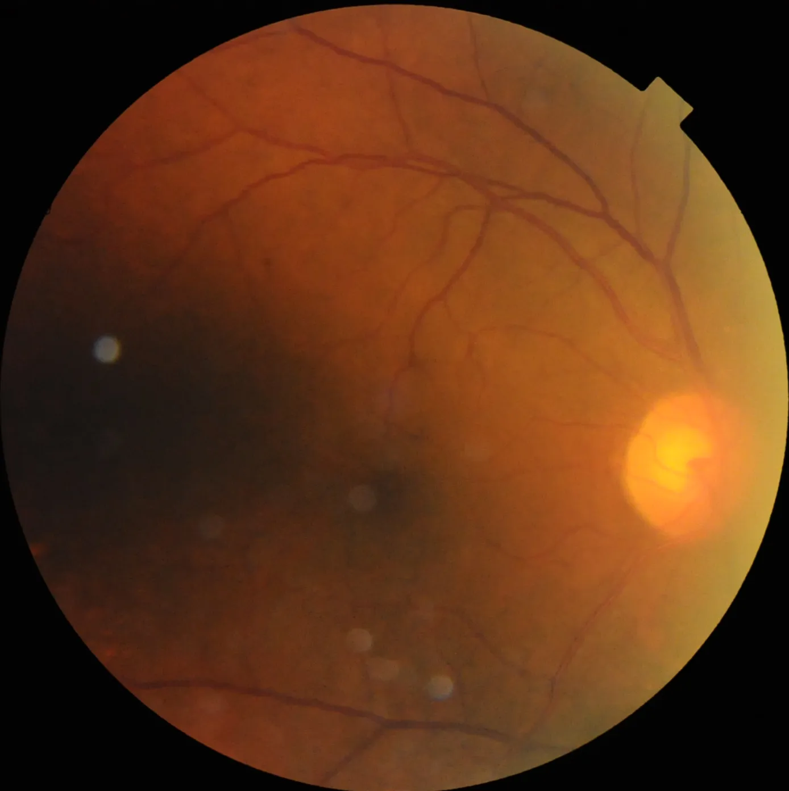
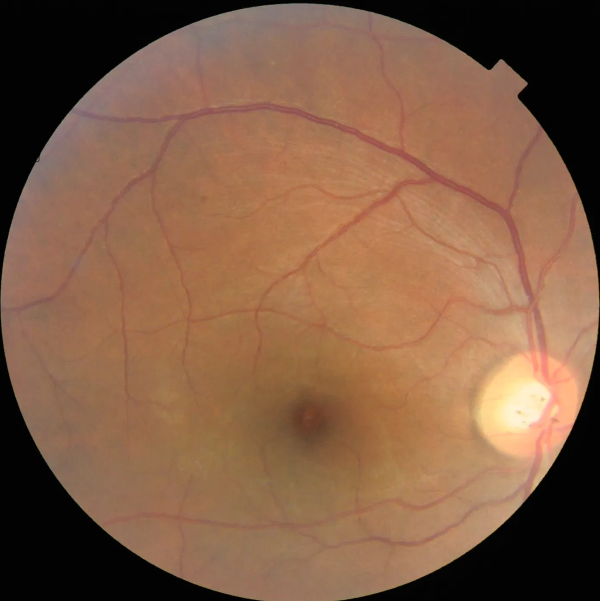
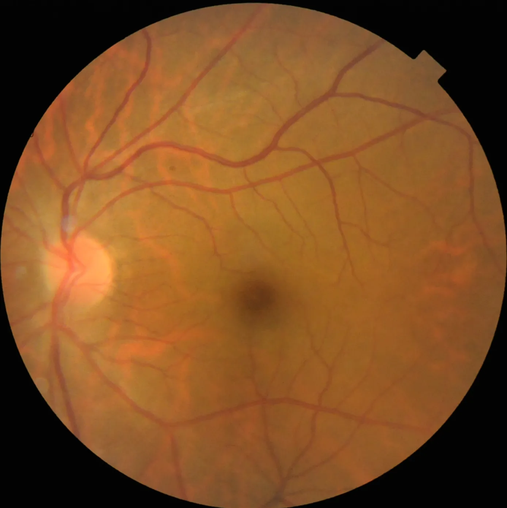
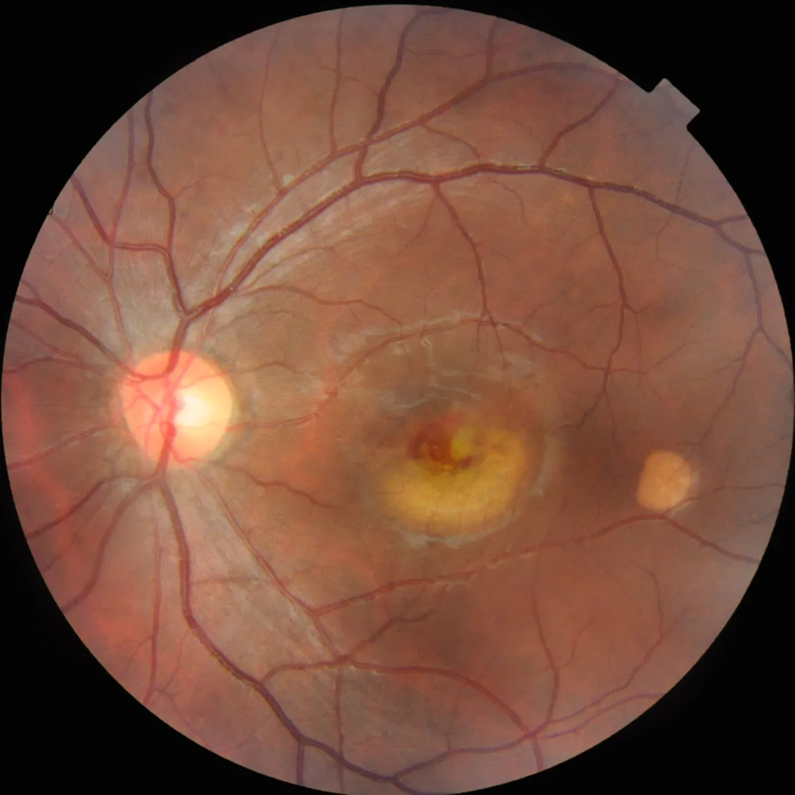
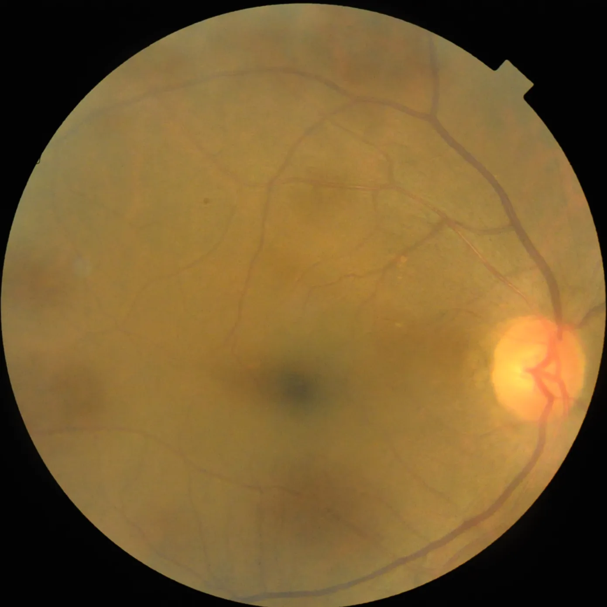

# Multi-Label Retinal Diseases

<div align="center">
    <a href="https://github.com/openmedlab/"></a>
</div>
<p style="text-align:center;font-size:10px;"><em></em></p>

## Dataset Information

The Multi-Label Retinal Diseases (MuReD) dataset consists of 2,451 multi-label retinal fundus images covering 20 categories. These categories include images of Diabetic Retinopathy (DR), NORMAL images, Media Haze (MH), Optic Disc Cupping (ODC), Tessellation (TSLN), Age-Related Macular Degeneration (ARMD), Drusen (DN), Myopia (MYA), Branch Retinal Vein Occlusion (BRVO), Optic Disc Pallor (ODP), Central Retinal Vein Occlusion (CRVO), Choroidal Neovascularization (CNV), Retinitis (RS), Optic Disc Edema (ODE), Laser Scars (LS), Central Serous Retinopathy (CSR), Hypertensive Retinopathy (HTR), Arteriosclerotic Retinopathy (ASR), Chorioretinitis (CR), and Other Diseases (OTHER) images. After thorough curation and cleaning by the authors, 2,208 high-quality labeled images remained, with a default split of 1,764 images for the training set and 444 images for the validation set.

Millions of people worldwide are diagnosed with retinal diseases each year. Early diagnosis of retinal diseases can effectively prevent patients from deteriorating into permanent blindness. In recent years, artificial intelligence technologies, represented by deep learning algorithms, are actively promoting the development of medical imaging. The authors have collected several retinal disease fundus image datasets, and after strict data cleaning, obtained the MuReD dataset. They hope that this dataset can assist researchers in developing models and software for the identification of retinal diseases based on retinal fundus images, thereby aiding doctors in quickly and accurately diagnosing related diseases and analyzing treatment effectiveness.

## Dataset Meta Information

| Dimensions | Modality | Task Type      | Anatomical Structures | Anatomical Area | Number of Categories | Data Volume | File Format |
|------------|----------|----------------|-----------------------|-----------------|----------------------|-------------|-------------|
| 2D         | Fundus photography       | Classification | Retina                | Eye             | 20                   | 2451        | .tif, .png  |


### Resolution Details


| Dataset Statistics | size         |
|--------------------|--------------|
| min                | [519,547]    |
| median             | [1389,1392]  |
| max                | [3925,2847]  |

## Label Information Statistics

| Acronym | Full Name                        | Training | Validation | Total |
|---------|----------------------------------|----------|------------|-------|
| DR      | Diabetic Retinopathy             | 396      | 99         | 495   |
| NORMAL  | Normal Retina                    | 395      | 98         | 493   |
| MH      | Media Haze                       | 135      | 34         | 169   |
| ODC     | Optic Disc Cupping               | 211      | 52         | 263   |
| TSLN    | Tessellation                     | 125      | 31         | 156   |
| ARMD    | Age-Related Macular Degeneration | 126      | 32         | 158   |
| DN      | Drusen                           | 130      | 32         | 162   |
| MYA     | Myopia                           | 71       | 18         | 89    |
| BRVO    | Branch Retinal Vein Occlusion    | 63       | 16         | 79    |
| ODP     | Optic Disc Pallor                | 50       | 12         | 62    |
| CRVO    | Central Retinal Vein Occlusion   | 44       | 11         | 55    |
| CNV     | Choroidal Neovascularization     | 48       | 12         | 60    |
| RS      | Retinitis                        | 47       | 11         | 58    |
| ODE     | Optic Disc Edema                 | 46       | 11         | 57    |
| LS      | Laser Scars                      | 37       | 9          | 46    |
| CSR     | Central Serous Retinopathy       | 29       | 7          | 36    |
| HTR     | Hypertensive Retinopathy         | 28       | 7          | 35    |
| ASR     | Arteriosclerotic Retinopathy     | 26       | 7          | 33    |
| CRS     | Chorioretinitis                  | 24       | 6          | 30    |
| OTHER   | Other Diseases                   | 209      | 52         | 261   |

Statistical table of each label and subset of the data set.

## Visualization

<div align="center">
    <a href="https://github.com/openmedlab/"></a>
</div>
<p style="text-align:center;font-size:10px;"><em>Diabetic Retinopathy Data Example.</em></p>

<div align="center">
    <a href="https://github.com/openmedlab/"></a>
</div>
<p style="text-align:center;font-size:10px;"><em>Normal Data Example.</em></p>

<div align="center">
    <a href="https://github.com/openmedlab/"></a>
</div>
<p style="text-align:center;font-size:10px;"><em>Media Haze Data Example.</em></p>

<div align="center">
    <a href="https://github.com/openmedlab/"></a>
</div>
<p style="text-align:center;font-size:10px;"><em>Optic Disc Cupping Data Example.</em></p>

<div align="center">
    <a href="https://github.com/openmedlab/"></a>
</div>
<p style="text-align:center;font-size:10px;"><em>Tessellation Data Example.</em></p>

<div align="center">
    <a href="https://github.com/openmedlab/"></a>
</div>
<p style="text-align:center;font-size:10px;"><em>Age-Related Macular Degeneration Data Example.</em></p>

<div align="center">
    <a href="https://github.com/openmedlab/"></a>
</div>
<p style="text-align:center;font-size:10px;"><em>Drusen Data Example.</em></p>

## File Structure

The file structure of the dataset is as follows: it includes a training set label file `train_data.csv`, a validation set label file `val_data.csv`, and a folder named `images` that contains all the images.

``` 
Multi-Label Retinal Diseases Dataset
├── images
│   ├── (0001)aria_d_26.tif
│   ├── (0001)aria_d_27.tif
│   ├── ...
├── train_data.csv
├── val_data.csv
```

## Authors and Institutions

Manuel Alejandro Rodriguez Rivera (Khalifa University, United Arab Emirates)

Hasan Al-Marzouqi (Khalifa University, United Arab Emirates)

Panos Liatsis (Khalifa University, United Arab Emirates)


## Source Information

Official Website: https://data.mendeley.com/datasets/pc4mb3h8hz/1

Download Link: https://prod-dcd-datasets-cache-zipfiles.s3.eu-west-1.amazonaws.com/pc4mb3h8hz-1.zip

Article Address: https://doi.org/10.48550/arXiv.2207.02335

Publication Date: 2022-07-26

## Citation

``` 
@article{rodriguez2022multi,
  title={Multi-label retinal disease classification using transformers},
  author={Rodr{\'\i}guez, Manuel Alejandro and AlMarzouqi, Hasan and Liatsis, Panos},
  journal={IEEE Journal of Biomedical and Health Informatics},
  year={2022},
  publisher={IEEE}
}
```

Original introduction article is [here](https://zhuanlan.zhihu.com/p/686884251).