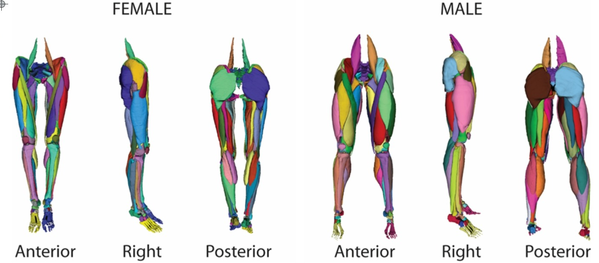

# Three Dimensional Lower Extremity Musculoskeletal Geometry Dataset

<div align="center">
    <a href="https://github.com/openmedlab/"></a>
</div>
<p style="text-align:center;font-size:10px;"><em></em></p>

## Dataset Information

**Musculoskeletal modeling** provides a pathway to gain in-depth insights into the human body, offering understanding that may otherwise be unattainable. Models and simulations of human functionality have had a profound impact on medicine, medical technology, product development, and education. For example, models and simulations are used to study tissue pathology and treatments, analyze responses to impacts and car accidents, develop and test products, create educational materials, and build entertainment models. Unfortunately, 3D geometries of human tissues necessary for creating practical applications are rarely made publicly available, or they may exist in raw forms with limited usability. As a result, new applications often require starting from scratch, a labor-intensive and time-consuming first step in constructing 3D tissue geometries. 

3D geometries are typically built from anatomical segmentations of cross-sectional images (e.g., MRI or CT scans). Although geometries derived from the Visible Human Project have been widely used in research and commercial applications, they are rarely shared. A few exceptions include models created for specific applications, such as crash analysis or electromagnetic studies, which focus on general structures of organs and limbs. These models are created by combining tissue geometries, but simulating musculoskeletal motion requires detailed representations of individual muscle geometries. Additionally, muscle geometries provided freely, such as in OpenSim, are often represented as 2D lines of action and frequently combine representations from different samples. While tissue geometries derived from the Visible Human male imaging dataset have been extensively used, the availability of the Visible Human female imaging dataset is often overlooked.

Our work aims to produce and publicly share a comprehensive set of individual 3D musculoskeletal geometries for the lower limb, including both the Visible Human female and male datasets, with results provided at multiple levels of post-processing to maximize data reuse. A natural consequence of creating 3D geometries from imaging is that raw and smoothed geometries may exhibit some over-closures or overlaps. A novel aspect of this work is that the final geometries provided contain no overlaps and exhibit sufficient smoothness, making them ready for computational modeling and simulation while maintaining fidelity to the original source imaging. These geometries provide a starting point for further high-fidelity simulations of deformable human musculoskeletal tissues, which may contribute to a better understanding of normal function as well as the evaluation of pathologies and treatments.

In summary, **3D musculoskeletal geometries** were extracted from the National Library of Medicine's Visible Human female and male frozen cadaver sections. Muscles, bones, cartilage, ligaments, and fat from the pelvis to the ankle were digitized and exported in shareable formats, available for download. While many published works have relied on the Visible Human Project, this is, to the best of the authors' knowledge, the first time a substantial collection of 3D geometries, including both male and female samples, has been made publicly accessible. A total of 260 geometries were extracted from the Visible Human female and male cadaver sections, including geometries of muscles, bones, cartilage, ligaments, and fat. The library is available at multiple processing stages, and notably, in its final form, there is no overlap between adjacent structures. This work provides resources for developing a range of computational models that may enable more representative musculoskeletal mechanics modeling. The library is available online to inspire continued work on multiscale, high-fidelity musculoskeletal modeling and to encourage reuse and ongoing development, including the addition of new musculoskeletal system geometries.

## Dataset Meta Information

| Dimensions | Modality                                 | Task Type      | Anatomical Structures           | Anatomical Area | Number of Categories | Data Volume | File Format  |
|------------|------------------------------------------|----------------|---------------------------------|-----------------|----------------------|-------------|--------------|
| 3D         | Lower Extremity Musculoskeletal Geometry | Segmentation   | Muscles, Bones, Cartilage, etc. | Entire body     | 130                  | 2           | DICOM, TIFF  |


## Label Information Statistics

| English             | 中文         |
|---------------------|------------|
| 76 muscles          | 76块肌肉      |
| 28 bones            | 28块骨骼      |
| 16 cartilages       | 16块软骨      |
| 8 ligaments         | 8条韧带       |
| 2 fat geometries    | 2个脂肪几何图形   |

## Visualization

<div align="center">
    <a href="https://github.com/openmedlab/"></a>
</div>
<p style="text-align:center;font-size:10px;"><em>Figure 1. Front, side, and back views of the 3D musculoskeletal geometry of a female (left) and male (right), consisting of 76 muscles, 28 bones, 16 articular cartilage segments, and 8 ligaments.</em></p>

## File Structure

``` 
├── Aligned Cryosection Images
├── Aligned and Rescaled CT Images
├── Original Segmentation Masks
├── Raw 3D Models
├── Smoothed 3D Models
├── Segmentation Masks of Smoothed Models
├── Final 3D Models
├── Segmentation Masks of Final Models
├── Raw 3D Model
├── ...
```

## Authors and Institutions

Thor E.Andreassen , Donald R. Hume, Landon D. Hamilton, Karen E.Walker, Sean E. Higinbotham & Kevin B. Shelburne

University of Denver, Center for Orthopaedic Biomechanics, Denver, CO, USA

## Source Information

Official Website: https://www.nature.com/articles/s41597-022-01905-2

Download Link: https://digitalcommons.du.edu/visiblehuman/

Article Address: https://www.nature.com/articles/s41597-022-01905-2

Publication Date: 2023-01

## Citation

``` 
@article{andreassen2023three,
  title={Three dimensional lower extremity musculoskeletal geometry of the visible human female and male},
  author={Andreassen, Thor E and Hume, Donald R and Hamilton, Landon D and Walker, Karen E and Higinbotham, Sean E and Shelburne, Kevin B},
  journal={Scientific Data},
  volume={10},
  number={1},
  pages={34},
  year={2023},
  publisher={Nature Publishing Group UK London}
}
```

Original introduction article is [here](https://zhuanlan.zhihu.com/p/7398125123).