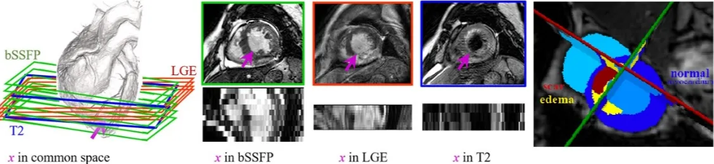
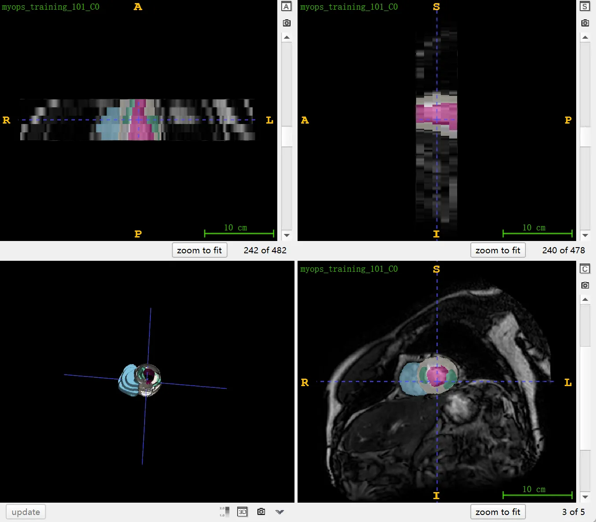

# MyoPS 2020

<div align="center">
    <a href="https://github.com/openmedlab/"></a>
</div>
<p style="text-align:center;font-size:10px;"><em></em></p>

## Dataset Information

MyoPS 2020 (Myocardial Pathology Segmentation Combining Multi-Sequence Cardiac Magnetic Resonance) is a dataset focused on myocardial pathology segmentation. This dataset provides aligned cardiac T2/bSSFP/LGE multi-sequence MRI imaging data for 45 patients, which have been manually annotated for scars, edema, normal myocardium, and the left and right ventricular blood pool. The challenge is to segment myocardial pathology by combining multi-sequence CMR data. The dataset is divided into 25 cases for training and 20 cases for testing, with the labels for the training set publicly available, and the testing set can be evaluated using the official evaluation toolkit provided.

Myocardial Infarction (MI), as one of the common cardiovascular diseases, is a frequent cause of death worldwide. Effective diagnosis and treatment for MI urgently require quantitative assessment of myocardial scars and edema. In real clinical scenarios, multi-sequence Cardiac Magnetic Resonance Imaging (CMR) is often used as an effective tool to assess MI. bSSFP CMR provides clear myocardial and left ventricular (LV) boundaries for the assessment of scars and edema; LGE CMR reveals special brightness in scar areas compared to healthy myocardium; and T2 images provide pathological information without the need for contrast agent injection. To perform quantitative analysis of multi-sequence CMR images, accurate and efficient segmentation of myocardial lesion areas is crucial. Manual delineation is arduous, time-consuming, and sometimes subjective, so there is an urgent need to automate this segmentation process. However, achieving such automatic segmentation remains a significant challenge due to poor image quality, blurry lesion boundaries, diverse lesion appearances, and the difficulty of fusing multi-sequence information.

## Dataset Meta Information

| Dimensions | Modality | Task Type | Anatomical Structures          | Anatomical Area | Number of Categories | Data Volume | File Format |
|------------|----------|-----------|--------------------------------|-----------------|----------------------|-------------|-------------|
| 3D         | MR       | Segmentation | Scar, edema, normal myocardium, and left and right ventricular blood pools | Heart           | 5                    | 45          | .nii.gz     |


### Resolution Details

| Dataset Statistics | spacing (mm)     | size            |
|--------------------|------------------|-----------------|
| min                | (0.73, 0.73, 12)              | (408, 392, 2)     |
| median             | (0.73, 0.73, 14)           | (483, 479, 4) |
| max                | (0.76, 0.76, 23)              | (512, 511, 6) |

Number of two-dimensional slices of 25 cases of training data: 306 (102 × 3 types of sequence MRI)

## Label Information Statistics

| Label | Description          | Cases | Percentage | Min Volume (cm³) | Median Volume (cm³) | Max Volume (cm³) |
|-------|----------------------|-------|------------|------------------|---------------------|------------------|
| 200   | LV normal myocardium | 25    | 100.00%    | 51.73             | 87.52               | 142.19           |
| 500   | LV blood pool        | 25    | 100.00%    | 44.43             | 86.62               | 144.39           |
| 600   | RV blood pool        | 25    | 100.00%    | 51.83             | 93.55               | 200.67           |
| 1220  | LV myocardial edema  | 25    | 100.00%    | 3.71              | 18.89               | 68.44            |
| 2221  | LV myocardial scars  | 25    | 100.00%    | 3.31              | 26.1                | 63.83            |


## Visualization

<div align="center">
    <a href="https://github.com/openmedlab/"></a>
</div>
<p style="text-align:center;font-size:10px;"><em> Official Visualization.</em></p>

<div align="center">
    <a href="https://github.com/openmedlab/"></a>
</div>
<p style="text-align:center;font-size:10px;"><em> ITK-SNAP Visualization.</em></p>

## File Structure

The file structure for the MyoPS 2020 dataset is as follows: The `MyoPS2020_EvaluateByYourself` folder contains evaluation tools and encrypted gold standard test data. The `test20` and `train25` folders include the test and training datasets, respectively, containing multi-sequence CMR images like C0, DE, and T2. The `train25_myops_gd` folder contains the gold standard labels for the training dataset. Each subfolder contains `.nii.gz` files which are compressed NIfTI format images, including different types of cardiac MRI data.

``` 
MyoPS 2020 Dataset
│
├── MyoPS2020_EvaluateByYourself
│   ├── readme.txt
│   ├── zhxCardMyoPSEvaluate
│   ├── zhxCardMyoPSEvaluate.exe
│   └── test_data_gd
│       ├── myops_test_201_gdencrypt.nii.gz
│       ├── myops_test_202_gdencrypt.nii.gz
│       └── ...
│
├── test20
│   ├── myops_test_201_C0.nii.gz
│   ├── myops_test_201_DE.nii.gz
│   ├── myops_test_201_T2.nii.gz
│   ├── myops_test_202_C0.nii.gz
│   ├── myops_test_202_DE.nii.gz
│   ├── myops_test_202_T2.nii.gz
│   └── ...
│
├── train25
│   ├── myops_training_101_C0.nii.gz
│   ├── myops_training_101_DE.nii.gz
│   ├── myops_training_101_T2.nii.gz
│   ├── myops_training_102_C0.nii.gz
│   ├── myops_training_102_DE.nii.gz
│   ├── myops_training_102_T2.nii.gz
│   └── ...
│
└── train25_myops_gd
    ├── myops_training_101_gd.nii.gz
    ├── myops_training_102_gd.nii.gz
    └── ...
```

## Authors and Institutions

Xiahai Zhuang (Fudan University)


## Source Information

Official Website: https://zmiclab.github.io/zxh/0/myops20/

Download Link: https://mega.nz/folder/BRdnDISQ#FnCg9ykPlTWYe5hrRZxi-w

Article Address: https://www.sciencedirect.com/science/article/pii/S1361841523001494, https://ieeexplore.ieee.org/document/9965747, https://ieeexplore.ieee.org/document/8458220, https://www.sciencedirect.com/science/article/pii/S136184152200322X

Publication Date: 2020-04

## Citation

``` 
@article{GAO2023102889,
title = {BayeSeg: Bayesian modeling for medical image segmentation with interpretable generalizability},
journal = {Medical Image Analysis},
volume = {89},
pages = {102889},
year = {2023},
issn = {1361-8415},
doi = {https://doi.org/10.1016/j.media.2023.102889},
url = {https://www.sciencedirect.com/science/article/pii/S1361841523001494},
author = {Shangqi Gao and Hangqi Zhou and Yibo Gao and Xiahai Zhuang},
keywords = {Image segmentation, Interpretation and generalization, Statistical modeling, Variational Bayes},
abstract = {Due to the cross-domain distribution shift aroused from diverse medical imaging systems, many deep learning segmentation methods fail to perform well on unseen data, which limits their real-world applicability. Recent works have shown the benefits of extracting domain-invariant representations on domain generalization. However, the interpretability of domain-invariant features remains a great challenge. To address this problem, we propose an interpretable Bayesian framework (BayeSeg) through Bayesian modeling of image and label statistics to enhance model generalizability for medical image segmentation. Specifically, we first decompose an image into a spatial-correlated variable and a spatial-variant variable, assigning hierarchical Bayesian priors to explicitly force them to model the domain-stable shape and domain-specific appearance information respectively. Then, we model the segmentation as a locally smooth variable only related to the shape. Finally, we develop a variational Bayesian framework to infer the posterior distributions of these explainable variables. The framework is implemented with neural networks, and thus is referred to as deep Bayesian segmentation. Quantitative and qualitative experimental results on prostate segmentation and cardiac segmentation tasks have shown the effectiveness of our proposed method. Moreover, we investigated the interpretability of BayeSeg by explaining the posteriors and analyzed certain factors that affect the generalization ability through further ablation studies. Our code is released via https://zmiclab.github.io/projects.html.}
}

@ARTICLE{8458220,
  author={Zhuang, Xiahai},
  journal={IEEE Transactions on Pattern Analysis and Machine Intelligence}, 
  title={Multivariate Mixture Model for Myocardial Segmentation Combining Multi-Source Images}, 
  year={2019},
  volume={41},
  number={12},
  pages={2933-2946},
  doi={10.1109/TPAMI.2018.2869576}}

@ARTICLE{9965747,
  author={Luo, Xinzhe and Zhuang, Xiahai},
  journal={IEEE Transactions on Pattern Analysis and Machine Intelligence}, 
  title={$\mathcal {X}$-Metric: An N-Dimensional Information-Theoretic Framework for Groupwise Registration and Deep Combined Computing}, 
  year={2023},
  volume={45},
  number={7},
  pages={9206-9224},
  doi={10.1109/TPAMI.2022.3225418}}

@article{QIU2023102694,
title = {MyoPS-Net: Myocardial pathology segmentation with flexible combination of multi-sequence CMR images},
journal = {Medical Image Analysis},
volume = {84},
pages = {102694},
year = {2023},
issn = {1361-8415},
doi = {https://doi.org/10.1016/j.media.2022.102694},
url = {https://www.sciencedirect.com/science/article/pii/S136184152200322X},
author = {Junyi Qiu and Lei Li and Sihan Wang and Ke Zhang and Yinyin Chen and Shan Yang and Xiahai Zhuang},
keywords = {Multi-sequence CMR, Myocardial pathology segmentation, Missing modality, Practical clinics},
abstract = {Myocardial pathology segmentation (MyoPS) can be a prerequisite for the accurate diagnosis and treatment planning of myocardial infarction. However, achieving this segmentation is challenging, mainly due to the inadequate and indistinct information from an image. In this work, we develop an end-to-end deep neural network, referred to as MyoPS-Net, to flexibly combine five-sequence cardiac magnetic resonance (CMR) images for MyoPS. To extract precise and adequate information, we design an effective yet flexible architecture to extract and fuse cross-modal features. This architecture can tackle different numbers of CMR images and complex combinations of modalities, with output branches targeting specific pathologies. To impose anatomical knowledge on the segmentation results, we first propose a module to regularize myocardium consistency and localize the pathologies, and then introduce an inclusiveness loss to utilize relations between myocardial scars and edema. We evaluated the proposed MyoPS-Net on two datasets, i.e., a private one consisting of 50 paired multi-sequence CMR images and a public one from MICCAI2020 MyoPS Challenge. Experimental results showed that MyoPS-Net could achieve state-of-the-art performance in various scenarios. Note that in practical clinics, the subjects may not have full sequences, such as missing LGE CMR or mapping CMR scans. We therefore conducted extensive experiments to investigate the performance of the proposed method in dealing with such complex combinations of different CMR sequences. Results proved the superiority and generalizability of MyoPS-Net, and more importantly, indicated a practical clinical application. The code has been released via https://github.com/QJYBall/MyoPS-Net.}
}
```

Original introduction article is [here](https://zhuanlan.zhihu.com/p/669391415).