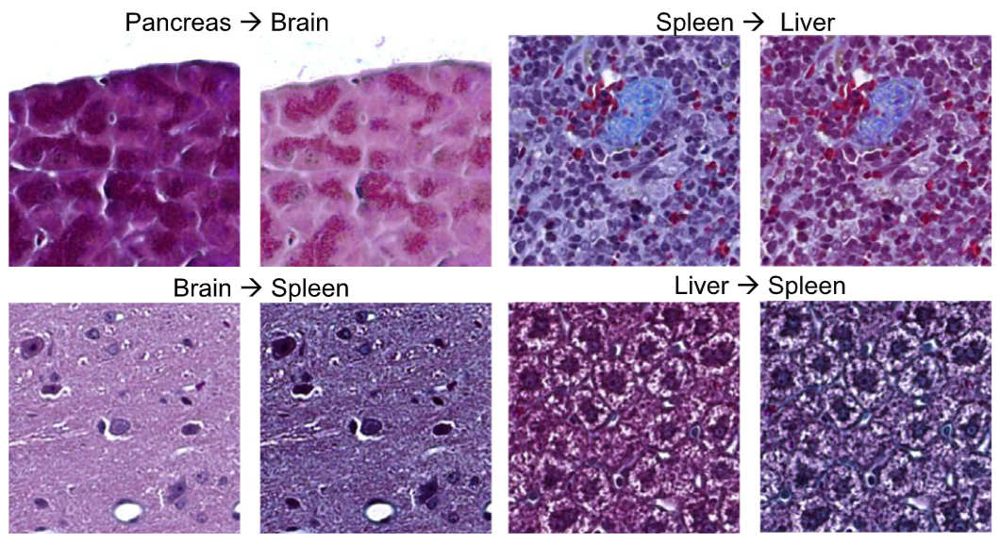
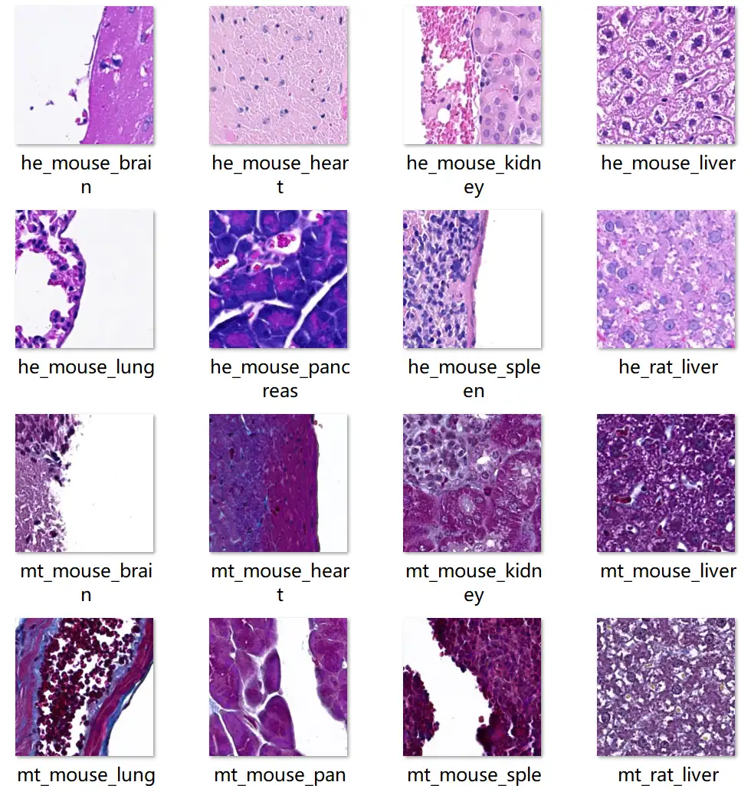

# NAFLD

<div align="center">
    <a href="https://github.com/openmedlab/"></a>
</div>
<p style="text-align:center;font-size:10px;"><em></em></p>

## Dataset Information

The NAFLD Pathology and Healthy Tissue Samples dataset is a specialized pathology image dataset covering a wide range of species, organs, and staining agents, making it significant for research. This dataset includes a variety of organ samples from mice and rats, such as the liver, brain, lungs, heart, pancreas, spleen, and kidneys, providing extensive coverage. This allows researchers to test and validate their models across multiple biological systems, enhancing the universality and applicability of their research.

In addition to normal tissue samples, the dataset also includes samples of non-alcoholic fatty liver disease (NAFLD) from mice, enabling researchers to delve into the pathological characteristics of NAFLD and develop targeted diagnostic and therapeutic methods. The dataset employs Masson's Trichrome and H&E staining techniques to highlight different tissue structures and pathological features, aiding in the generalization and accuracy of image classification models. The large-scale image dataset—totaling 119,828 images, with 110,746 in the training set and 9,082 in the test set—supports the training and validation of deep learning models, ensuring their robustness and reliability in practical applications.

## Dataset Meta Information

| Dimensions | Modality  | Task Type      | Anatomical Structures | Anatomical Area | Number of Categories | Data Volume | File Format |
|------------|-----------|----------------|-----------------------|-----------------|----------------------|-------------|-------------|
| 2D         | Pathology | Classification | Entire body           | Entire body     | 16                   | 119828      | PNG         |


### Resolution Details

| Dataset Statistics | size        |
|--------------------|-------------|
| min                | (256, 256)  |
| median             | (256, 256)  |
| max                | (256, 256)  |

## Label Information Statistics

Training Set:

| Category          | Class Name          | Number of Samples | Percentage |
|-------------------|---------------------|-------------------|------------|
| he_mouse_brain    | Mouse Brain (HE)    | 6922              | 0.05777    |
| he_mouse_heart    | Mouse Heart (HE)    | 6922              | 0.05777    |
| he_mouse_kidney   | Mouse Kidney (HE)   | 6922              | 0.05777    |
| he_mouse_liver    | Mouse Liver (HE)    | 6921              | 0.05776    |
| he_mouse_lung     | Mouse Lung (HE)     | 6922              | 0.05777    |
| he_mouse_pancreas | Mouse Pancreas (HE) | 6922              | 0.05777    |
| he_mouse_spleen   | Mouse Spleen (HE)   | 6922              | 0.05777    |
| he_rat_liver      | Rat Liver (HE)      | 6920              | 0.05775    |
| mt_mouse_brain    | Mouse Brain (MT)    | 6922              | 0.05777    |
| mt_mouse_heart    | Mouse Heart (MT)    | 6922              | 0.05777    |
| mt_mouse_kidney   | Mouse Kidney (MT)   | 6922              | 0.05777    |
| mt_mouse_liver    | Mouse Liver (MT)    | 6921              | 0.05776    |
| mt_mouse_liver    | Mouse Liver (MT)    | 6921              | 0.05776    |
| mt_mouse_lung     | Mouse Lung (MT)     | 6922              | 0.05777    |
| mt_mouse_pancreas | Mouse Pancreas (MT) | 6922              | 0.05777    |
| mt_mouse_spleen   | Mouse Spleen (MT)   | 6922              | 0.05777    |
| mt_rat_liver      | Rat Liver (MT)      | 6920              | 0.05775    |


Test Set:

| Category                      | Class Name                       | Number of Samples | Percentage  |
|-------------------------------|----------------------------------|-------------------|-------------|
| NAFLD_anomaly_mt_mouse_liver  | NAFLD Anomalous Mouse Liver (MT) | 2372              | 0.0198      |
| NAFLD_anomaly_he_mouse_liver  | NAFLD Anomalous Mouse Liver (HE) | 2150              | 0.01794     |
| normal_he_mouse_liver         | Normal Mouse Liver (HE)          | 2170              | 0.01811     |
| normal_mt_mouse_liver         | Normal Mouse Liver (MT)          | 2390              | 0.01995     |


## Visualization

<div align="center">
    <a href="https://github.com/openmedlab/"></a>
</div>
<p style="text-align:center;font-size:10px;"><em> Local Visualization.</em></p>

## File Structure

The dataset file structure is as follows:

``` 
NAFLD pathology and healthy tissue samples
├── data
│   ├── train
│   │   ├── he_mouse_brain.zip
│   │   ├── he_mouse_heart.zip
│   │   ├── xxx.zip
│   │   ├── xxx.zip
│   │   └── ...
│   └── test
│   │   ├── normal_he_mouse_liver.zip
│   │   ├── normal_mt_mouse_liver.zip
│   │   ├── xxx.zip
│   │   ├── xxx.zip
│   │   └── ...
```

## Authors and Institutions

Igor Zingman (Drug Discovery Sciences, Boehringer Ingelheim Pharma GmbH and Co., Biberach an der Riβ, Germany)

Birgit Stierstorfer (Non-Clinical Drug Safety, Boehringer Ingelheim Pharma GmbH and Co., Biberach an der Riβ, Germany)

Charlotte Lempp (Drug Discovery Sciences, Boehringer Ingelheim Pharma GmbH and Co., Biberach an der Riβ, Germany)

Fabian Heinemann (Drug Discovery Sciences, Boehringer Ingelheim Pharma GmbH and Co., Biberach an der Riβ, Germany)

## Source Information

Official Website: https://osf.io/gqutd/

Download Link: https://osf.io/gqutd/

Article Address: https://www.sciencedirect.com/science/article/pii/S1361841523003274

Publication Date: 2022-10

## Citation

``` 
@article{zingman2024learning,
  title={Learning image representations for anomaly detection: application to discovery of histological alterations in drug development},
  author={Zingman, Igor and Stierstorfer, Birgit and Lempp, Charlotte and Heinemann, Fabian},
  journal={Medical Image Analysis},
  volume={92},
  pages={103067},
  year={2024},
  publisher={Elsevier}
}
```

Original introduction article is [here](https://zhuanlan.zhihu.com/p/710091973).