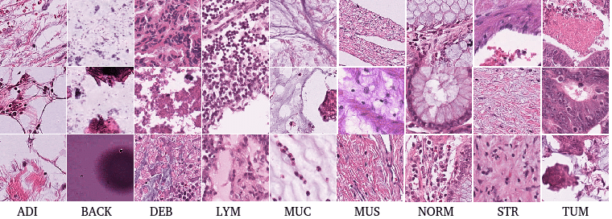

# NCT-CRC-HE-100K

<div align="center">
    <a href="https://github.com/openmedlab/"></a>
</div>
<p style="text-align:center;font-size:10px;"><em></em></p>

## Dataset Information

The NCT-CRC-HE-100K dataset is a pathology image dataset designed for image classification, comprising 100,000 hematoxylin and eosin (H&E) stained histological images of human colorectal cancer and healthy tissues extracted from 86 patients. The dataset includes images of nine different tissue types, which have been color normalized using the Macenko method to effectively reduce color variations from different slides.

Clinically, this dataset provides a high-quality and diverse image base for researchers and algorithm developers to improve and validate automated technologies for cancer diagnostics, tissue segmentation, and classification. The NCT-CRC-HE-100K dataset aids in advancing computational pathology, particularly in the study of colorectal cancer diagnosis and treatment, by facilitating the identification of microscopic features of cancer and its surrounding environment, potentially providing more accurate support for clinical decision-making.

## Dataset Meta Information

| Dimensions | Modality  | Task Type      | Anatomical Structures | Anatomical Area | Number of Categories | Data Volume | File Format |
|------------|-----------|----------------|-----------------------|-----------------|----------------------|-------------|-------------|
| 2D         | Pathology | Classification | Colon                 | Colon           | 9                    | 100,000     | .tif        |


### Resolution Details

| Dataset Statistics | size       |
|--------------------|------------|
| min                | (224, 224) |
| median             | (224, 224) |
| max                | (224, 224) |

## Label Information Statistics

| #   | Type | Number of Images | Percentage |
|-----|------|------------------|------------|
| 1   | ADI  | 10407            | 0.10407    |
| 2   | BACK | 10566            | 0.10566    |
| 3   | DEB  | 1512             | 0.11512    |
| 4   | LYM  | 11557            | 0.11557    |
| 5   | MUC  | 8896             | 0.08896    |
| 6   | MUS  | 13536            | 0.13536    |
| 7   | NORM | 8763             | 0.08763    |
| 8   | STR  | 10446            | 0.10446    |
| 9   | TUM  | 14317            | 0.14317    |

The tissue types included in the dataset are:

- **Adipose (ADI):** Fat tissue.
- **Background (BACK):** Background elements.
- **Debris (DEB):** Debris within the sample.
- **Lymphocytes (LYM):** Lymphocytes, which are a type of white blood cell.
- **Mucus (MUC):** Mucus found within the sample.
- **Smooth muscle (MUS):** Muscle fibers found in the gastrointestinal tract.
- **Normal colon mucosa (NORM):** Normal tissue lining the colon.
- **Cancer-associated stroma (STR):** Connective tissue associated with cancer growth.
- **Colorectal adenocarcinoma epithelial (TUM):** Epithelial cells from colorectal adenocarcinoma, a type of colon cancer.

## Visualization

<div align="center">
    <a href="https://github.com/openmedlab/"></a>
</div>
<p style="text-align:center;font-size:10px;"><em>Example images of the nine categories are provided.</em></p>

## File Structure

``` 
NCT-CRC-HE-100K
│
├── ADI
│   ├─image1.tif
│   ├─image2.tif
│   └─ ...
├── BACK
│   ├─image1.tif
│   ├─image2.tif
│   └─ ...
├── ...
```

## Authors and Institutions

- **Kather, Jakob Nikolas:** National Center for Tumor Diseases, Germany
- **Halama, Niels:** National Center for Tumor Diseases, Germany
- **Marx, Alexander:** Institute of Pathology, Mannheim Medical Center, University of Heidelberg, Germany

## Source Information

Official Website: https://zenodo.org/records/1214456

Download Link: https://zenodo.org/records/1214456

Article Address: https://zenodo.org/records/1214456

Publication Date: 2008-04

## Citation

``` 
@dataset{kather_jakob_nikolas_2018_1214456,
  author       = {Kather, Jakob Nikolas and Halama, Niels and Marx, Alexander},
  title        = {{100,000 histological images of human colorectal cancer and healthy tissue}},
  month        = apr,
  year         = 2018,
  publisher    = {Zenodo},
  version      = {v0.1},
  doi          = {10.5281/zenodo.1214456},
  url          = {https://doi.org/10.5281/zenodo.1214456}
}
```

Original introduction article is [here](https://zhuanlan.zhihu.com/p/707106937).