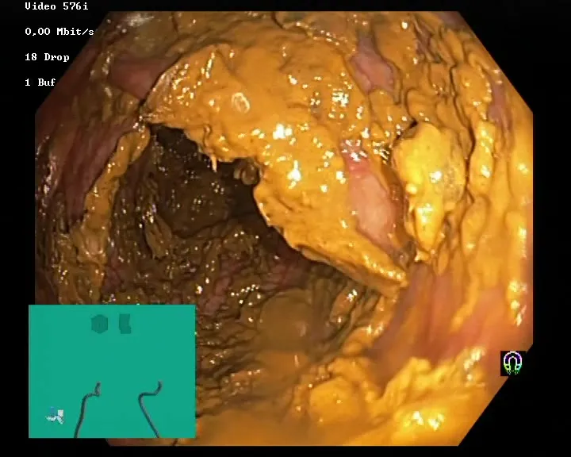
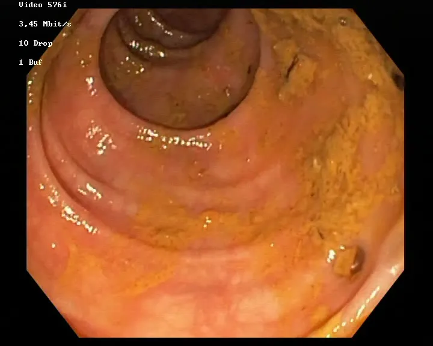
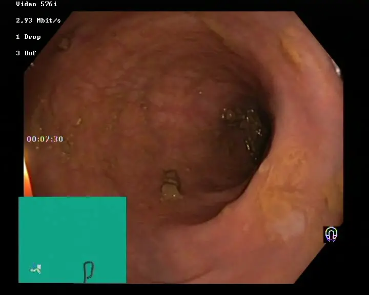
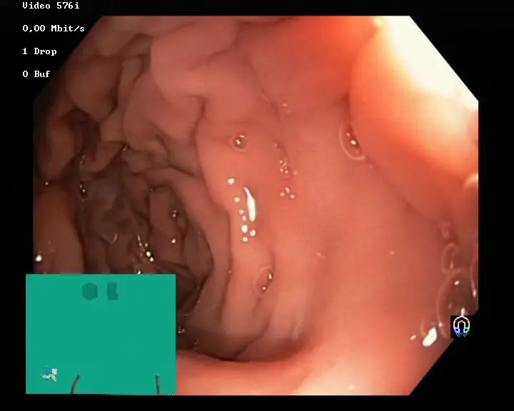

# The Nerthus Dataset

<div align="center">
    <a href="https://github.com/openmedlab/"></a>
</div>
<p style="text-align:center;font-size:10px;"><em></em></p>

## Dataset Information

The Nerthus dataset is a gastroenterological endoscopy dataset designed to enhance the accuracy and efficiency of colonoscopic examinations. It consists of 21 videos containing a total of 5525 frames, annotated and validated by experienced endoscopists, demonstrating various levels of intestinal cleanliness. These videos are classified into four distinct cleanliness levels according to the Boston Bowel Preparation Scale (BBPS). The Nerthus dataset aims to engage multimedia researchers and promote the development of systems capable of automatically assessing intestinal cleanliness, thereby improving the quality and efficiency of gastroenterological endoscopic diagnosis.

The quality of bowel preparation (cleanliness) is fundamental to the success of colonoscopic examinations, directly affecting the ability to detect diseases and determining the intervals for screening and follow-up exams. Therefore, accurate assessment of bowel preparation quality is of utmost importance. While reliable and validated bowel preparation scoring systems exist, scoring can vary among physicians. Developing an objective and automated system for assessing bowel cleanliness can reduce the inconsistency of scoring between doctors and improve the efficiency of medical resource use, thereby achieving greater accuracy and efficiency in colonoscopic examinations. The provision of the Nerthus dataset is intended to foster this progress, encouraging collaboration between researchers in multimedia and medical fields to develop and refine technologies for the automatic assessment of bowel cleanliness.

## Dataset Meta Information

| Dimensions | Modality | Task Type  | Anatomical Area | Number of Categories | Data Volume | File Format |
|------------|----------|------------|-----------------|----------------------|-------------|-------------|
| 2D         | Endoscopy       | Evaluation | Intestine           | 4                    | 5525        | jpg         |

### Resolution Details

| Dataset Statistics | size      |
|--------------------|-----------|
| min                | 720 x 576 |
| median             | 720 x 576 |
| max                | 720 x 576 |

## Label Information Statistics

| Cleaning Level | Number of Images | Percentage (%) |
|----------------|------------------|----------------|
| 0              | 500              | 9.05           |
| 1              | 2700             | 48.87          |
| 2              | 975              | 17.65          |
| 3              | 1350             | 24.44          |


## Visualization

<div align="center">
    <a href="https://github.com/openmedlab/"></a>
</div>
<p style="text-align:center;font-size:10px;"><em>Level 0 cleaning</em></p>

<div align="center">
    <a href="https://github.com/openmedlab/"></a>
</div>
<p style="text-align:center;font-size:10px;"><em>Level 1 cleaning</em></p>

<div align="center">
    <a href="https://github.com/openmedlab/"></a>
</div>
<p style="text-align:center;font-size:10px;"><em>Level 2 cleaning</em></p>

<div align="center">
    <a href="https://github.com/openmedlab/"></a>
</div>
<p style="text-align:center;font-size:10px;"><em>Level 3 cleaning</em></p>


## File Structure

``` 
Dataset
│
├── nerthus-dataset-frames
│   ├── 0
│   │   ├── bowel_1_score_0-0_00000001.jpg
│   │   ├── bowel_1_score_0-0_00000002.jpg
│   │   ├── ...
│   ├── 1
│   │   ├── bowel_3_score_1-0_00000001.jpg
│   │   ├── bowel_3_score_1-0_00000002.jpg
│   │   ├── ...
│   ├── 2
│   │   ├── bowel_13_score_0-0_00000001.jpg
│   │   ├── bowel_13_score_0-0_00000002.jpg
│   │   ├── ...
│   ├── 3
│   │   ├── bowel_17_score_0-0_00000001.jpg
│   │   ├── bowel_17_score_0-0_00000002.jpg
│   │   ├── ...
```

## Authors and Institutions

Konstantin Pogorelov (University of Oslo)

Kristin Ranheim Randel (University of Oslo)

Thomas de Lange (Bærum Hospital, Norway)

Sigrun Losada Eskeland (Bærum Hospital, Norway)

Carsten Griwodz (University of Oslo)

Dag Johansen (UiT The Arctic University of Norway)

Concetto Spampinato (University of Catania, Italy)

Mario Taschwer (University of Klagenfurt, Austria)

Mathias Lux (University of Klagenfurt, Austria)

Peter Thelin Schmidt (Karolinska Institute)

Michael Riegler (University of Oslo)

Pål Halvorsen (University of Oslo)


## Source Information

Official Website: TBD

Download Link: TBD

Article Address: TBD

Publication Date: TBD

## Citation

``` 
@inproceedings{Pogorelov:2017:NBP:3083187.3083216,
  title = {Nerthus: A Bowel Preparation Quality Video Dataset},
  author = {
    Pogorelov, Konstantin and Randel, Kristin Ranheim and de Lange, Thomas and
    Eskeland, Sigrun Losada and Griwodz, Carsten and Johansen, Dag and
    Spampinato, Concetto and Taschwer, Mario and Lux, Mathias and
    Schmidt, Peter Thelin and Riegler, Michael and Halvorsen, P{\aa}l
  },
  booktitle = {Proceedings of the 8th ACM on Multimedia Systems Conference},
  series = {MMSys'17},
  year = {2017},
  location = {Taipei, Taiwan},
  pages = {170--174},
  numpages = {5},
  doi = {10.1145/3083187.3083216},
  acmid = {3083216},
  publisher = {ACM},
  address = {New York, NY, USA},
}
```

Original introduction article is [here](https://zhuanlan.zhihu.com/p/672083265).