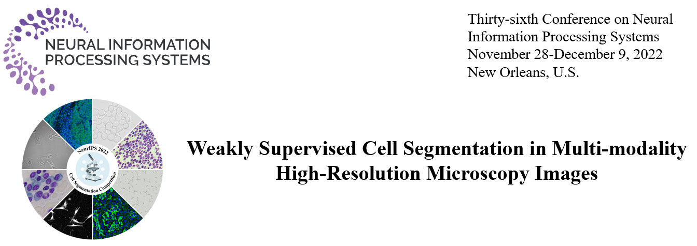
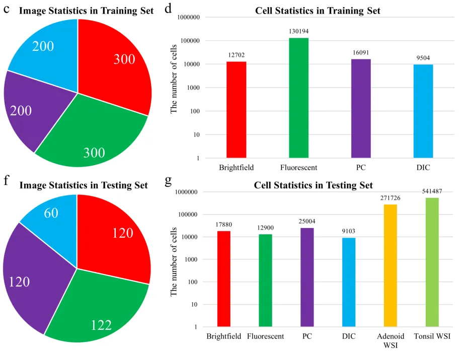
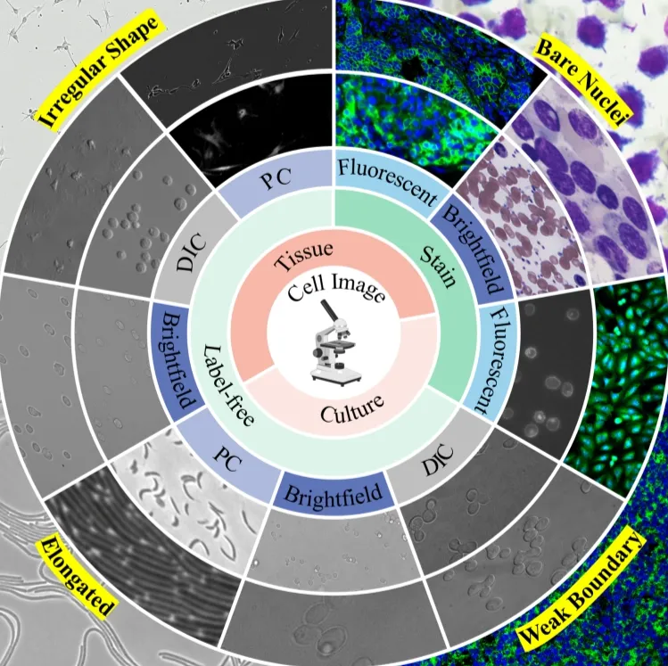
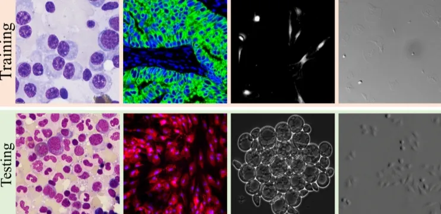

# NeurIPS 2022 Cell Seg

<div align="center">
    <a href="https://github.com/openmedlab/"></a>
</div>
<p style="text-align:center;font-size:10px;"><em></em></p>

## Dataset Information

The NeurIPS 2022 cell segmentation competition, officially named "Weakly Supervised Cell Segmentation in Multi-modality High-Resolution Microscopy Images", has introduced a large-scale, multi-modality microscopy image dataset for cell segmentation. This dataset brings together images from over 40 different biological experiments from more than ten laboratories around the world, making it one of the most diverse collections to date. It covers four main microscopy techniques: Differential Interference Contrast (DIC), Fluorescent, Phase-contrast, and Brightfield, and includes various types of cells such as tissue cells, cultured cells, unlabeled cells, and stained cells. The training set includes 1000 labeled images and 1500 unlabeled images. The validation set consists of 100 images with publicly available labels. The test set includes 422 images, including two fluorescent Whole Slide Images (WSIs), adding to the challenges faced by researchers.

Cell segmentation is an indispensable basic task in biological image analysis, applicable to various experimental setups and imaging methods. For example, in the analysis of the cancer microenvironment with multi-fluorescence imaging, cell segmentation is a prerequisite for identifying tumor subtypes, composition, and structured organization, which can reveal critical biological information. Despite this, due to the immense diversity of cell origins, microscopy techniques, staining methods, and cell morphology, developing a universal and automated cell segmentation technique remains a significant challenge.

## Dataset Meta Information

| Dimensions | Modality            | Task Type             | Anatomical Structures | Anatomical Area | Number of Categories | Data Volume | File Format |
|------------|---------------------|-----------------------|-----------------------|-----------------|----------------------|-------------|-------------|
| 2D         | Microscopic imaging | Instance Segmentation | Cell                  | Cell            | 1                    | 3022 images | .png .bmp .tif .tiff         |


### Resolution Details

Statistics on 1000 labeled images in the training set


| Dataset Statistics | size         |
|--------------------|--------------|
| min                | (200, 200)   |
| median             | (970, 970)   |
| max                | (4096, 4096)   |

## Label Information Statistics

<div align="center">
    <a href="https://github.com/openmedlab/"></a>
</div>
<p style="text-align:center;font-size:10px;"><em> Official arxiv paper statistics. </em></p>

## Visualization

<div align="center">
    <a href="https://github.com/openmedlab/"></a>
</div>
<p style="text-align:center;font-size:10px;"><em></em></p>

<div align="center">
    <a href="https://github.com/openmedlab/"></a>
</div>
<p style="text-align:center;font-size:10px;"><em></em></p>

## File Structure

The file structure of the NeurIPS22-CellSeg dataset is as follows:

- **Training**: This folder contains labeled images, label information, and unlabeled images for training the model.
- **Tuning**: This folder provides images with corresponding labels for model tuning.
- **Testing**: This folder is divided into two subfolders:
  - **Public**: Contains publicly available labeled images for evaluation.
  - **Hidden**: Contains private labels that are not publicly available for model testing.

``` 
NeurIPS22-CellSeg
│
├── Testing
│   ├── Hidden
│   └── Public
│
├── Training
│   ├── images
│   ├── labels
│   └── unlabeled
│   └── ReadMe.md
│
└── Tuning
    ├── images
    └── labels
```

## Authors and Institutions

Jun Ma (University of Toronto, Canada)

Ronald Xie (University of Toronto, Canada)

Gary D. Bader (University of Toronto, Canada)

Bo Wang (University of Toronto, Canada)


## Source Information

Official Website: https://neurips22-cellseg.grand-challenge.org/

Download Link: https://neurips22-cellseg.grand-challenge.org/dataset/

Article Address: https://arxiv.org/abs/2308.05864

Publication Date: 2022-06

## Citation

``` 
@article{NeurIPS22CellSeg,
    Author = {Jun Ma and Ronald Xie and Shamini Ayyadhury and Cheng Ge and Anubha Gupta and Ritu Gupta and Song Gu and Yao Zhang and Gihun Lee and Joonkee Kim and Wei Lou and Haofeng Li and Eric Upschulte and Timo Dickscheid and José Guilherme de Almeida and Yixin Wang and Lin Han and Xin Yang and Marco Labagnara and Sahand Jamal Rahi and Carly Kempster and Alice Pollitt and Leon Espinosa and Tâm Mignot and Jan Moritz Middeke and Jan-Niklas Eckardt and Wangkai Li and Zhaoyang Li and Xiaochen Cai and Bizhe Bai and Noah F. Greenwald and David Van Valen and Erin Weisbart and Beth A. Cimini and Zhuoshi Li and Chao Zuo and Oscar Brück and Gary D. Bader and Bo Wang},
    Title = {The Multi-modality Cell Segmentation Challenge: Towards Universal Solutions},
    Year = {2023},
    Journal = {arXiv:2308.05864},
}
```

Original introduction article is [here](https://zhuanlan.zhihu.com/p/671145774).