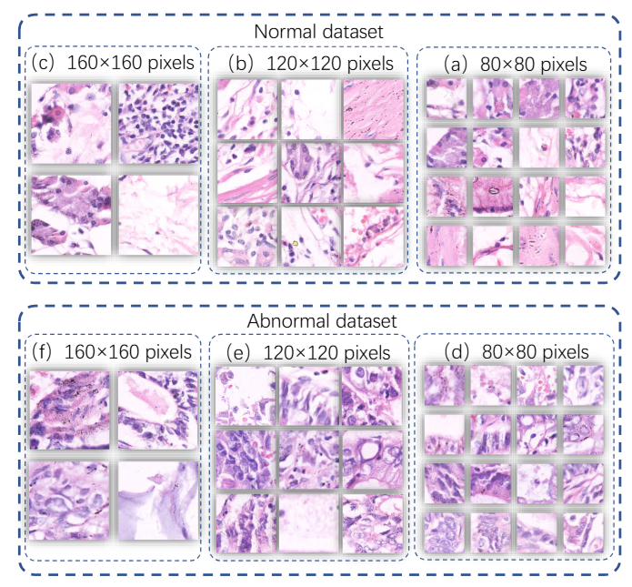
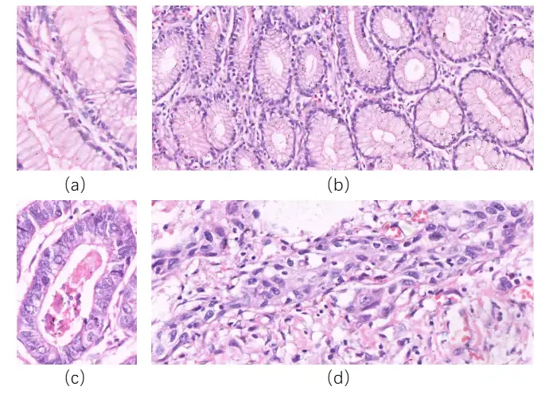

# NuCLS

<div align="center">
    <a href="https://github.com/openmedlab/"></a>
</div>
<p style="text-align:center;font-size:10px;"><em></em></p>

## Dataset Information

The NuCLS dataset is a pathology dataset specifically designed for image classification tasks, derived from 600 high-resolution gastric cancer pathology images (2048x2048 pixels). These images have been finely cropped to produce 245,196 sub-images of varying sizes (160x160, 120x120, 80x80), which are classified into two major categories: normal and abnormal.

Gastric cancer is the fifth most common cancer worldwide, and early diagnosis is crucial for improving patient survival rates and prognosis. Histopathological examination of gastric tissue is recognized as the gold standard for diagnosing this disease. However, traditional diagnostic methods rely on the experience of pathologists, which can be subjective and time-consuming. Thus, developing new computer-assisted diagnostic algorithms, especially those capable of automatically recognizing and classifying gastric cancer pathology images, is of great importance for enhancing diagnostic efficiency and accuracy. The launch of the GasHisSDB dataset provides researchers with a rich and high-quality resource, helping them explore and develop new deep learning and machine learning algorithms. These algorithms have the potential to automate the diagnosis of gastric cancer, thereby assisting clinicians in making faster and more accurate decisions.

## Dataset Meta Information

| Dimensions | Modality  | Task Type      | Anatomical Structures | Anatomical Area | Number of Categories | Data Volume   | File Format |
|------------|-----------|----------------|-----------------------|-----------------|----------------------|---------------|-------------|
| 2D         | Pathology | Classification | Stomach               | Stomach         | 2                    | 119828        | PNG         |


### Resolution Details

| Dataset Statistics | size       |
|--------------------|------------|
| min                | (160, 160) |
| median             | (120, 120) |
| max                | (80, 80)   |

## Label Information Statistics

| Size    | Category | Quantity | Percentage |
|---------|----------|----------|------------|
| 160x160 | Abnormal | 13,124   | 5.35%      |
| 120x120 | Abnormal | 24,801   | 10.11%     |
| 80x80   | Abnormal | 59,151   | 24.12%     |
| 160x160 | Normal   | 20,160   | 8.22%      |
| 120x120 | Normal   | 40,460   | 16.50%     |
| 80x80   | Normal   | 87,500   | 35.69%     |


## Visualization

<div align="center">
    <a href="https://github.com/openmedlab/"></a>
</div>
<p style="text-align:center;font-size:10px;"><em>Pathological image examples: (a)(b) normal image (c)(d) abnormal image (from the original paper).</em></p>

<div align="center">
    <a href="https://github.com/openmedlab/"></a>
</div>
<p style="text-align:center;font-size:10px;"><em>GasHisSDB dataset content (from the original paper).</em></p>

## File Structure

The dataset file structure is as follows:

``` 
GasHisSDB
├── 120x120
│   ├── Abnormal
│   │   ├── Abnormal-00001.png
│   │   ├── Abnormal-00002.png
│   │   ├── Abnormal-00003.png
│   │   └── ...
│   └── Normal
├── 160x160
├── 80x80
```

## Authors and Institutions

Weiming Hu (Microscopic Image and Medical Image Analysis Group, College of Medicine and Biological Information Engineering, Northeastern University)

Chen Li (Microscopic Image and Medical Image Analysis Group, College of Medicine and Biological Information Engineering, Northeastern University)

Xiaoyan Li (Department of Pathology, Cancer Hospital, China Medical University, Liaoning Cancer Hospital and Institute)

Md Mamunur Rahaman (Microscopic Image and Medical Image Analysis Group, College of Medicine and Biological Information Engineering, Northeastern University&School of Computer Science and Engineering, University of New South Wales)

Jiquan Ma (Department of Computer Science and Technology, Heilongjiang University)

Yong Zhang (Department of Pathology, Cancer Hospital, China Medical University, Liaoning Cancer Hospital and Institute)

Haoyuan Chen (Microscopic Image and Medical Image Analysis Group, College of Medicine and Biological Information Engineering, Northeastern University)

Wanli Liu (Microscopic Image and Medical Image Analysis Group, College of Medicine and Biological Information Engineering, Northeastern University)

Changhao Sun (Microscopic Image and Medical Image Analysis Group, College of Medicine and Biological Information Engineering, Northeastern University & Shenyang Institute of Automation, Chinese Academy of Sciences)

YudongYao (Department of Electrical and Computer Engineering, Stevens Institute of Technology)

Hongzan Sun (Department of Radiology, Shengjing Hospital, China Medical University)

Marcin Grzegorzek (Institute of Medical Informatics, University of Luebeck)

## Source Information

Official Website: https://www.sciencedirect.com/science/article/abs/pii/S0010482521010015

Download Link: https://gitee.com/neuhwm/GasHisSDB

Article Address: https://www.sciencedirect.com/science/article/abs/pii/S0010482521010015

Publication Date: 2022-03

## Citation

``` 
@article{hu2022gashissdb,
  title={GasHisSDB: A new gastric histopathology image dataset for computer aided diagnosis of gastric cancer},
  author={Hu, Weiming and Li, Chen and Li, Xiaoyan and Rahaman, Md Mamunur and Ma, Jiquan and Zhang, Yong and Chen, Haoyuan and Liu, Wanli and Sun, Changhao and Yao, Yudong and others},
  journal={Computers in biology and medicine},
  volume={142},
  pages={105207},
  year={2022},
  publisher={Elsevier}
}
```

Original introduction article is [here](https://zhuanlan.zhihu.com/p/716169480).