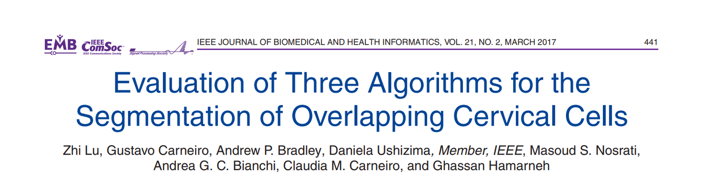
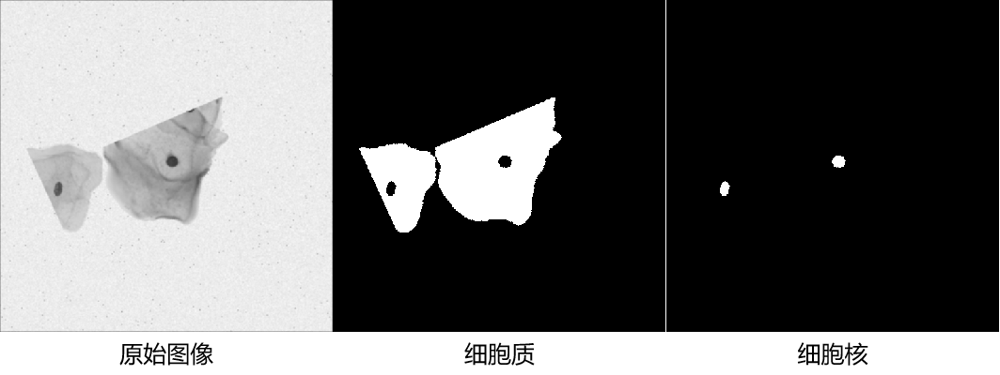

# OCCISC

<div align="center">
    <a href="https://github.com/openmedlab/"></a>
</div>
<p style="text-align:center;font-size:10px;"><em></em></p>

## Dataset Information

**OCCISC (Overlapping Cervical Cytology Image Segmentation Challenge)** dataset aims to extract the boundaries of individual cytoplasm and nuclei from overlapping cervical cytology images. The dataset includes 16 real Extended Depth of Field (EDF) cervical cytology images and 945 synthetic images. In the original challenge, qualitative evaluation was based on the 16 real EDF images, while the 945 synthetic images were used for quantitative assessment of submitted algorithms.  

In the first stage of the challenge, 45 training synthetic images and 90 testing synthetic images were released to participants for developing their methods. The remaining 810 synthetic images were reserved for quantitatively evaluating the performance of the participants' algorithms.  

This dataset combines real EDF cervical cytology images with a large number of synthetic images, allowing for both qualitative validation of algorithms in real clinical applications and quantitative analysis using extensive synthetic data. Real images provide direct feedback on method performance in complex and authentic scenarios, while synthetic images support the evaluation of algorithm robustness, generalizability, and adaptability across diverse scenarios. This makes the dataset a reliable benchmark for automated cervical cytology analysis with broad applicability.

## Dataset Meta Information

| Dimensions | Modality            | Task Type     | Anatomical Structures | Anatomical Area   | Number of Categories | Data Volume | File Format |
|------------|---------------------|---------------|-----------------------|-------------------|----------------------|-------------|-------------|
| 2D         | Microscopic Imaging | Segmentation  | Cell Structure        | Cervical Cells    | 2                    | 945         | .png, .mat  |


### Resolution Details

| Dataset Statistics | size     |
|--------------------|----------|
| min                | 512x512  |
| median             | 512x512  |
| max                | 512x512  |

## Label Information Statistics

| Segmentation Structure | Cytoplasm | Nucleus |
|-------------------------|-----------|---------|
| Occurrences            | 945       | 945     |
| Percentage             | 100%      | 100%    |


## Visualization

Original image and corresponding segmentation annotations.

<div align="center">
    <a href="https://github.com/openmedlab/"></a>
</div>
<p style="text-align:center;font-size:10px;"><em></em></p>

## File Structure

``` 
Dataset
│
├── EDF
│   ├── EDF000.png
│   ├── EDF000_GT.png
│   ├── EDF001.png
│   ├── EDF001_GT.png
│   └── ...
│
└── Synthetic
    ├── trainset.mat
    ├── trainset_GT.mat
    ├── testset.mat
    └── testset_GT.mat
```

## Authors and Institutions

- Zhi Lu (The University of Adelaide, Australia)  
- Gustavo Carneiro (The University of Adelaide, Australia)  
- Andrew P. Bradley (The University of Queensland, Australia)  
- Daniela Ushizima (University of California, Berkeley, USA)  
- Masoud S. Nosrati (Simon Fraser University, Canada)  
- Andrea G. C. Bianchi (Federal University of Ouro Preto, Brazil)  
- Claudia M. Carneiro (Federal University of Ouro Preto, Brazil)  
- Ghassan Hamarneh (Simon Fraser University, Canada)

## Source Information

Official Website: https://cs.adelaide.edu.au/~carneiro/isbi14_challenge/index.html

Download Link: https://cs.adelaide.edu.au/~carneiro/isbi14_challenge/index.html

Article Address: https://ieeexplore.ieee.org/document/7386573

Publication Date: 2014.01

## Citation

``` 
@article{lu2016evaluation,
  title={Evaluation of three algorithms for the segmentation of overlapping cervical cells},
  author={Lu, Zhi and Carneiro, Gustavo and Bradley, Andrew P and Ushizima, Daniela and Nosrati, Masoud S and Bianchi, Andrea GC and Carneiro, Claudia M and Hamarneh, Ghassan},
  journal={IEEE journal of biomedical and health informatics},
  volume={21},
  number={2},
  pages={441--450},
  year={2016},
  publisher={IEEE}
},
@article{lu2015improved,
  title={An improved joint optimization of multiple level set functions for the segmentation of overlapping cervical cells},
  author={Lu, Zhi and Carneiro, Gustavo and Bradley, Andrew P},
  journal={IEEE transactions on image processing},
  volume={24},
  number={4},
  pages={1261--1272},
  year={2015},
  publisher={IEEE}
}
```

Original introduction article is [here](https://zhuanlan.zhihu.com/p/721998329).