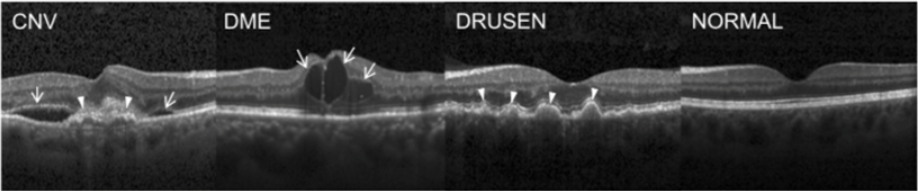

# OCT 2017

<div align="center">
    <a href="https://github.com/openmedlab/"></a>
</div>
<p style="text-align:center;font-size:10px;"><em></em></p>

## Dataset Information

The OCT 2017 dataset contains 84,484 retinal optical coherence tomography (OCT) images, divided into four categories: CNV, DME, DRUSEN, and NORMAL. All images are labeled with the disease type, patient ID, and the image number for that patient. The four categories are illustrated as shown in Figure 1. In the figure, the far left shows Choroidal Neovascularization (CNV), featuring neovascular membranes (indicated by white arrows) and associated subretinal fluid (arrows); the left-middle shows Diabetic Macular Edema (DME) with intraretinal fluid associated with retinal thickening (arrows); the mid-right shows early Age-Related Macular Degeneration (AMD) with multiple drusen (arrows); and the far right shows a normal retina (NORMAL) with a preserved foveal contour and without any retinal fluid or edema.

The dataset provides a vast collection of high-quality, clearly labeled OCT images, which are extremely valuable for the field of medical image analysis, especially for the training and testing of models related to retinal diseases. The detailed categorization and labeling allow for specific and nuanced analyses, making this dataset a powerful tool for developing and testing algorithms designed to diagnose and differentiate between various retinal conditions. This will promote the advancement of AI in ophthalmology, potentially improving diagnostic accuracy and efficiency in clinical settings.

Optical Coherence Tomography (OCT) is an imaging technique that captures high-resolution cross-sectional images of the retina in living patients. Approximately 30 million OCT scans are performed annually, and the analysis and interpretation of these images consume a substantial amount of time. OCT is widely used by ophthalmologists to obtain high-resolution images of the retinal structure of the eye and is also instrumental in diagnosing a variety of retinal-related eye diseases, making OCT images crucial for medical image processing tasks.

## Dataset Meta Information

| Dimensions | Modality | Task Type       | Anatomical Structures | Anatomical Area | Number of Categories | Data Volume | File Format |
|------------|----------|-----------------|-----------------------|-----------------|----------------------|-------------|-------------|
| 2D         | OCT      | Classification  | Eye                   | Eye             | 4                    | 35126        | JPEG        |


### Resolution Details

| Dataset Statistics | size         |
|--------------------|--------------|
| min                | (433, 289)   |
| median             | (498, 682)   |
| max                | (496, 1536)  |

## Label Information Statistics

| Categories | Number    |
|------------|-----------|
| CNV        | 37455     |
| DME        | 11598     |
| DRUSEN     | 8866      |
| NORMAL     | 26565     |

## Visualization

<div align="center">
    <a href="https://github.com/openmedlab/"></a>
</div>
<p style="text-align:center;font-size:10px;"><em>Figure 1. Four categories of image display.</em></p>

## File Structure

The file structure of the data set is as follows. `images` stores images, and the annotations of `train`, `val` and `test` are given in `txt` format.

``` 
OCT2017
├── image
│   ├── xxx.jpeg
│   ├── xxx.jpeg
│   │    ...
│   ├── xxx.jpeg
│   ├── xxx.jpeg
│   │    ...
├── train.txt
├── val.txt
├── test.txt
```

## Authors and Institutions

Kang Zhang (University of California San Diego)

MichaelGoldbaum (University of California San Diego)


## Source Information

Official Website: https://github.com/aishangcengloua/OCT_Classification?tab=readme-ov-file

Download Link: https://data.mendeley.com/datasets/rscbjbr9sj/2

Article Address: https://data.mendeley.com/datasets/rscbjbr9sj/2

Publication Date: 2018

## Citation

``` 
@article{kermany2018labeled,
  title={Labeled optical coherence tomography (OCT) and chest X-ray images for classification (2018)},
  author={Kermany, Daniel and Zhang, Kang and Goldbaum, Michael},
  journal={Mendeley Data, v2 https://doi. org/10.17632/rscbjbr9sj https://nihcc. app. box. com/v/ChestXray-NIHCC},
  year={2018}
}
```

Original introduction article is [here](https://zhuanlan.zhihu.com/p/686008386).