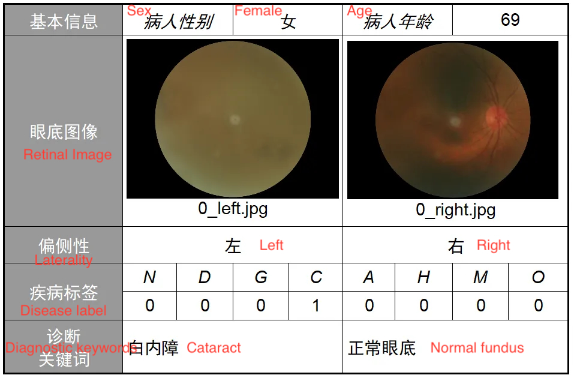

# ODIR-5K

<div align="center">
    <a href="https://github.com/openmedlab/"></a>
</div>
<p style="text-align:center;font-size:10px;"><em></em></p>

## Dataset Information

The ODIR-5K dataset, released by a Chinese team, is a multi-label classification dataset of fundus images. It was made available during the "Intelligent Eye" competition hosted by Peking University in 2019 and contains paired fundus images of the left and right eyes from 5000 patients, with labeled data for 3500 cases released for training.

Unlike other fundus datasets (like CHASE and DRIVE), ODIR-5K's key distinction lies in providing paired data for both left and right eyes along with relevant descriptions. This setup allows for the data to be used both as 7000 individual cases or as 3500 paired cases for exploring consistencies or other aspects. ODIR-5K provides 8 categories of labels: Normal (N), Diabetes (D), Glaucoma (G), Cataract (C), Age-related Macular Degeneration (AMD), Hypertension (H), Myopia (M), and Other diseases/abnormalities (O). These categories encompass many common ophthalmic diseases and present an opportunity to explore the long-tail problem of datasets where some categories have much less data than others. 

The significance of developing local datasets like ODIR-5K is profound for constructing medical diagnostic AI that is more suitable for the Chinese population, addressing biases that datasets can bring into AI research. By tailoring datasets to reflect the demographic and clinical profiles of the local population, AI systems can deliver more accurate and reliable diagnoses, ultimately enhancing patient care.

## Dataset Meta Information

| Dimensions | Modality      | Task Type       | Anatomical Structures | Anatomical Area | Number of Categories | Data Volume                         | File Format |
|------------|---------------|-----------------|-----------------------|-----------------|----------------------|-------------------------------------|-------------|
| 2D         | Retinal Image | Classification  | Eye                   | Eye       | 8                    | 3500 for training, 1500 for testing | jpg         |


## Visualization

<div align="center">
    <a href="https://github.com/openmedlab/"></a>
</div>
<p style="text-align:center;font-size:10px;"><em> Pairwise data visualization.</em></p>

| #  | Tag | Training Set | Number of off-site test samples | Number of on-site test samples | Total |
|----|-----|--------------|----------------|--------------------------------|-------|
| 1  | N   | 1,135        | 161            | 324                            | 1,620 |
| 2  | D   | 1,131        | 162            | 323                            | 1,616 |
| 3  | G   | 207          | 30             | 58                             | 307   |
| 4  | C   | 211          | 32             | 64                             | 243   |
| 5  | A   | 171          | 25             | 47                             | 295   |
| 6  | H   | 94           | 14             | 30                             | 138   |
| 7  | M   | 177          | 23             | 49                             | 249   |
| 8  | O   | 944          | 134            | 268                            | 1,346 |


## File Structure

The file structure is very simple, consisting of an image folder plus an annotation file. The jpg files for training are stored in the "Train" directory, and there is a separate "Annotations" directory at the same level.

``` 
Dataset
│
├── Train
│   ├── 0_left.jpg
│   └── 0_right.jpg
│   ├── ...
│   ├── 4784_left.jpg
│   └── 4784_right.jpg
├── ODIR-5K_Training_Annotations(Updated)_V2
```

## Authors and Institutions

Peking University

National Institute of Health and Medical Big Data, Peking University

Institute of Artificial Intelligence, Peking University

Shanggong Medical Information Technology Co., Ltd.

Advanced Research Institute of Information Technology, Peking University


## Source Information

Official Website: https://odir2019.grand-challenge.org/introduction/

Download Link: https://odir2019.grand-challenge.org/dataset/

Article Address: TBD

Publication Date: 2023

## Citation

``` 
TBD
```

Original introduction article is [here](https://zhuanlan.zhihu.com/p/666837714).