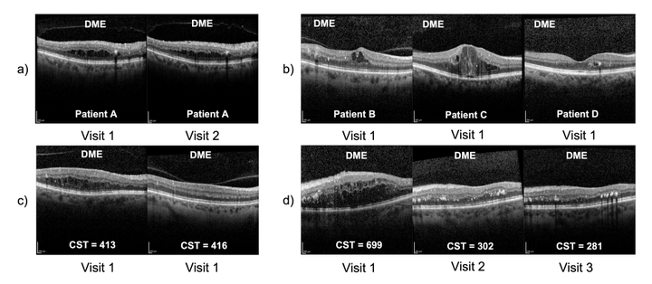
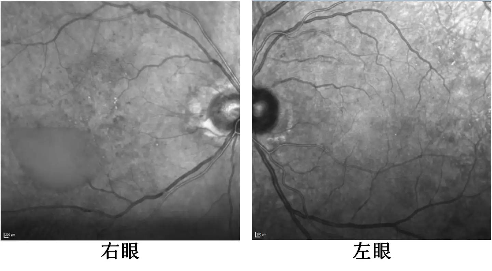

# OLIVES

<div align="center">
    <a href="https://github.com/openmedlab/"></a>
</div>
<p style="text-align:center;font-size:10px;"><em></em></p>

## Dataset Information

The **OLIVES dataset** is a pioneering ophthalmic labeled dataset designed for the study of visual eye semantics, uniquely integrating OCT scans with fundus image data. For the first time, it incorporates clinical labels, biomarker labels, and detailed patient treatment timelines from related clinical trials. The dataset is rich in content, containing 1268 fundus images, each accompanied by 49 OCT scan images, along with 16 biomarker indicators, and 3 clinical labels, specifically annotating the disease diagnosis of diabetic retinopathy (DR) or diabetic macular edema (DME). The dataset involves data from 96 eyes, spanning an average of at least two years, with each eye receiving an average of 66 weeks of treatment and 7 injections. Additionally, the OLIVES dataset offers a diverse range of medically-based data augmentation strategies for machine learning research, particularly in the field of self-supervised learning, further highlighting its unique value.

In the clinical diagnosis of eye diseases, physicians rely on a combination of data modalities, including scalar clinical labels measured directly through instruments, two-dimensional fundus images, and three-dimensional OCT scan images, as well as vectorized biomarkers interpreted from other measurement results. These diverse data modalities form the basis for diagnosing eye diseases such as diabetic retinopathy and diabetic macular edema. Therefore, exploring the complex relationships and interactions among these data modalities is particularly crucial when applying machine learning algorithms in the field of ophthalmology.

## Dataset Meta Information

| Dimensions | Modality                 | Task Type        | Anatomical Area | Number of Categories | Data Volume | File Format |
|------------|--------------------------|------------------|-----------------|----------------------|-------------|-------------|
| 2D         | Fundus Color Photography | Classification   | Eye             | 2                    | 412         | .tif        |


### Resolution Details


| Dataset Statistics | size        |
|--------------------|-------------|
| min                | (768, 768)  |
| max                | (768, 768)  |

## Label Information Statistics

| Category        | Number |
|-----------------|--------|
| Oculus Dexter   | 2764   |
| Oculus Sinister | 2727   |

## Visualization

<div align="center">
    <a href="https://github.com/openmedlab/"></a>
</div>
<p style="text-align:center;font-size:10px;"><em> Paper Visualization.</em></p>

<div align="center">
    <a href="https://github.com/openmedlab/"></a>
</div>
<p style="text-align:center;font-size:10px;"><em> Local Visualization.</em></p>

## File Structure

``` 
OLIVES
│
├── images
│   ├── train
│   │   ├── 1.tif
│   │   ├── 2.tif
│   │   ├── ....
├── train.txt
├── val.txt
```

## Authors and Institutions

Mohit Prabhushankar (OLIVES at the Centre for Signal and Info. Processing, Georgia Tech, Atlanta)

Kiran Kokilepersaud (OLIVES at the Centre for Signal and Info. Processing, Georgia Tech, Atlanta)

Yash-yee Logan (OLIVES at the Centre for Signal and Info. Processing, Georgia Tech, Atlanta)

Stephanie Trejo Corona (Retina Consultants Texas, Retina Consultants of America, Houston, Texas)

## Source Information

Official Website: https://github.com/olivesgatech/OLIVES_Dataset

Download Link: https://github.com/olivesgatech/OLIVES_Dataset

Article Address: https://proceedings.neurips.cc/paper_files/paper/2022/file/3be60b4a739b95a07a944a1a2c41e05e-Paper-Datasets_and_Benchmarks.pdf

Publication Date: 2022

## Citation

``` 
@article{prabhushankar2022olives,
  title={Olives dataset: Ophthalmic labels for investigating visual eye semantics},
  author={Prabhushankar, Mohit and Kokilepersaud, Kiran and Logan, Yash-yee and Trejo Corona, Stephanie and AlRegib, Ghassan and Wykoff, Charles},
  journal={Advances in Neural Information Processing Systems},
  volume={35},
  pages={9201--9216},
  year={2022}
}
```

Original introduction article is [here](https://zhuanlan.zhihu.com/p/715182388).