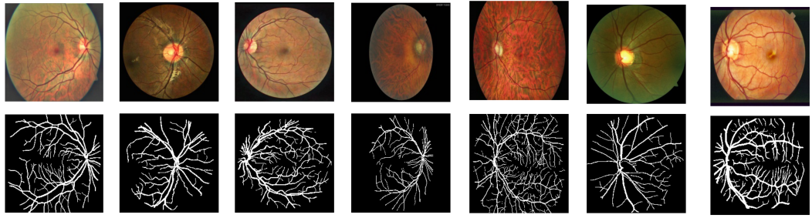
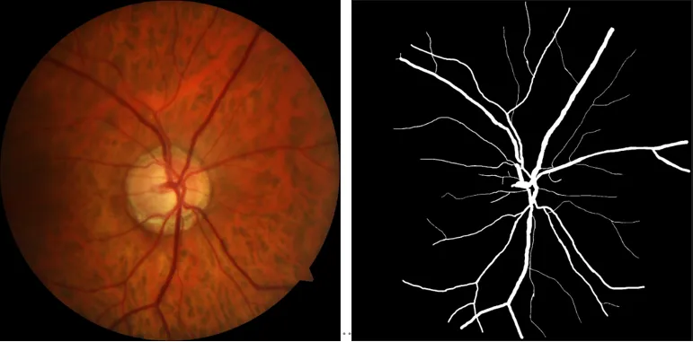

# ORVS

<div align="center">
    <a href="https://github.com/openmedlab/"></a>
</div>
<p style="text-align:center;font-size:10px;"><em></em></p>

## Dataset Information

The structure of retinal vessels plays an important role in the diagnosis of retinal diseases such as glaucoma. The ORVS dataset is a newly established collaboration between the Department of Computer Science and the Department of Visual Sciences at the University of Calgary. This dataset contains 49 images collected from a clinic in Calgary, Canada (42 training images and 7 test images). All images were acquired using a Zeiss Visucam 200 with a 30-degree field of view (FOV). The image size is 1444×1444 with 24 bits per pixel. The images are stored in JPEG format with low compression, which is common in ophthalmic practice. All images were manually traced by an expert who has been working in the field of retinal image analysis and has been trained. The expert was asked to mark all pixels belonging to retinal vessels. The Windows Paint 3D tool was used for manual labeling of images.

## Dataset Meta Information

| Dimensions | Modality | Task Type | Anatomical Structures | Anatomical Area | Number of Categories | Data Volume | File Format |
|------------|----------|-----------|-----------------------|-----------------|----------------------|-------------|-------------|
| 2D         | Retinal Image   | Segmentation | Vessel                | Eye             | 1                    | 49          | JPEG     |


### Resolution Details

| Dataset Statistics | size          |
|--------------------|---------------|
| min                | (584, 565)    |
| median             | (1444, 1444)  |
| max                | (2336, 3504)  |

## Label Information Statistics

| Category          | Retinal Vessel |
|-------------------|----------------|
| Number of Images  | 49             |
| Availability      | 100%           |
| Small Vessel Count| 19898        |
| Medium Vessel Count| 100094        |
| Large Vessel Count| 858434        |

## Visualization

<div align="center">
    <a href="https://github.com/openmedlab/"></a>
</div>
<p style="text-align:center;font-size:10px;"><em> Local Visualization.</em></p>

## File Structure

The ORVS training dataset contains two main directories: `image` and `mask`. The `image` directory contains the original images, and the `mask` directory contains the corresponding segmentation annotation images.

``` 
ORVS
│
├── images
│       ├─train
│            ├── ORVS_xx.png
│            ├── ORVS_xx.png
│            ├── ...
│            ├── ORVS_xx.png
│       ├─test
│            ├── ORVS_xx.png
│            ├── ORVS_xx.png
│            ├── ...
│            ├── ORVS_xx.png
│
├── masks
│       ├─train
│            ├── ORVS_xx.png
│            ├── ORVS_xx.png
│            ├── ...
│            ├── ORVS_xx.png
│       ├─test
│            ├── ORVS_xx.png
│            ├── ORVS_xx.png
│            ├── ...
│            ├── ORVS_xx.png
```

## Authors and Institutions

Abdullah Sarhan, University of Calgary (Alberta, Canada)

Jon Rokne, University of Calgary (Alberta, Canada)

Reda Alhajj, University of Calgary (Alberta, Canada)

Andrew Crichton, University of Calgary (Alberta, Canada)


## Source Information

Official Website: https://github.com/AbdullahSarhan/ICPRVessels

Download Link: https://github.com/AbdullahSarhan/ICPRVessels

Article Address: https://arxiv.org/pdf/2012.09250.pdf

Publication Date: 2020-12

## Citation

``` 
@inproceedings{sarhan2021transfer,
title={Transfer learning through weighted loss function and group normalization for vessel segmentation from retinal images},
author={Sarhan, Abdullah and Rokne, Jon and Alhajj, Reda and Crichton, Andrew},
booktitle={2020 25th International Conference on Pattern Recognition (ICPR)},
pages={9211--9218},
year={2021},
organization={IEEE}
}
```

Original introduction article is [here](https://zhuanlan.zhihu.com/p/671152464).