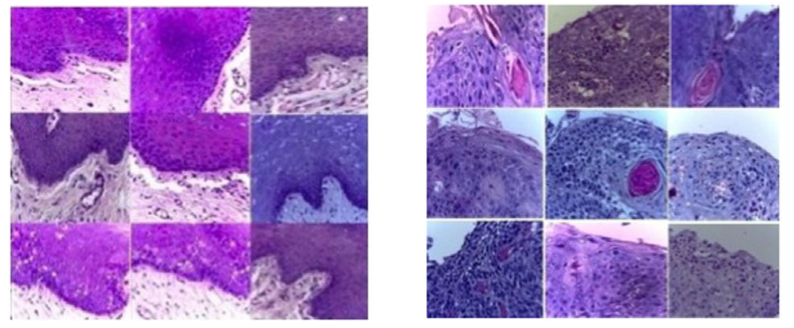

# OSCC

<div align="center">
    <a href="https://github.com/openmedlab/"></a>
</div>
<p style="text-align:center;font-size:10px;"><em></em></p>


## Dataset Information

The **OSCC dataset** is a pathology dataset specifically designed for image classification tasks, aiming to advance research in the automated diagnosis of **oral squamous cell carcinoma (OSCC)**. The dataset includes a total of **1,224 pathology images**, divided into two groups with different resolutions.  

- **Group 1**: Contains **89 images** of normal oral epithelial tissue and **439 images** of OSCC at **100x magnification**.  
- **Group 2**: Contains **201 images** of normal epithelial tissue and **495 images** of OSCC at **400x magnification**.  

All images were acquired using a **Leica ICC50 HD microscope** from **H&E-stained tissue slides** collected, prepared, and classified by medical experts. These slides were derived from **230 patients**. OSCC is the most common form of oral cancer globally, and early diagnosis is critical for improving patient outcomes and survival rates. However, traditional pathological diagnosis relies heavily on the expertise of pathologists, making it susceptible to subjectivity and time-consuming processes.  

The release of the **OSCC dataset** provides researchers with a high-quality resource platform to explore and develop advanced algorithms based on deep learning and machine learning. These algorithms hold the potential to enable automated OSCC diagnosis in the future, assisting clinicians in performing faster and more accurate pathological assessments, thereby enhancing diagnostic efficiency and patient care.  

## Dataset Meta Information

| Dimensions | Modality  | Task Type      | Anatomical Area | Number of Categories | Data Volume | File Format |
|------------|-----------|----------------|-----------------|----------------------|-------------|-------------|
| 2D         | Pathology | Classification | Oral            | 2                    | 1224        | JPG         |


### Resolution Details

| Dataset Statistics  | size          |
|---------------------|---------------|
| min                 | (2048, 1536)  |
| median              | (2048, 1536)  |
| max                 | (2048, 1536)  |

## Label Information Statistics

| Category                       | Normal (100x magnification) | OSCC (100x magnification) | Normal (400x magnification) | OSCC (400x magnification) |
|--------------------------------|-----------------------------|----------------------------|-----------------------------|----------------------------|
| Occurrence Count               | 89                          | 439                        | 201                         | 495                        |
| Percentage of Occurrence       | 7.27%                       | 35.97%                     | 16.42%                      | 40.33%                     |

## Visualization

<div align="center">
    <a href="https://github.com/openmedlab/"></a>
</div>
<p style="text-align:center;font-size:10px;"><em>Image visualization, the left is the Normal image, and the right is the OSCC (oral squamous cell carcinoma) image.</em></p>

## File Structure

The dataset file structure is as follows:

``` 
dataset
├── First Set
│   ├── 100x Normal Oral Cavity Histopathological Images
│   │   ├── Normal_100x_1.jpg
│   │   ├── Normal_100x_2.jpg
│   │   ├── Normal_100x_3.jpg
│   │   └── ...
│   └── 100x OSCC Histopathological Images
│   │   ├── OSCC_100x_1.jpg
│   │   ├── OSCC_100x_2.jpg
│   │   ├── OSCC_100x_3.jpg
│   │   └── ...
├── Second Set
│   ├── 400x Normal Oral Cavity Histopathological Images
│   │   ├── Normal_400x_1.jpg
│   │   ├── Normal_400x_2.jpg
│   │   ├── Normal_400x_3.jpg
│   │   └── ...
│   └── 400x OSCC Histopathological Images
│   │   ├── OSCC_400x_1.jpg
│   │   ├── OSCC_400x_2.jpg
│   │   ├── OSCC_400x_3.jpg
│   │   └── ...
```

## Authors and Institutions

T.Y. RAHMAN (Centre for Computational and Numerical Sciences Division, Institute of Advanced Study in Science and Technolog)

L.B. MAHANTA (Centre for Computational and Numerical Sciences Division, Institute of Advanced Study in Science and Technolog)

C. CHAKRABORTY (School of Medical Science and Technology, IIT Kharagpur)

A.K. DAS (Ayursundra Healthcare Pvt. Ltd, Guwahati)

J.D. SARMA (Dr. B. Borooah Cancer Research Institute)

## Source Information

Official Website: https://data.mendeley.com/datasets/ftmp4cvtmb/1

Download Link: https://data.mendeley.com/datasets/ftmp4cvtmb/1

Article Address: https://onlinelibrary.wiley.com/doi/abs/10.1111/jmi.12611

Publication Date: 2019-11

## Citation

``` 
@article{rahman2018textural,
  title={Textural pattern classification for oral squamous cell carcinoma},
  author={Rahman, TY and Mahanta, LB and Chakraborty, C and Das, AK and Sarma, JD},
  journal={Journal of microscopy},
  volume={269},
  number={1},
  pages={85--93},
  year={2018},
  publisher={Wiley Online Library}
}
```

Original introduction article is [here](https://zhuanlan.zhihu.com/p/3436210224).