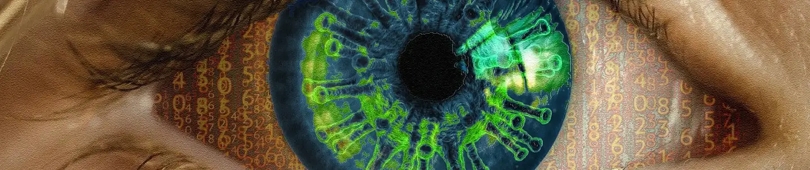
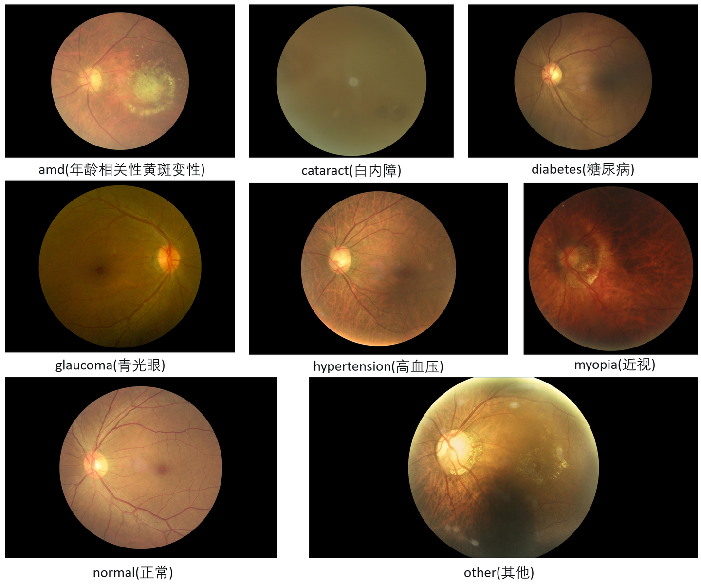

# Ocular Disease Recognition

<div align="center">
    <a href="https://github.com/openmedlab/"></a>
</div>
<p style="text-align:center;font-size:10px;"><em></em></p>

## Dataset Information

**Ocular Disease Intelligent Recognition (ODIR)** is a structured ophthalmic database that includes detailed information on 5,000 patients, encompassing their age, color fundus images for both eyes, and diagnostic keywords provided by physicians. The dataset was collected by Shenzhen Zhongke Microelectronics Company from various hospitals and medical centers in China, aiming to represent "real-world" patient data to advance research and diagnosis of ocular diseases.

During data acquisition, the fundus images were captured using multiple market-available cameras (e.g., Canon, Zeiss, and Kowa), resulting in images of varying resolutions. These images were annotated by well-trained human readers, ensuring high-quality and reliable data. The labeling process categorized patients into eight classes: Normal (N), Diabetes (D), Glaucoma (G), Cataract (C), Age-related Macular Degeneration (A), Hypertension (H), Pathological Myopia (M), and Other diseases/abnormalities (O).

The ODIR database serves as a valuable foundational resource for intelligent recognition and analysis of ocular diseases. It fosters the application of machine learning and artificial intelligence techniques in medical imaging analysis, enhancing the accuracy and efficiency of clinical decision support systems. Moreover, the database provides researchers with a significant platform to promote in-depth studies and interdisciplinary collaborations in the field of ophthalmology.

## Dataset Meta Information

| Dimensions | Modality       | Task Type      | Anatomical Structures  | Number of Categories | Data Volume | File Format |
|------------|----------------|----------------|------------------------|----------------------|-------------|-------------|
| 2D         | Retinal Image  | Classification | Retina                 | 8                    | 5k          | PNG         |


### Resolution Details

| Dataset Statistics | size         |
|--------------------|--------------|
| min                | (5184, 5184) |
| median             | (2592, 1728) |
| max                | (250, 188)   |

## Label Information Statistics

| Class                                      | Count |
|--------------------------------------------|-------|
| 0 Age-related Macular Degeneration (A)     | 266   |
| 1 Cataract (C)                             | 293   |
| 2 Diabetes (D)                             | 1608  |
| 3 Glaucoma (G)                             | 284   |
| 4 Hypertension (H)                         | 128   |
| 5 Pathological Myopia (M)                  | 232   |
| 6 Normal (N)                               | 2873  |
| 7 Other diseases/abnormalities (O)         | 708   |

## Visualization

<div align="center">
    <a href="https://github.com/openmedlab/"></a>
</div>
<p style="text-align:center;font-size:10px;"><em>Local Visualization.</em></p>

## File Structure

``` 
Dataset
│
├── train
│   ├── xxxx.png
│   ├── xxxx.png
│   └── ...
├── val
│   ├── xxxx.png
│   ├── xxxx.png
│   └── ...
├── train.text
├── val.text
```

## Authors and Institutions

None

## Source Information

Official Website: https://www.kaggle.com/datasets/andrewmvd/ocular-disease-recognition-odir5k

Download Link: https://www.kaggle.com/datasets/andrewmvd/ocular-disease-recognition-odir5k

Article Address: TBD

Publication Date: 2021

## Citation

``` 
https://www.kaggle.com/datasets/andrewmvd/ocular-disease-recognition-odir5k/data
```

Original introduction article is [here](https://zhuanlan.zhihu.com/p/4584775459).