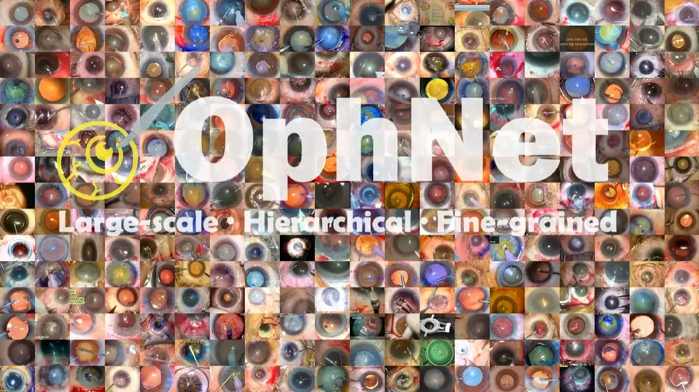
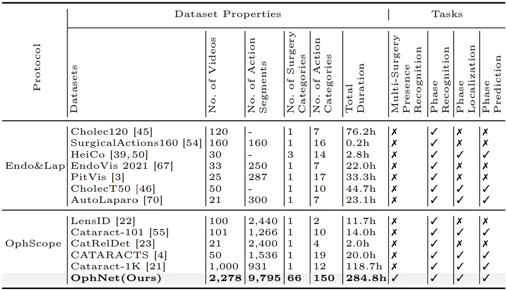
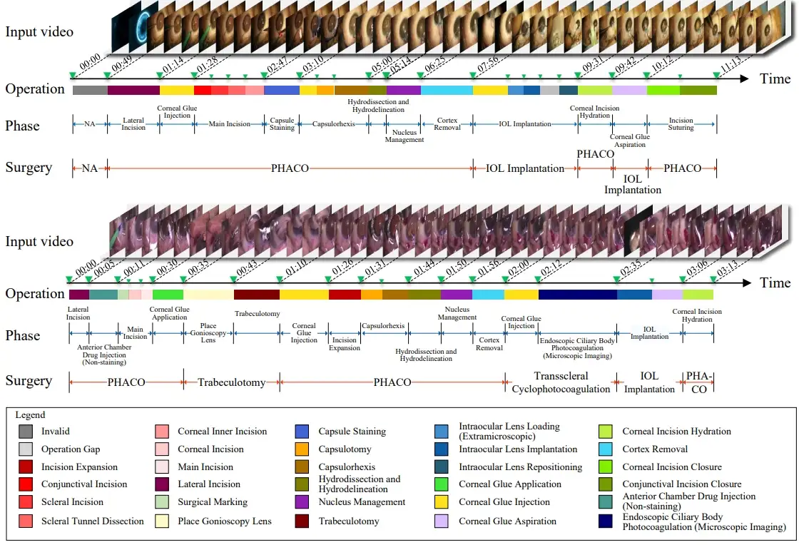
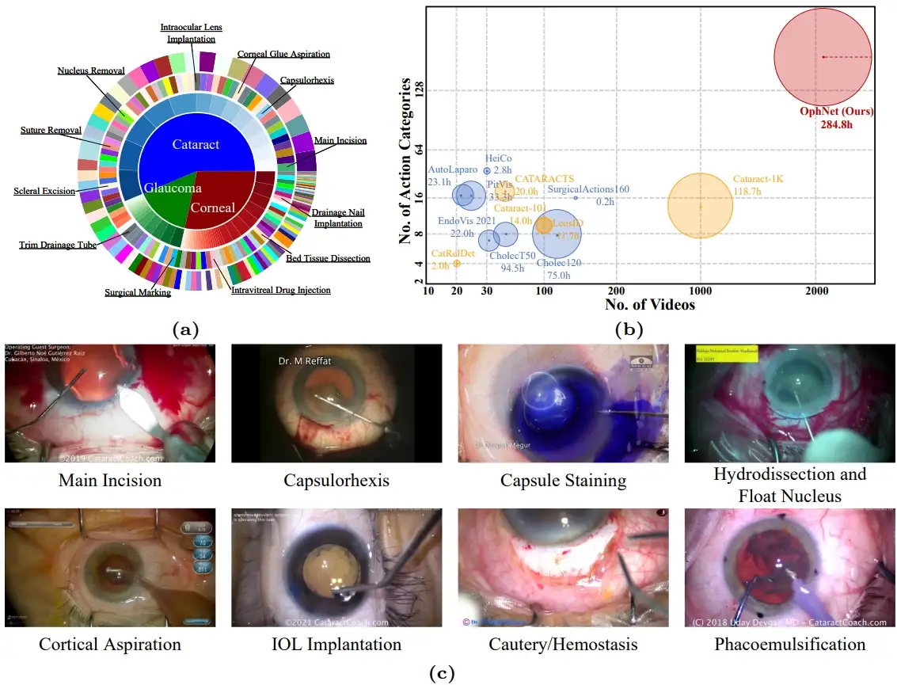

# OphNet

<div align="center">
    <a href="https://github.com/openmedlab/"></a>
</div>
<p style="text-align:center;font-size:10px;"><em></em></p>

## Dataset Information

Perceiving surgical scenes through video is crucial for advancing robotic surgery, tele-surgery, and AI-assisted surgery, particularly in the field of ophthalmology. However, the scarcity of diverse and richly annotated video datasets hinders the development of intelligent systems for surgical workflow analysis. Existing datasets face challenges such as small scale, lack of diversity in surgical and phase categories, and absence of temporally localized annotations. These limitations impede the validation of action understanding and model generalization in complex and diverse real-world surgical scenarios. 

To address this gap, the authors introduce OphNet, a large-scale, expert-annotated video benchmark designed for understanding ophthalmic surgical workflows. OphNet features include: 1) The collection of 2,278 surgical videos covering 66 types of cataract, glaucoma, and corneal surgeries, with detailed annotations for 102 unique surgical phases and 150 fine-grained actions. 2) Sequential and hierarchical annotations for each surgery, phase, and action, enabling comprehensive understanding and enhanced interpretability. 3) Temporally localized annotations to facilitate temporal localization and prediction tasks in surgical workflows. With approximately 285 hours of surgical video, OphNet is about 20 times larger than the largest existing benchmarks for surgical workflow analysis.

## Dataset Meta Information

| Dimensions | Modality               | Task Type                | Anatomical Structures | Anatomical Area | Number of Categories                      | Data Volume | File Format |
|------------|------------------------|--------------------------|-----------------------|-----------------|-------------------------------------------|-------------|-------------|
| 2D         | Ophthalmic microscope  | Classification, Location | Eye                   | Eye             | 66 surgeries, 103 stages, 150 operations  | 2278        | .mp4        |

## Dataset Information Statistics

Compared to other datasets, OphNet focuses more on comprehensive coverage of various surgeries, phases, and operation categories, with a large collection of videos totaling 284.8 hours, supporting multiple recognition, localization, and prediction tasks. OphNet demonstrates significant competitiveness in terms of scale and label richness. For example, Cholec120, Cholec80, m2caiworkflow, and LapChole form one series, while CholecT50, CholecT45, and CholecT40 make up another series. 

The authors have excluded the following scenarios from comparison: (1) Non-open-source datasets such as Bypass170, ESD, etc.; (2) Supersets of multiple open-source or non-open-source datasets, such as Cholec207; (3) Datasets for lesion, anatomy, and instrument classification and segmentation, such as SUN-SEG, CVC-ClinicDB, ROBUSTMIS, Cata7, etc.; anomaly detection datasets like PolypDiag (from Hyper-Kvasir and LDPolypVideo), Kvasir-Capsule, etc.; and other datasets not specifically intended for workflow analysis. It is worth mentioning that even compared with the above datasets, OphNet shows considerable competitiveness in terms of scale and label richness. Endo&Lap refers to endoscopy and laparoscopy, and OphScope refers to ophthalmic microscopy. When datasets have multiple supplemental updates, we chose the latest version for comparison.

<div align="center">
    <a href="https://github.com/openmedlab/"></a>
</div>
<p style="text-align:center;font-size:10px;"><em>Table 1: Statistical comparison between existing surgical process analysis datasets and OphNet.</em></p>

## Visualization

<div align="center">
    <a href="https://github.com/openmedlab/"></a>
</div>
<p style="text-align:center;font-size:10px;"><em>Figure 1: This figure shows two combined surgical videos, PHACO + IOL implantation and PHACO + trabeculotomy + transscleral cyclophotocoagulation + IOL implantation. For each color-coded frame, we provide temporal boundary annotations at the surgery, stage, and operation levels.</em></p>

The composition of OphNet, a comparison with other datasets for the same task, and examples of several phases: 

(a) An overview of the composition proportions at the surgery, phase, and operation levels.  
(b) A comparison between existing open-source laparoscopic and endoscopic, as well as ophthalmic microscope workflow analysis video datasets, and OphNet. OphNet is the largest real-world video dataset for understanding ophthalmic surgical workflows, with the most videos, longest duration, and the most diverse categories of surgeries and phases.  
(c) Eight examples of phases from OphNet.

<div align="center">
    <a href="https://github.com/openmedlab/"></a>
</div>
<p style="text-align:center;font-size:10px;"><em>Figure 2: Composition of OphNet, comparison with other datasets for the same task, and some stage examples</em></p>

### Task Setup

**Task 1: Surgery Presence, Phase, and Operation Recognition**  
Surgery presence recognition focuses on identifying various types of surgeries in untrimmed videos through a weakly supervised approach. This requires models to recognize and capture different surgical action features across extensive video footage. In OphNet, all types of surgeries occurring in each video are annotated, but only a portion of the videos have temporal boundary annotations. We identify the primary surgery based on its main objective and duration. To simplify the process, the authors' experiments are limited to recognizing the presence of these primary surgeries. Additionally, the phase recognition task uses visual cues and actions, such as incision, lens removal, and implantation, to divide surgeries into different phases. Operation recognition involves identifying more fine-grained surgical actions.

**Task 2: Phase Localization**  
Phase localization refers to the task of precisely identifying the exact moments or time intervals when specific surgical phases start and end in surgical videos. This involves segmenting the entire surgical procedure in detail according to time, based on visual cues, the surgeon's actions, and the progress of the surgery. The goal of phase localization is to accurately identify the start and end times of different surgical phases, such as pre-operative preparation, incision, and lens removal, providing a detailed and precise understanding of the surgical timeline. This task is crucial for detailed surgical documentation, efficient surgical training, and developing targeted interventions for specific surgical phases, enhancing overall surgical management and postoperative analysis.

**Task 3: Phase Prediction**  
This task requires analyzing real-time or recorded video data to anticipate the sequence of events based on current and past surgical activities. By understanding the typical progression of ophthalmic surgeries and recognizing patterns in the surgeon's actions and instrument use, the system aims to predict the next phase of the surgery, allowing for proactive preparation and response. The goal of phase prediction is to improve the efficiency and safety of surgical procedures by providing the surgical team with advance notice of upcoming steps, thus enabling better resource allocation, timely execution of critical tasks, and overall coordination in the operating room.

## File Structure

``` 
OphNet
├── Annotation Files
│   ├── all
│   ├── task1_primary_surgery_recognition
│   ├── task2_phase_recognition
│   ├── task3_operation_recognition
│   ├── task4_phase_localization
│   ├── task5_phase_anticipation
├── Original Video Files
├── Processed Video Files
├── Trimmed Video Files
```

## Authors and Institutions

Ming Hu (AIM Lab, Faculty of IT, Faculty of Engineering, Monash University, Airdoc-Monash Research, Airdoc)

Peng Xia (AIM Lab, Faculty of IT, Monash University, Airdoc-Monash Research, Airdoc)

Lin Wang (Bosch Corporate Research)

Siyuan Yan (AIM Lab, Faculty of IT, Faculty of Engineering, Monash University)

Feilong Tang (AIM Lab, Faculty of IT, Monash University, Airdoc-Monash Research, Airdoc)

Zhongxing Xu (Cornell University)

Yimin Luo (King’s College London)

Kaimin Song (Airdoc-Monash Research, Airdoc)

Jurgen Leitner (Faculty of Engineering, Monash University)

Xuelian Cheng (AIM Lab, Faculty of IT, Monash University,)

Jun Cheng (Institute for Infocomm Research, A*STAR)

Chi Liu (Faculty of Data Science, City University of Macau)

Kaijing Zhou (Eye Hospital, Wenzhou Medical University)

Zongyuan Ge (AIM Lab, Faculty of IT, Faculty of Engineering, Monash University, Airdoc-Monash Research, Airdoc)

## Source Information

Official Website: https://minghu0830.github.io/OphNet-benchmark/

Download Link: https://minghu0830.github.io/OphNet-benchmark/

Article Address: https://arxiv.org/pdf/2406.07471

Publication Date: 2024-07

## Citation

``` 
@article{hu2024ophnet,
  title={OphNet: A Large-Scale Video Benchmark for Ophthalmic Surgical Workflow Understanding},
  author={Hu, Ming and Xia, Peng and Wang, Lin and Yan, Siyuan and Tang, Feilong and Xu, Zhongxing and Luo, Yimin and Song, Kaimin and Leitner, Jurgen and Cheng, Xuelian and others},
  journal={arXiv preprint arXiv:2406.07471},
  year={2024}
}
```

Original introduction article is [here](https://zhuanlan.zhihu.com/p/712579707).