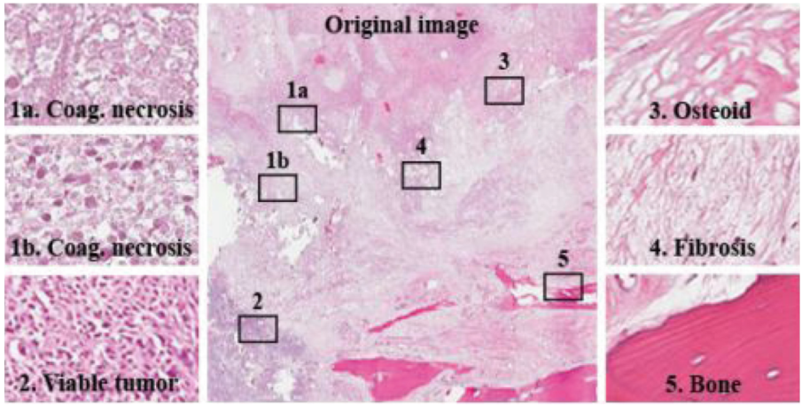

# Osteosarcoma Tumor Assessment

<div align="center">
    <a href="https://github.com/openmedlab/"></a>
</div>
<p style="text-align:center;font-size:10px;"><em></em></p>

## Dataset Information

The Osteosarcoma-Tumor-Assessment dataset uses archival samples from 50 patients who were treated at Children's Medical Center Dallas between 1995 and 2015. Four patients (out of the 50) were selected by pathologists based on the diversity of their tumor specimens after surgical resection. Each image is labeled as non-tumor, viable tumor, or necrotic based on the predominant cancer type in the image. Annotations were made by two medical experts. All images were assigned to two pathologists for the annotation task, but each image has only one annotation, as any given image was annotated by a single pathologist. The dataset consists of 1,144 images with a size of 1024 x 1024 at 10X magnification, distributed as follows: 536 (47%) non-tumor images, 263 (23%) necrotic tumor images, and 345 (30%) viable tumor images.

Osteosarcoma is the most common type of bone cancer, primarily affecting adolescents aged 10 to 14 years. This dataset comprises histological images of osteosarcoma stained with Hematoxylin and Eosin (H&E). The data was collected by a team of clinical scientists at the University of Texas Southwestern Medical Center in Dallas.

## Dataset Meta Information

| Dimensions | Modality   | Task Type      | Anatomical Structures | Number of Categories | Data Volume | File Format |
|------------|------------|----------------|-----------------------|----------------------|-------------|-------------|
| 2D         | pathology  | Classification | Bone                  | 3                    | 1144        | PNG         |


### Resolution Details

| Dataset Statistics  | size          |
|---------------------|---------------|
| min                 | (1024, 1024)  |
| median              | (1024, 1024)  |
| max                 | (1024, 1024)  |

## Label Information Statistics

| Metric             | Tumor |
|--------------------|-------|
| 0 (Non Tumor)      | 415   |
| 1 (Necrotic Tumor) | 267   |
| 2 (Viable Tumor)   | 233   |

## Visualization

<div align="center">
    <a href="https://github.com/openmedlab/"></a>
</div>
<p style="text-align:center;font-size:10px;"><em>Paper Visualization.</em></p>

## File Structure

The dataset file structure is as follows:

``` 
Osteosarcoma-Tumor-Assessment
├── image
│   ├── train
│   │   ├── xxx.jpg
│   │   ├── xxx.jpg
│   │   ├── xxx.jpg
│   │   ├── xxx.jpg
│   │   └── ...
│   └── val
│   │   ├── xxx.jpg
│   │   ├── xxx.jpg
│   │   ├── xxx.jpg
│   │   ├── xxx.jpg
│   │   └── ...
    ├── train.txt
    └── val.txt
```

## Authors and Institutions

Rashika Mishra (Department of Computer Science, University of Texas at Dallas)

Ovidiu Daescu (Department of Computer Science, University of Texas at Dallas)

Patrick Leavey (University of Texas Southwestern Medical Center)

Dinesh Rakheja (University of Texas Southwestern Medical Center)

## Source Information

Official Website: https://www.cancerimagingarchive.net/collection/osteosarcoma-tumor-assessment/

Download Link: https://www.cancerimagingarchive.net/collection/osteosarcoma-tumor-assessment/

Article Address: https://doi.org/10.1007/978-3-319-59575-7_2

Publication Date: 2019

## Citation

``` 
@inproceedings{mishra2017histopathological,
  title={Histopathological diagnosis for viable and non-viable tumor prediction for osteosarcoma using convolutional neural network},
  author={Mishra, Rashika and Daescu, Ovidiu and Leavey, Patrick and Rakheja, Dinesh and Sengupta, Anita},
  booktitle={Bioinformatics Research and Applications: 13th International Symposium, ISBRA 2017, Honolulu, HI, USA, May 29--June 2, 2017, Proceedings 13},
  pages={12--23},
  year={2017},
  organization={Springer}
}
```

Original introduction article is [here](https://zhuanlan.zhihu.com/p/711409352).