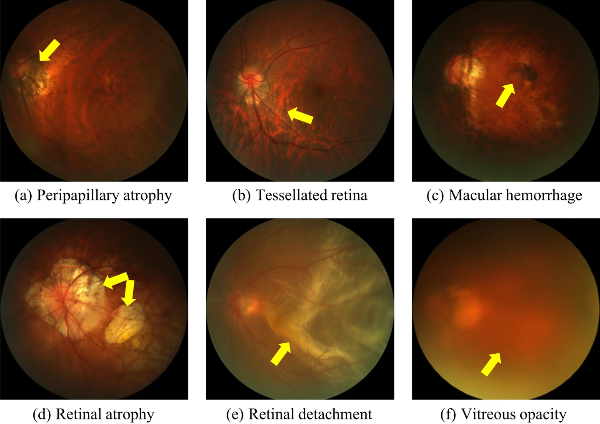

# PALM: Open Fundus Photograph Dataset with Pathologic Myopia Recognition and Anatomical Structure Annotation

<div align="center">
    <a href="https://github.com/openmedlab/"></a>
</div>
<p style="text-align:center;font-size:10px;"><em></em></p>

## Dataset Information

Pathological myopia (PM) is a common blinding retinal degenerative condition among individuals with high myopia. Early screening for this condition can mitigate the damage caused by related fundus pathologies, thereby preventing vision loss. Automated diagnostic tools based on artificial intelligence can assist clinicians in identifying disease indicators or screening large populations using color fundus photographs as input, benefiting this process. 

This paper provides insights into PALM, an open fundus imaging dataset designed for pathological myopia identification and anatomical structure annotation. Our database consists of 1,200 images, each labeled with pathological myopia categories, along with manual annotations for the optic disc, macular location, and lesions such as patchy atrophy (including peripapillary atrophy) and retinal detachment. Furthermore, this paper details the annotation process used to construct the database, the quality and characteristics of the samples, and additional usage instructions.

<div align="center">
    <a href="https://github.com/openmedlab/"></a>
</div>
<p style="text-align:center;font-size:10px;"><em>Figure 1. Examples of common retinal lesions in pathological myopia (PM) cases include: (a)Peripapillary atrophy, occurring near the optic disc; (b)Reticular retina, where prominent large choroidal vessels can be observed in the posterior pole of the fundus; (c)Macular hemorrhage, primarily along the fissure itself and at or near the macular center; (d)Retinal atrophy, caused by the migration of degenerated retinal pigment epithelial cells to the inner retinal layers, leading to lesions in and around the affected areas.</em></p>

## Dataset Meta Information

| Dimensions | Modality                | Task Type                      | Anatomical Area     | Number of Categories | Data Volume | File Format |
|------------|-------------------------|--------------------------------|---------------------|----------------------|-------------|-------------|
| 2D         | Fundus Photography | Classification, Segmentation   | Retina              | 5 or 2               | 1200        | JPG         |


### Resolution Details

| Dataset Statistics  | size          |
|---------------------|---------------|
| min                 | (1444, 1444)  |
| median              | (2124, 2056)  |
| max                 | (2124, 2056)  |

## Label Information Statistics

| Set        | Num. | PM/Non-PM           | With/Without OD   | With/Without Fovea | With/Without Detachment | With/Without Atrophy | Photo Centering (OD/Fovea/Midpoint of OD and Fovea) | Device (Zeiss/Canon) |
|------------|------|---------------------|-------------------|--------------------|--------------------------|----------------------|---------------------------------------------------|----------------------|
| Training   | 400  | 213/187             | 381/19            | 397/3              | 12/388                  | 311/89              | 42/258/100                                        | 350/50              |
| Validation | 400  | 211/189             | 379/21            | 397/3              | 6/394                   | 271/129             | 43/258/99                                         | 344/56              |
| Testing    | 400  | 213/187             | 384/16            | 398/2              | 6/394                   | 288/112             | 38/284/78                                         | 353/47              |
| **Total**  | 1200 | **637/563**         | **1144/56**       | **1192/8**         | **24/1176**             | **870/330**         | **123/800/277**                                   | **1047/153**        |

**Explanation of Columns**:
- **Set**: Dataset split into training, validation, and testing subsets.
- **Num.**: Number of images in each set.
- **PM/Non-PM**: Images labeled as Pathological Myopia (PM) or Non-Pathological Myopia (Non-PM).
- **With/Without OD**: Images with or without Optic Disc (OD).
- **With/Without Fovea**: Images with or without the presence of the fovea.
- **With/Without Detachment**: Images with or without retinal detachment.
- **With/Without Atrophy**: Images with or without retinal atrophy.
- **Photo Centering**: Centering of the photo based on OD, Fovea, or the midpoint between OD and Fovea.
- **Device**: Equipment used to capture images (Zeiss or Canon).

## Visualization

<div align="center">
    <a href="https://github.com/openmedlab/"></a>
</div>
<p style="text-align:center;font-size:10px;"><em>Figure 1. Examples of common retinal lesions in cases of pathological myopia (PM) include: (a) Peripapillary atrophy; (b) Reticular retina; (c) Macular hemorrhage; (d) Retinal atrophy; (e) Retinal detachment; (f) Vitreous opacity. All images are sourced from the PALM training samples.</em></p>

<div align="center">
    <a href="https://github.com/openmedlab/"></a>
</div>
<p style="text-align:center;font-size:10px;"><em>Figure 2. Examples of annotation interfaces used by experts for (a) non-pathological myopia samples and (b) pathological myopia samples. (a1) and (b1): Original input images; (a2) and (b2): Manual annotations.</em></p>


## File Structure

``` 
PALM
│
├── Training
│   ├── hippocampus_001.nii.gz
│   │   └── Images
│   │       ├── ...
│   │   └── Disc Masks
│   │       ├── ...
│   │   └── Lesion Masks
│   │       ├── Atrophy
│   │           ├── ...
│   │       ├── Detachment
│   │           ├── ...
│   │
│   └── Classification Labels
│   └── Fovea Localization
│   └── Supplementary Information
│
├── Validation
│   ├── ...
│   └── ...
├── Testing
│   ├── ...
│   └── ...
```

## Authors and Institutions

Huihui Fang (South China University of Technology, Guangzhou, China; Pazhou Lab., Guangzhou, China)  

Fei Li (State Key Laboratory of Ophthalmology, Zhongshan Ophthalmic Center, Sun Yat-sen University, Guangdong Provincial Key Laboratory of Ophthalmology and Visual Science, Guangzhou, China)  

Junde Wu (National University of Singapore, Singapore, Singapore)  

Huazhu Fu (Institute of High Performance Computing, Agency for Science, Technology and Research, Singapore, Singapore)  

Xu Sun (Pazhou Lab., Guangzhou, China)  

José Ignacio Orlando (Yatiris Group, PLADEMA Institute, CONICET, UNICEN, Tandil, Argentina)  

Hrvoje Bogunović (Christian Doppler Lab for Artificial Intelligence in Retina, Department of Ophthalmology and Optometry, Medical University of Vienna, Vienna, Austria)  

Xiulan Zhang (State Key Laboratory of Ophthalmology, Zhongshan Ophthalmic Center, Sun Yat-sen University, Guangdong Provincial Key Laboratory of Ophthalmology and Visual Science, Guangzhou, China)  

Yanwu Xu (South China University of Technology, Guangzhou, China; Pazhou Lab., Guangzhou, China)  

## Source Information

Official Website: https://www.nature.com/articles/s41597-024-02911-2?_gl=1*16u2cf9*_up*MQ..&gclid=CjwKCAjw9eO3BhBNEiwAoc0-jXF2c7y1hinoDc71AuwyTwBqCuBlioxEwhfIUDUuFRPDtXrGn6S7HhoC4IMQAvD_BwE

Download Link: https://palm.grand-challenge.org/SemifinalLeaderboard/

Article Address: https://www.nature.com/articles/s41597-024-02911-2?_gl=1*16u2cf9*_up*MQ..&gclid=CjwKCAjw9eO3BhBNEiwAoc0-jXF2c7y1hinoDc71AuwyTwBqCuBlioxEwhfIUDUuFRPDtXrGn6S7HhoC4IMQAvD_BwE

Publication Date: 2024-01

## Citation

``` 
@article{fang2024open,
  title={Open fundus photograph dataset with pathologic myopia recognition and anatomical structure annotation},
  author={Fang, Huihui and Li, Fei and Wu, Junde and Fu, Huazhu and Sun, Xu and Orlando, Jos{\'e} Ignacio and Bogunovi{\'c}, Hrvoje and Zhang, Xiulan and Xu, Yanwu},
  journal={Scientific Data},
  volume={11},
  number={1},
  pages={99},
  year={2024},
  publisher={Nature Publishing Group UK London}
}
```

Original introduction article is [here](https://zhuanlan.zhihu.com/p/762623974).