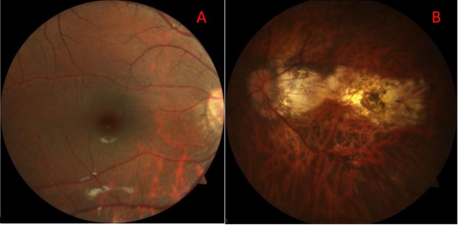
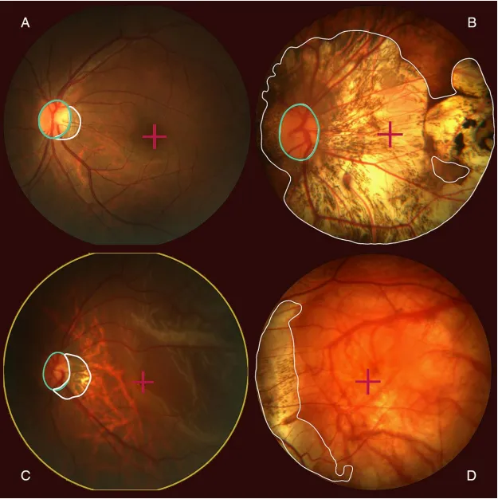

# PALM19

<div align="center">
    <a href="https://github.com/openmedlab/"></a>
</div>
<p style="text-align:center;font-size:10px;"><em></em></p>

## Dataset Information

This part is introduction and summarization of the dataset.

## Dataset Meta Information

| Dimensions | Modality | Task Type     | Anatomical Structures | Number of Categories | Data Volume                     | File Format |
|------------|----------|---------------|-----------------------|----------------------|---------------------------------|-------------|
| 2D         | Retinal Image   | Segmentation  | Eye             | 1                    | train: 400, val: 400, test: 400 | PNG         |


### Resolution Details

| Dataset Statistics | size          |
|--------------------|---------------|
| min                | (2056, 2124)  |
| median             | (2056, 2124)  |
| max                | (2056, 2124)  |

## Label Information Statistics

| Category          | Retinal Vessel |
|-------------------|----------------|
| Number of Images  | 384            |
| Availability      | 96%            |
| Small Vessel Count| 0              |
| Medium Vessel Count| 66045         |
| Large Vessel Count| 131973         |

## Visualization

<div align="center">
    <a href="https://github.com/openmedlab/"></a>
</div>
<p style="text-align:center;font-size:10px;"><em> Test set visualization results: The optic disc (green contour) is detected and segmented in A, B, and C. Retinal atrophy is detected and segmented (white contour) in B and C. Retinal detachment is detected in C, where the entire fundus is outlined in yellow. Finally, in all cases, the macula is located, indicated by a purple cross.</em></p>

## File Structure

The dataset file structure is as follows. The PALM19 dataset consists of two folders: `images` and `masks`, where the former contains the images and the latter contains the corresponding annotations.

``` 
PALM19          
├── images            
│   ├── train
│       ├── H0001.png
│       ├── H0002.png
│       └──  ...
│   ├── val
│       ├── V0001.png
│       ├── V0002.png
│       └──  ...
│   ├── test
│       ├── T0001.png
│       ├── T0002.png
│       └──  ...
├── masks            
│   ├── train
│       ├── H0001.png
│       ├── H0002.png
│       └──  ...
│   ├── val
│       ├── V0001.png
│       ├── V0002.png
│       └──  ...
│   ├── test
│       ├── T0001.png
│       ├── T0002.png
│       └──  ...
```

## Authors and Institutions

Yanwu Xu (Artificial Intelligence Innovation Business, Baidu Inc., China)

José Ignacio Orlando (Medical University of Vienna, Austria)

Hrvoje Bogunovic (Medical University of Vienna, Austria)

Xiulan Zhang (Zhongshan Ophthalmic Center, Sun Yat-sen University, China)

Fei Li (Zhongshan Ophthalmic Center, Sun Yat-sen University, China)

Xu Sun (Intelligent Healthcare Department, Baidu Inc., China)

Xingxing Cao (Intelligent Healthcare Department, Baidu Inc., China)

Jinling Li (Intelligent Healthcare Department, Baidu Inc., China)


## Source Information

Official Website: https://palm.grand-challenge.org/Home/

Download Link: https://ieee-dataport.org/documents/palm-pathologic-myopia-challenge

Article Address: https://ieee-dataport.org/documents/palm-pathologic-myopia-challenge

Publication Date: 2019

## Citation

``` 
@data{55pk-8z03-19,
doi = {10.21227/55pk-8z03},
url = {https://dx.doi.org/10.21227/55pk-8z03},
author = {Fu, Huazhu and Li, Fei and Orlando, José Ignacio and Bogunović, Hrvoje and Sun, Xu and Liao, Jingan and Xu, Yanwu and Zhang, Shaochong and Zhang, Xiulan},
publisher = {IEEE Dataport},
title = {PALM: PAthoLogic Myopia Challenge},
year = {2019} }
```

Original introduction article is [here](https://zhuanlan.zhihu.com/p/677543244).