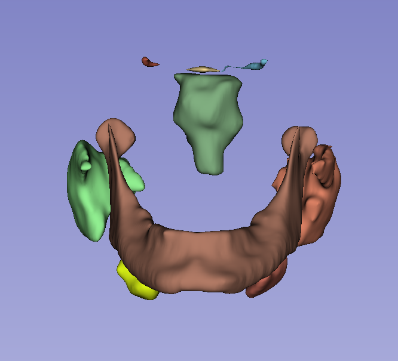
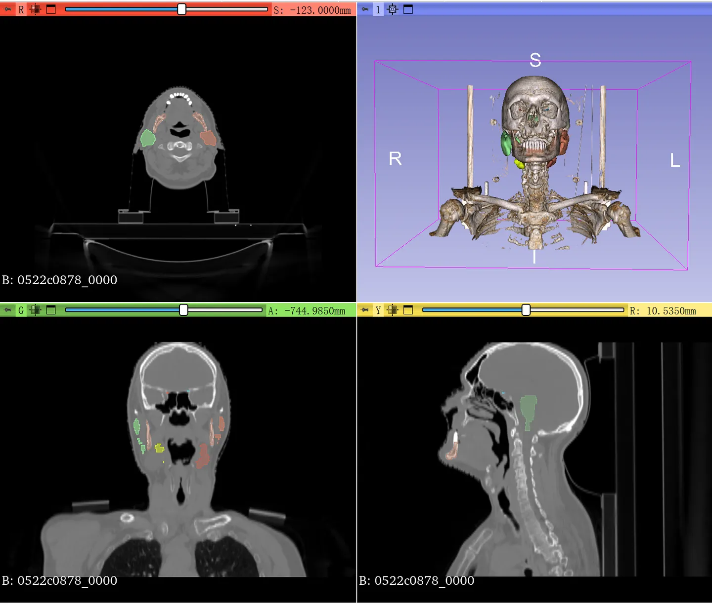

# PDDCA

<div align="center">
    <a href="https://github.com/openmedlab/"></a>
</div>
<p style="text-align:center;font-size:10px;"><em></em></p>

## Dataset Information

PDDCA is a CT dataset for segmentation tasks, derived from the CT images of 48 patients from the Radiation Therapy Oncology Group (RTOG) 0522 study (a multi-institutional clinical trial led by Dr. Kian Ang), which includes manual segmentations of the left and right parotid glands, brainstem, optic chiasm, optic nerves (left and right sides), mandible, submandibular glands (left and right sides), and manual annotations of bone landmarks. This dataset was also used for the MICCAI Head and Neck Auto Segmentation Challenge 2015, where the official division consisted of 38 training samples and 10 test samples. The PDDCA dataset is continuously updated, with the current latest version being 1.4.1.

## Dataset Meta Information


| Dimensions | Modality | Task Type | Anatomical Structures          | Anatomical Area | Number of Categories | Data Volume | File Format |
|------------|----------|-----------|--------------------------------|-----------------|----------------------|-------------|-------------|
| 3D         | CT       | Segmentation | Brainstem, Optic Chiasm, Mandible, Left and Right Optic Nerves, Left and Right Parotid Glands, Left and Right Submandibular Glands. | Head and Neck   | 9                    | 48          | .nrrd       |


### Resolution Details

| Dataset Statistics | spacing (mm)     | size            |
|--------------------|------------------|-----------------|
| min                | (0.76,0.76,1.25)              | (512,512,76)     |
| median             | (1.10,1.10,3.0)           | (512,512,141) |
| max                | (1.27,1.27,3.0)              | (512,512,360) |

## Label Information Statistics

| Anatomical Structure | Cases | Coverage | Mean Volume (cm³) | Median Volume (cm³) | Max Volume (cm³) |
|----------------------|-------|----------|-------------------|---------------------|------------------|
| BrainStem            | 48    | 100.00%  | 35.68             | 18.05               | 26.48            |
| Chiasm               | 48    | 100.00%  | 1.13              | 0.32                | 0.55             |
| Mandible             | 40    | 83.33%   | 78.64             | 34.66               | 52.74            |
| OpticNerve_L         | 48    | 100.00%  | 1.02              | 0.44                | 0.67             |
| OpticNerve_R         | 48    | 100.00%  | 0.96              | 0.39                | 0.6              |
| Parotid_L            | 48    | 100.00%  | 52.02             | 6.85                | 29.79            |
| Parotid_R            | 48    | 100.00%  | 56.39             | 6.69                | 30.19            |
| Submandibular_L      | 41    | 85.42%   | 13.64             | 2.97                | 6.99             |
| Submandibular_R      | 36    | 75.00%   | 14                | 3.81                | 7.41             |


## Visualization

<div align="center">
    <a href="https://github.com/openmedlab/"></a>
</div>
<p style="text-align:center;font-size:10px;"><em> 3D Slicer Visualization.</em></p>

## File Structure

The official file structure is as follows, divided into three compressed files, namely "PDDCA-1.4.1_part1.zip," "PDDCA-1.4.1_part2.zip," and "PDDCA-1.4.1_part3.zip." After unzipping and merging the three folders, the structure is as follows:

``` 
Dataset
│
├── 0522cXXXX
│   ├── img.nrrd
│   ├── Landmarks_0001.fcsv
│   └──structures
│      ├── BrainStem.nrrd
│      ├── Chiasm.nrrd
│      └── ...
```

## Authors and Institutions

Dr. Gregory C Sharp (Harvard Medical School - Massachusetts General Hospital, USA) and his team.


## Source Information

Official Website: https://www.imagenglab.com/newsite/pddca/

Download Link: https://www.imagenglab.com/newsite/pddca/

Article Address: https://aapm.onlinelibrary.wiley.com/doi/10.1002/mp.12197

Publication Date: March 8th, 2017.

## Citation

``` 
@article{raudaschl2017evaluation,
  title={Evaluation of segmentation methods on head and neck CT: auto-segmentation challenge 2015},
  author={Raudaschl, Patrik F and Zaffino, Paolo and Sharp, Gregory C and Spadea, Maria Francesca and Chen, Antong and Dawant, Benoit M and Albrecht, Thomas and Gass, Tobias and Langguth, Christoph and L{\"u}thi, Marcel and others},
  journal={Medical physics},
  volume={44},
  number={5},
  pages={2020--2036},
  year={2017},
  publisher={Wiley Online Library}
}
```

Original introduction article is [here](https://zhuanlan.zhihu.com/p/657190293).