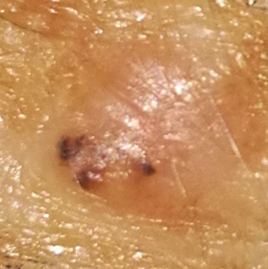
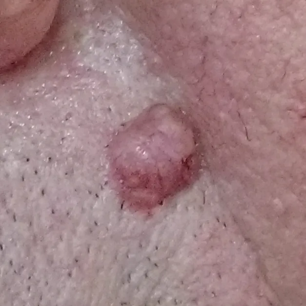
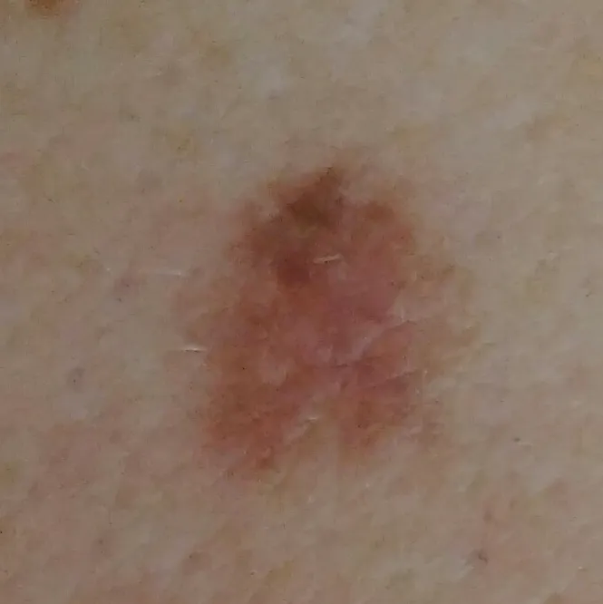
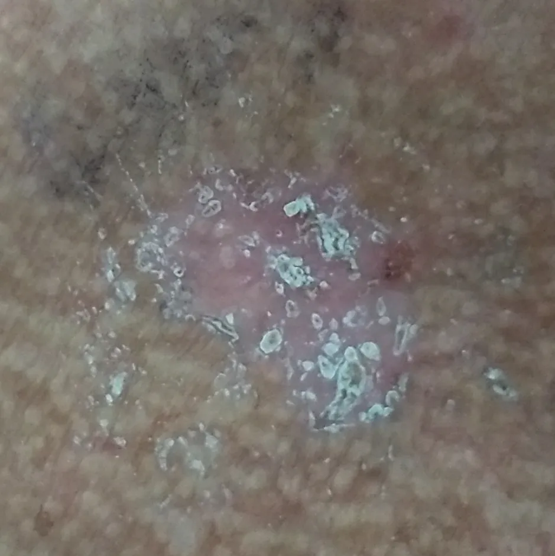
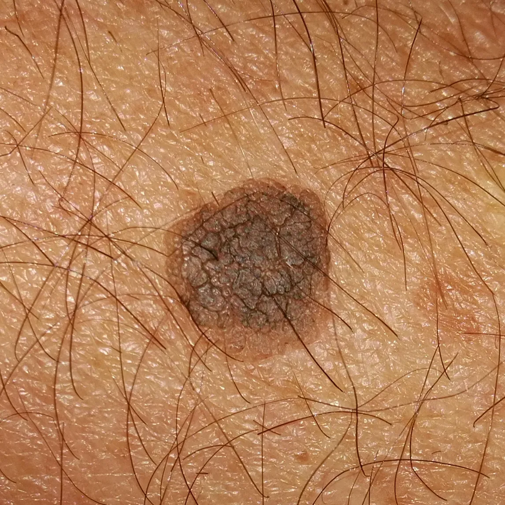
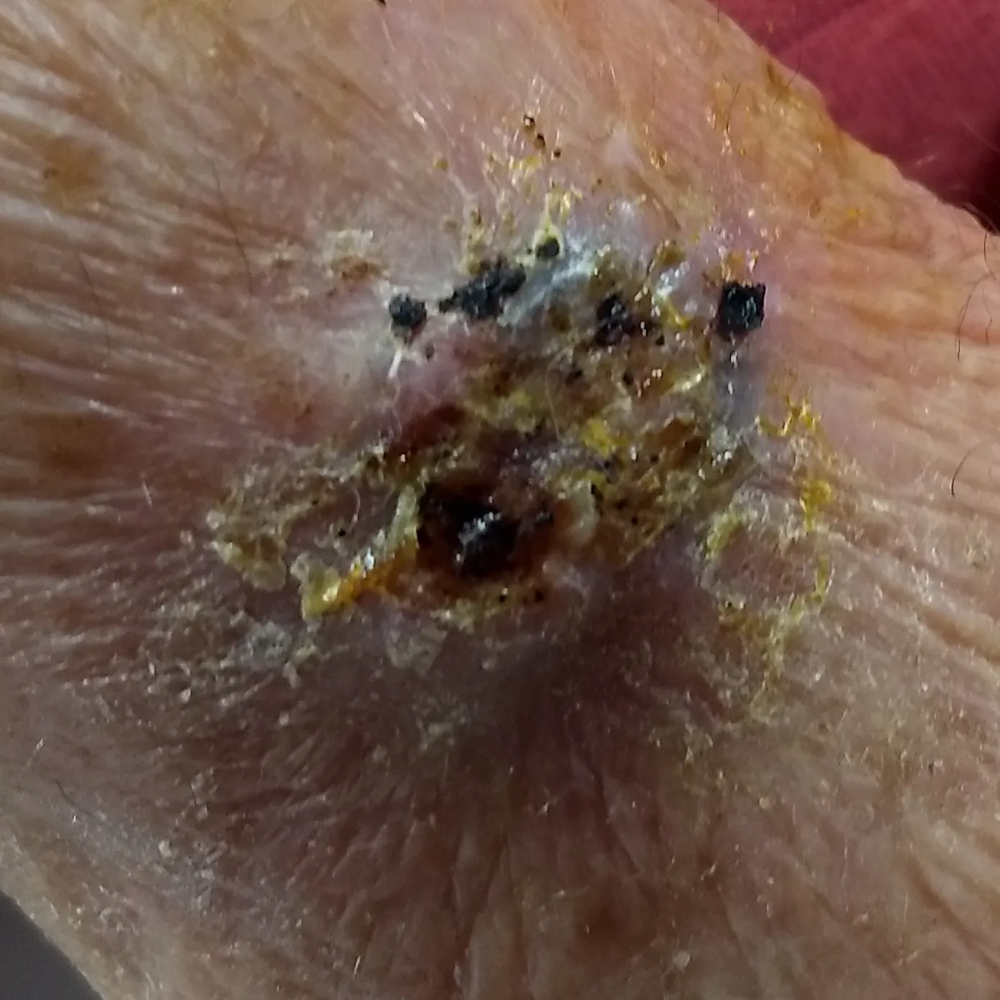
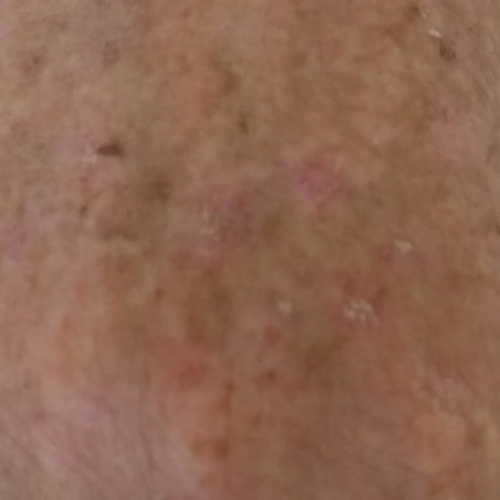

# PED-UFES-20

<div align="center">
    <a href="https://github.com/openmedlab/"></a>
</div>
<p style="text-align:center;font-size:10px;"><em></em></p>

## Dataset Information

The PAD-UFES-20 dataset contains 2298 skin lesion images taken with various smartphones from 1373 patients. This dataset involves 6 categories, three of which are types of skin cancer: Basal Cell Carcinoma (BCC), Squamous Cell Carcinoma (SCC), and Melanoma (MEL); the other three are skin conditions: Actinic Keratosis (ACK), Seborrheic Keratosis (SEK), and Nevus (NEV). The SCC category also includes Bowen's disease (BOD). All BCC, SCC, and MEL cases in the dataset have been biopsy-verified, while the other categories have been diagnosed by a group of dermatologists. For each image in the dataset, the authors provide the image category label, patient age, skin lesion location, and skin lesion diameter.

The collection and preparation of the PAD-UFES-20 dataset received support from the Skin Disease & Surgery Assistance program project of the Federal University of Espírito Santo. This non-profit project aims to assist researchers in developing automatic identification algorithms and software to provide free skin disease diagnoses for low-income individuals who cannot afford private treatment.

## Dataset Meta Information

| Dimensions | Modality   | Task Type      | Anatomical Structures | Anatomical Area | Number of Categories | Data Volume | File Format |
|------------|------------|----------------|-----------------------|-----------------|----------------------|-------------|-------------|
| 2D         | dermoscopic | Classification | Skin                  | Skin            | 6                    | 2298         | PNG         |


### Resolution Details

| Dataset Statistics | size         |
|--------------------|--------------|
| min                | [147,147]   |
| median             | [780,780]  |
| max                | [3474,3476]  |

## Label Information Statistics

| Disease                         | Count |
|---------------------------------|-------|
| Basal Cell Carcinoma (BCC)      | 845   |
| Squamous Cell Carcinoma (SCC)   | 192   |
| Melanoma (MEL)                  | 52    |
| Seborrheic Keratosis (SEK)      | 235   |
| Actinic Keratosis (ACK)         | 730   |
| Nevus (NEV)                     | 244   |


## Visualization

<div align="center">
    <a href="https://github.com/openmedlab/"></a>
</div>
<p style="text-align:center;font-size:10px;"><em> BCC example image.</em></p>

<div align="center">
    <a href="https://github.com/openmedlab/"></a>
</div>
<p style="text-align:center;font-size:10px;"><em> SCC example image.</em></p>

<div align="center">
    <a href="https://github.com/openmedlab/"></a>
</div>
<p style="text-align:center;font-size:10px;"><em> MEL example image.</em></p>

<div align="center">
    <a href="https://github.com/openmedlab/"></a>
</div>
<p style="text-align:center;font-size:10px;"><em> SEK example image.</em></p>

<div align="center">
    <a href="https://github.com/openmedlab/"></a>
</div>
<p style="text-align:center;font-size:10px;"><em> ACK example image.</em></p>

<div align="center">
    <a href="https://github.com/openmedlab/"></a>
</div>
<p style="text-align:center;font-size:10px;"><em> NEV example image.</em></p>


## File Structure

The file structure of the dataset is as follows, including a folder that contains all the images, as well as a .csv file that provides the labels for each image, the location of the lesion, the patient's age, and other information.

``` 
PAD-UFES-20 Dataset
├── images
│   ├── imgs_part_1
│   │   ├── PAT_8_15_820.png
│   │   ├── PAT_9_17_80.png
│   │    ...
│   ├── imgs_part_2
│   │   ├── PAT_587_1117_880.png
│   │   ├── PAT_587_3431_6.png
│   ├── ...
│   ├── imgs_part_3
│   │   ├── PAT_1094_381_85.png
│   │   ├── PAT_1094_381_355.png
│   ├── ...
├── metadata.csv
```

## Authors and Institutions

Andre G. C. Pacheco (Federal University of Espírito Santo, Brazil)

Gustavo R. Lima (Federal University of Espírito Santo, Brazil)

Amanda S. Salomão (Federal University of Espírito Santo, Brazil)

Breno Krohling (Federal University of Espírito Santo, Brazil)

Igor P. Biral (Federal University of Espírito Santo, Brazil)

Gabriel G. de Angelo (Federal University of Espírito Santo, Brazil)

Fábio C.R. Alves Jr (Federal University of Espírito Santo, Brazil)

José G.M. Esgario (Federal University of Espírito Santo, Brazil)

Alana C. Simora (Federal University of Espírito Santo, Brazil)

Pedro B.C. Castro (Federal University of Espírito Santo, Brazil)

Felipe B. Rodrigues (Federal University of Espírito Santo, Brazil)

Patricia H.L. Frasson (Federal University of Espírito Santo, Brazil)

Renato A. Krohling (Federal University of Espírito Santo, Brazil)

Helder Knidel (Federal University of Espírito Santo, Brazil)

Maria C.S. Santos (Federal University of Espírito Santo, Brazil)

Rachel B. do Espírito Santo (Health Department of the State of Espírito Santo, Brazil)

Telma L.S.G. Macedo (Health Department of the State of Espírito Santo, Brazil)

Tania R.P. Canuto (Health Department of the State of Espírito Santo, Brazil)

Luíz F.S. de Barros (Federal University of Espírito Santo, Brazil)


## Source Information

Official Website: https://data.mendeley.com/datasets/zr7vgbcyr2/1

Download Link: https://prod-dcd-datasets-cache-zipfiles.s3.eu-west-1.amazonaws.com/zr7vgbcyr2-1.zip

Article Address: https://www.sciencedirect.com/science/article/pii/S235234092031115X

Publication Date: 2020-07-08

## Citation

``` 
@article{pacheco2020pad,
  title={PAD-UFES-20: A skin lesion dataset composed of patient data and clinical images collected from smartphones},
  author={Pacheco, Andre GC and Lima, Gustavo R and Salomao, Amanda S and Krohling, Breno and Biral, Igor P and de Angelo, Gabriel G and Alves Jr, F{\'a}bio CR and Esgario, Jos{\'e} GM and Simora, Alana C and Castro, Pedro BC and others},
  journal={Data in brief},
  volume={32},
  pages={106221},
  year={2020},
  publisher={Elsevier}
}
```

Original introduction article is [here](https://zhuanlan.zhihu.com/p/675139392).