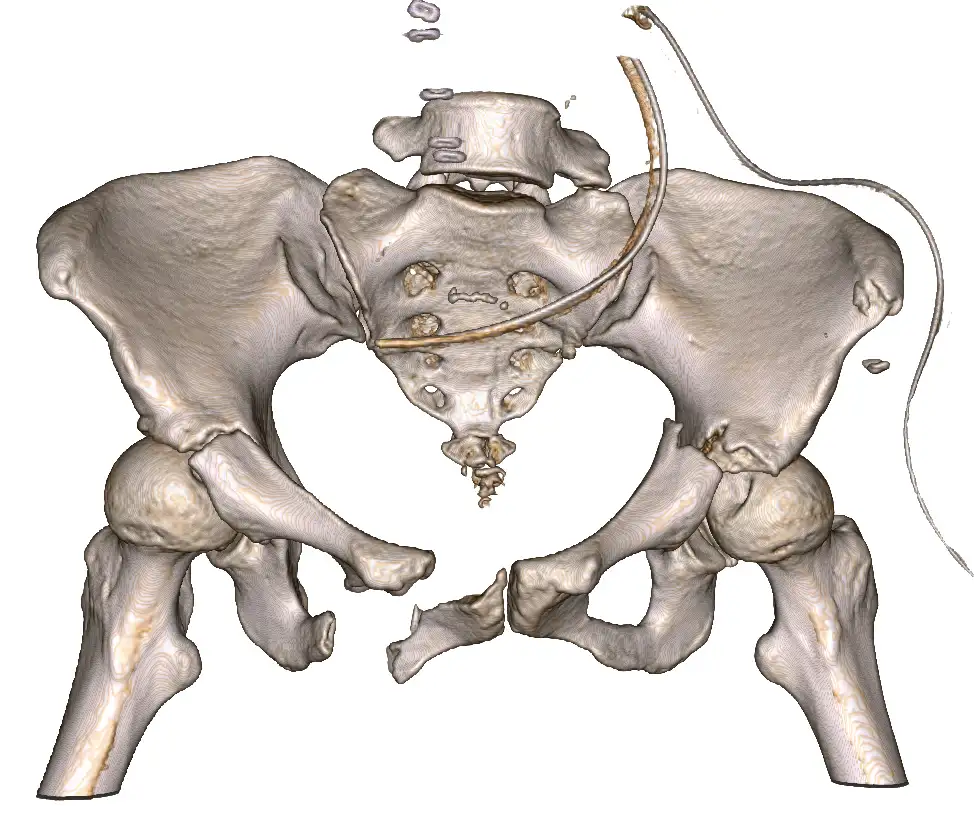
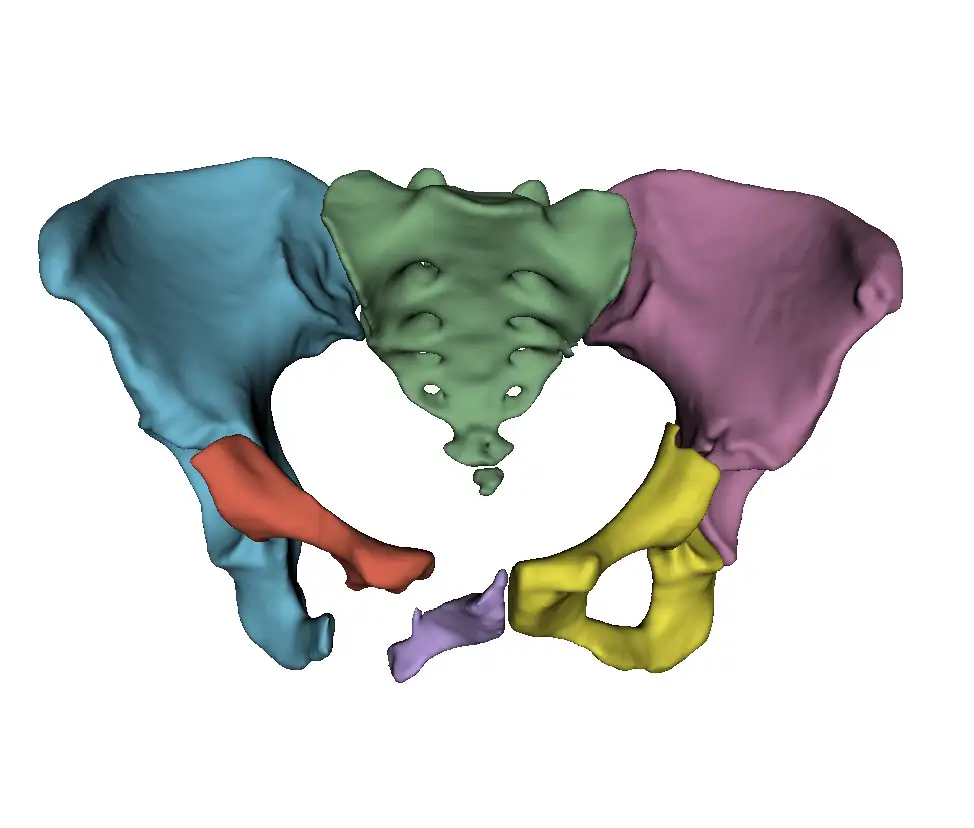

# MICCAI 2024 PENGWIN Task1

<div align="center">
    <a href="https://github.com/openmedlab/"></a>
</div>
<p style="text-align:center;font-size:10px;"><em></em></p>

## Dataset Information

The **PENGWIN** dataset is part of the PENGWIN challenge for MICCAI 2024, which includes two tasks:  
- **Task 1** involves fracture segmentation in 3D CT scans, which is crucial for determining fracture types, preoperative planning, and screw fixation planning.  
- **Task 2** focuses on segmentation in 2D X-ray images, which is vital for transferring the surgical plan to the operating room and enabling precise surgical navigation through registration. The development of these techniques will have a profound impact on the diagnosis of pelvic fractures and image-guided surgery.

This document primarily introduces the **Task 1** dataset. The **Task 1** training data includes 100 `.mha` files, while we do not have access to the validation and test data. The dataset labels are as follows:  
- 0 = background  
- 1-10 = sacrum fragments  
- 11-20 = left ilium fragments  
- 21-30 = right ilium fragments.

This dataset is designed for the **PENGWIN segmentation challenge** at MICCAI 2024, aiming to advance the development of automated segmentation techniques for pelvic fractures. The dataset includes 3D CT scans from 150 patients scheduled for pelvic fracture surgery, sourced from multiple institutions using various scanning devices. The dataset covers a diverse patient population and fracture types. The ground truth (GT) annotations of fracture regions were semi-automatically labeled and validated by medical experts. Additionally, high-quality, realistic X-ray images and corresponding 2D labels were generated from the CT data using the **DeepDRR** method, simulating various virtual C-arm camera positions and surgical tools.

## Dataset Meta Information

| Dimensions | Modality | Task Type      | Anatomical Structures | Anatomical Area | Number of Categories | Data Volume | File Format |
|------------|----------|----------------|-----------------------|-----------------|----------------------|-------------|-------------|
| 3D         | CT       | Segmentation   | Pelvis                | Abdomen         | 3                    | 100         | .mha        |


### Resolution Details

| Dataset Statistics | spacing (mm)           | size             |
|--------------------|------------------------|------------------|
| min                | (0.625, 0.658, 0.658 ) | (322, 154, 193)  |
| median             | (0.801, 0.798, 0.798)  | (512, 512, 326)  |
| max                | (1.25, 1.25, 1.25)     | (512, 512, 414)  |

Number of 2D slices in the dataset: 32106.

## Label Information Statistics

| Category              | Sacrum Fragment | Left Hipbone Fragment | Right Hipbone Fragment |
|-----------------------|-----------------|-----------------------|------------------------|
| Number of Cases       | 100             | 100                   | 100                    |
| Percentage            | 100%            | 100%                  | 100%                   |
| Minimum Volume (cm³)  | 0.31            | 0.64                  | 1.19                   |
| Median Volume (cm³)   | 175.6           | 262.105               | 266.18                 |
| Maximum Volume (cm³)  | 235.79          | 390.95                | 416.13                 |

## Visualization

<div align="center">
    <a href="https://github.com/openmedlab/"></a>
</div>
<p style="text-align:center;font-size:10px;"><em>Raw Image.</em></p>

<div align="center">
    <a href="https://github.com/openmedlab/"></a>
</div>
<p style="text-align:center;font-size:10px;"><em>3D Segmentation Image.</em></p>

## File Structure

``` 
.
├── 001.mha
├── 002.mha
├── 003.mha
├── ...
├── 098.mha
├── 099.mha
└── 100.mha
```

## Authors and Institutions

Yanzhen Liu (School of Biological Science and Medical Engineering, Beihang University, Beijing, China)  

Sutuke Yibulayimu (School of Biological Science and Medical Engineering, Beihang University, Beijing, China)  

Yudi Sang (Beijing Rosen Robotics Co., Ltd., Beijing, China)  

Gang Zhu (Beijing Rosen Robotics Co., Ltd., Beijing, China)  

Yu Wang (School of Biological Science and Medical Engineering, Beihang University, Beijing, China)  

Chunpeng Zhao (Department of Orthopedics, Jishuitan Hospital, Beijing, China)  

Xinbao Wu (Department of Orthopedics, Jishuitan Hospital, Beijing, China)  

## Source Information

Official Website: https://pengwin.grand-challenge.org/pengwin/

Download Link: https://pengwin.grand-challenge.org/data/

Article Address: https://link.springer.com/chapter/10.1007/978-3-031-43996-4_30

Publication Date: 2024-07

## Citation

``` 
@inproceedings{liu2023pelvic,
  title={Pelvic Fracture Segmentation Using a Multi-scale Distance-Weighted Neural Network},
  author={Liu, Yanzhen and Yibulayimu, Sutuke and Sang, Yudi and Zhu, Gang and Wang, Yu and Zhao, Chunpeng and Wu, Xinbao},
  booktitle={International Conference on Medical Image Computing and Computer-Assisted Intervention},
  pages={312--321},
  year={2023},
  organization={Springer}
}
```

Original introduction article is [here](https://zhuanlan.zhihu.com/p/714345127).