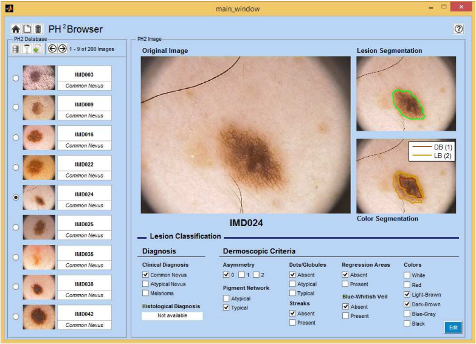
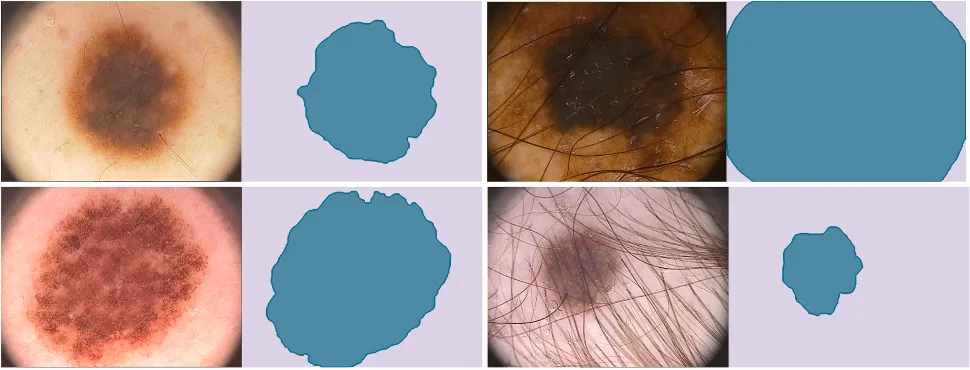

# PH²

<div align="center">
    <a href="https://github.com/openmedlab/"></a>
</div>
<p style="text-align:center;font-size:10px;"><em></em></p>

## Dataset Information

The increase in melanoma incidence has recently prompted the development of computer-aided diagnostic systems for dermatoscopic image classification. The PH² dataset was developed for research and benchmarking purposes to facilitate comparative studies of segmentation and classification algorithms for dermatoscopic images. PH² is a database of dermatoscopic images obtained from the Dermatology Service at Pedro Hispano Hospital in Matosinhos, Portugal. This dataset contains 200 dermatoscopic images along with corresponding annotation images, all stored in PNG format. Analysis and evaluation of the PH² dataset can help researchers understand and verify the performance of proposed systems in real-world dermatological scenarios, providing a foundation for further research and innovation in the field of skin disease diagnosis.

## Dataset Meta Information

| Dimensions | Modality   | Task Type    | Anatomical Structures | Anatomical Area | Number of Categories | Data Volume | File Format |
|------------|------------|--------------|-----------------------|-----------------|----------------------|-------------|-------------|
| 2D         | dermoscopic | Segmentation | Melanoma                  | Skin            | 1                    | 200         | PNG         |


### Resolution Details

| Dataset Statistics | size         |
|--------------------|--------------|
| min                | (560, 768)   |
| median             | (560, 768)   |
| max                | (560, 768)   |

## Label Information Statistics

| Category          | Retinal Vessel |
|-------------------|----------------|
| Number of Images  | 200            |
| Availability      | 100%           |
| Small Vessel Count| 13863           |
| Medium Vessel Count| 101399          |
| Large Vessel Count| 434894         |

## Visualization

<div align="center">
    <a href="https://github.com/openmedlab/"></a>
</div>
<p style="text-align:center;font-size:10px;"><em> Paper Visualization.</em></p>

## File Structure

The PH² dataset consists of two main directories: `images` and `masks`. The `images` directory contains the original images, and the `masks` directory contains the corresponding segmentation annotation images.

``` 
PH2
│
├── images
│       ├── 0.png
│       ├── 1.png
│       ├── ...
│       ├── 200.png
│
├── masks
│       ├── 0.png
│       ├── 1.png
│       ├── ...
│       ├── 200.png
```

## Authors and Institutions

Teresa Feio Mendonça (Faculdade de Ciências, Universidade do Porto)

André Marçal (Faculdade de Ciências, Universidade do Porto)

Jorge Salvador Marques (Researcher at the Signal and Image Processing Lab (SIPG) ofInstitute for Systems and Robotics)

Jorge Rozeira (Director of the Dermatology Service of theHospital Pedro Hispano, Matosinhos)

## Source Information

Official Website: https://www.fc.up.pt/addi/ph2%20database.html

Download Link: https://www.dropbox.com/s/k88qukc20ljnbuo/PH2Dataset.rar

Article Address: https://www.researchgate.net/profile/Catarina-Barata-2/publication/300467916_PH2_A_Public_Database_for_the_Analysis_of_Dermoscopic_Images/links/570fa8cf08ae170055bde6db/PH2-A-Public-Database-for-the-Analysis-of-Dermoscopic-Images.pdf

Publication Date: 2015

## Citation

``` 
@article{mendoncca2015ph2,
  title={Ph2: A public database for the analysis of dermoscopic images},
  author={Mendon{\c{c}}a, Teresa and Celebi, M and Mendonca, T and Marques, J},
  journal={Dermoscopy image analysis},
  year={2015},
  publisher={CRC Press Boca Raton, FL, USA}
}
```

Original introduction article is [here](https://zhuanlan.zhihu.com/p/676302493).