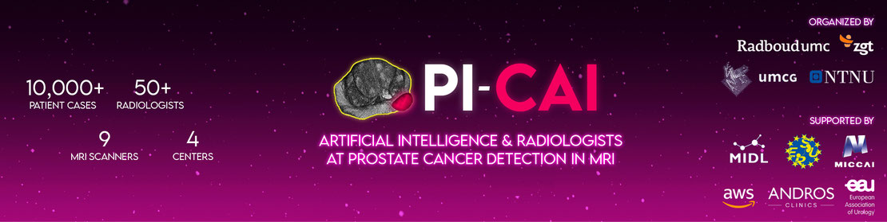
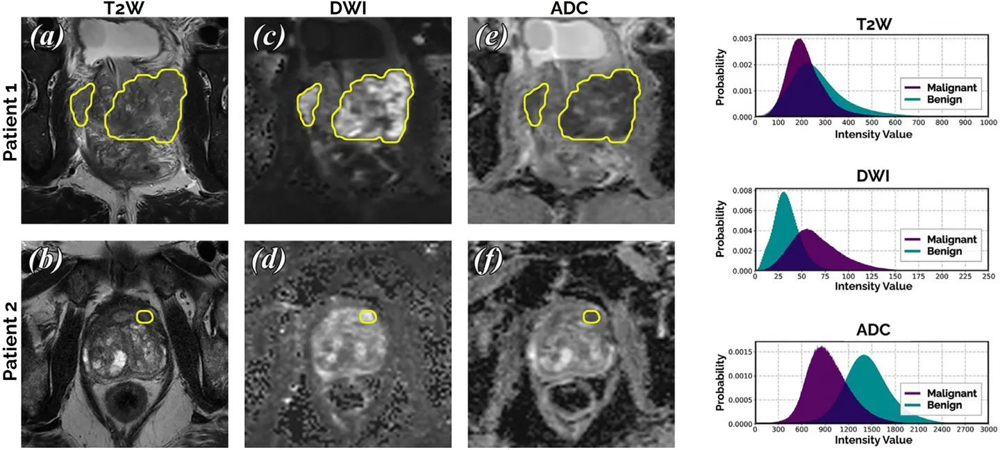
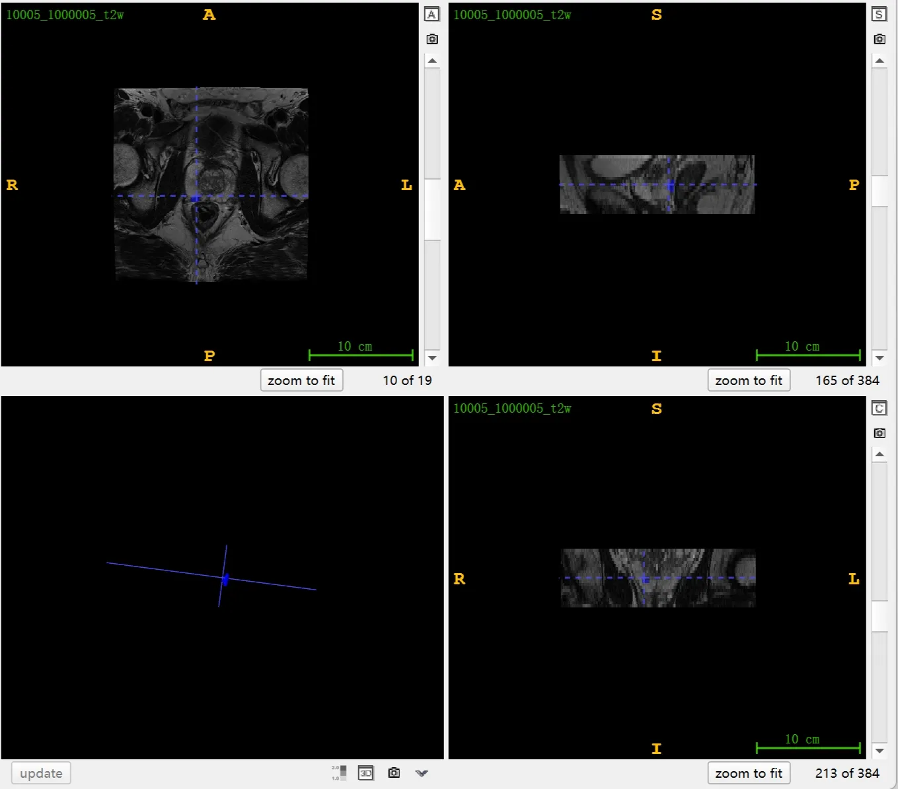

# PI-CAI

<div align="center">
    <a href="https://github.com/openmedlab/"></a>
</div>
<p style="text-align:center;font-size:10px;"><em></em></p>

## Dataset Information

**PI-CAI (Prostate Imaging: Cancer AI) Challenge** offers a large prostate MRI dataset collected jointly by medical centers in the Netherlands and Norway. Currently, a dataset of 1500 annotated multicenter, multivendor bpMRI (biparametric MRI) examinations has been made publicly available to all participants and researchers for the training and development of AI models, with 328 cases derived from the ProstateX challenge. Additionally, the challenge includes 7607 private training data cases for organizer use only, along with 100 hidden validation cases and 1000 hidden test cases. All algorithms will be evaluated based on these 1000 undisclosed test cases, and the top five AI algorithms will be retrained and evaluated during the closed testing phase using a larger dataset containing 9107 bpMRI scans. Of the 1500 publicly available cases, 1075 are considered benign tissue or low-risk PCa (i.e., labels should be empty or all zeros), while 425 are csPCa (i.e., labels should contain lesions with values of 2, 3, 4, or 5). Among these 425 positive cases, only 220 are annotated by human experts.

Prostate cancer is one of the most common cancers among men, and its diagnosis presents a significant challenge for radiologists. Multiparametric magnetic resonance imaging (mpMRI) plays a key role in early diagnosis, but its interpretation requires a high level of expertise and suffers from consistency issues below 50%. To address this, the PI-CAI (Prostate Imaging: Cancer AI) Challenge uses biparametric MRI (bpMRI), a method that excludes dynamic contrast-enhanced imaging, to reduce costs and examination time, suitable for high-volume population screening. The challenge provides access to over 10,000 prostate MRI examinations to validate the performance of AI algorithms in detecting and diagnosing clinically significant prostate cancer (csPCa) and compare their performance with that of radiologists.

## Dataset Meta Information

| Dimensions | Modality | Task Type | Anatomical Structures | Anatomical Area | Number of Categories | Data Volume | File Format |
|------------|----------|-----------|-----------------------|-----------------|----------------------|-------------|-------------|
| 3D         | MRI      | Segmentation | prostate cancer              | prostate       | 1                    | 1500        | .mha        |


### Resolution Details

| Dataset Statistics | spacing (mm)     | size            |
|--------------------|------------------|-----------------|
| min                | (0.23, 0.23, 2.2)             | (256, 256, 17)     |
| median             | (0.5, 0.5, 3.0)          | (384, 384, 21) |
| max                | (0.78, 0.78, 5.0)             | (1024, 1024, 45) |

Number of two-dimensional slices in the data set: 168,520 (1500 publicly available training sets, each with 5 modalities)

## Label Information Statistics

| Characteristic                 | Frequency                 |
|--------------------------------|---------------------------|
| Number of sites                | 11                        |
| Number of MRI scanners         | 5 S, 2 P                  |
| Number of patients             | 1476                      |
| Number of cases                | 1500                      |
| — Benign or indolent PCa       | 1075                      |
| — csPCa (ISUP ≥ 2)             | 425                       |
| Median age (years)             | 66 (IQR: 61–70)           |
| Median PSA (ng/mL)             | 8.5 (IQR: 6–13)           |
| Median prostate volume (mL)    | 57 (IQR: 40–80)           |
| Number of positive MRI lesions | 1087                      |
| — PI-RADS 3                    | 246 (23%)                 |
| — PI-RADS 4                    | 438 (40%)                 |
| — PI-RADS 5                    | 403 (37%)                 |
| Number of ISUP-based lesions   | 776                       |
| — ISUP 1                       | 311 (40%)                 |
| — ISUP 2                       | 260 (34%)                 |
| — ISUP 3                       | 109 (14%)                 |
| — ISUP 4                       | 41 (5%)                   |
| — ISUP 5                       | 55 (7%)                   |

## Visualization

<div align="center">
    <a href="https://github.com/openmedlab/"></a>
</div>
<p style="text-align:center;font-size:10px;"><em> Official Visualization.</em></p>

<div align="center">
    <a href="https://github.com/openmedlab/"></a>
</div>
<p style="text-align:center;font-size:10px;"><em> ITK-SNAP Visualization.</em></p>

## File Structure

The dataset file structure is as follows: there are 1476 folders under the root directory corresponding to the images of different patients. Under each patient, there are MR images of different sequences, which are distinguished by the part after the underscore in the different file names.

``` 
images  (root folder with all patients, and in turn, all 1500 studies)
├── ...
├── 10417  (patient-level folder, including all studies for a given patient)
    ├── 10417_1000424_t2w.mha  (axial T2W imaging for study 1000424)
    ├── 10417_1000424_adc.mha  (axial ADC imaging for study 1000424)
    ├── ...
    ├── 10417_1000425_t2w.mha  (axial T2W imaging for study 1000425)
    ├── 10417_1000425_adc.mha  (axial ADC imaging for study 1000425)
    ├── ...
├── ...
```

## Authors and Institutions

Anindo Saha (Radboud University Medical Center, Netherlands)

Joeran Bosma (Radboud University Medical Center, Netherlands)

Jasper Twilt (Radboud University Medical Center, Netherlands)

Bram van Ginneken (Radboud University Medical Center, Netherlands)


## Source Information

Official Website: https://pi-cai.grand-challenge.org/

Download Link: https://zenodo.org/records/6624726, https://github.com/DIAGNijmegen/picai_labels

Article Address: TBD

Publication Date: 2022-05

## Citation

``` 
TBD
```

Original introduction article is [here](https://zhuanlan.zhihu.com/p/673875021).