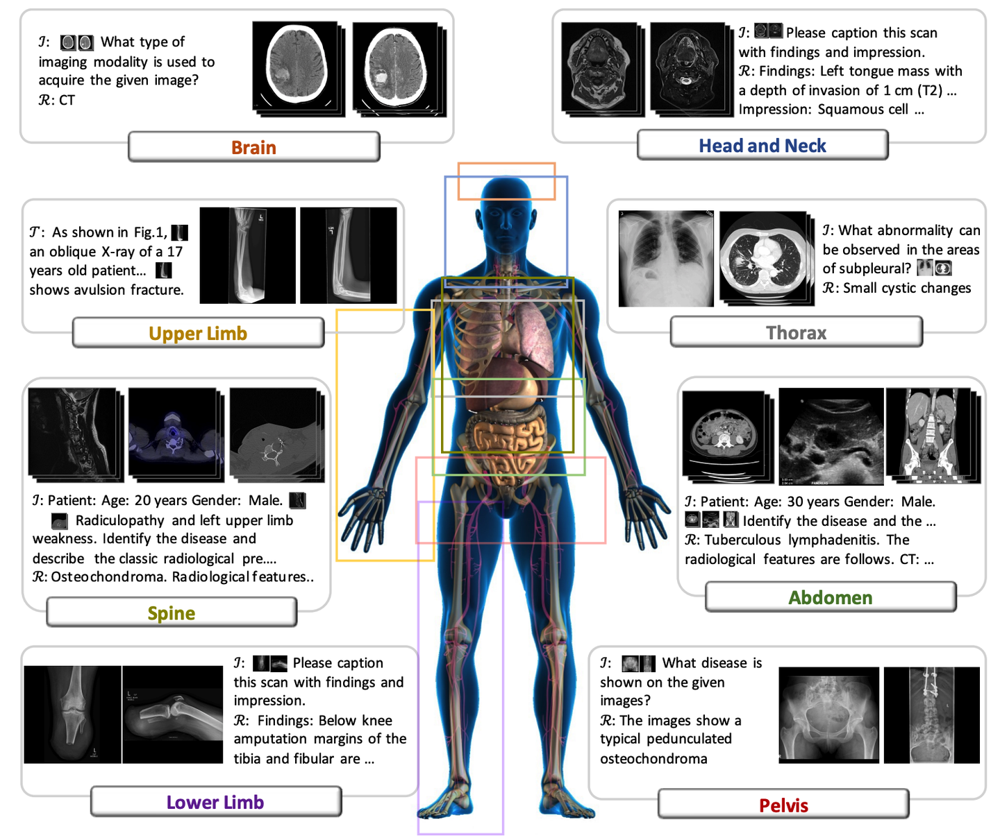
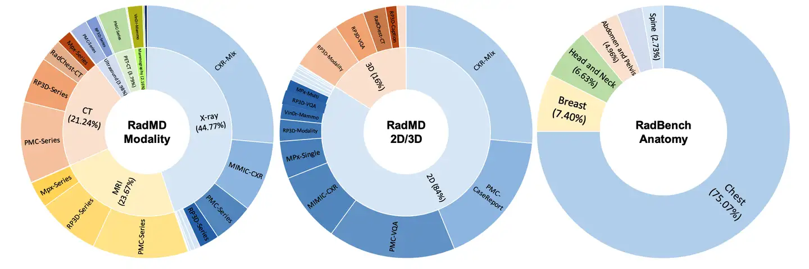

# PMC-Inline

<div align="center">
    <a href="https://github.com/openmedlab/"></a>
</div>
<p style="text-align:center;font-size:10px;"><em></em></p>

## Dataset Information

The PMC-Inline dataset includes portions of papers with embedded images collected from PubMed Central (PMC), with references, author information, tables, and image captions removed from the original paper XML files. The dataset links back 11 million images to the context of the papers based on the embedded image references.

This dataset holds significant importance in the medical field by providing precise pairing of images and text, supporting multimodal data analysis and medical image understanding. It aids in developing intelligent medical assistance systems, enhancing diagnostic accuracy, reducing medical errors, and promoting biomedical research and technological innovation.

## Dataset Meta Information

| Task Type | Language  | Train | Val | Test | File Format |
|-----------|-----------|-------|-----|------|-------------|
| Caption   | English   | 11M   | -   | -    | .jpg, .json |

## Dataset Information Statistics

The PMC-Inline dataset facilitates visually conditioned generative pre-training, which allows combining text input with 2D or 3D medical scan images and generating responses for various radiological tasks. The proportions of various datasets used for training are as follows.

<div align="center">
    <a href="https://github.com/openmedlab/"></a>
</div>
<p style="text-align:center;font-size:10px;"><em></em></p>

## Dataset Example

``` 
{
  "info": {
    "article-type": "research-article",
    "pmid": "17925856",
    "pmc": "PMC1999654",
    "publisher-id": "07-PONE-RA-01026R1",
    "doi": "10.1371/journal.pone.0001008"
  },
  "text": "\nPredicting Spatial Patterns of Plant Recruitment Using Animal-Displacement Kernels\nFor plants ...",
  "img_ref": [
    {"id": "pone-0001008-g001", "start": 9177, "end": 9185},
    {"id": "pone-0001008-g001", "start": 10715, "end": 10723},
    ...
  ]
}
```

Explanation of each key:

- `info`: Contains information about the paper, such as the paper type, PMID, PMC ID, etc.
- `text`: A string of the paper content.
- `img_ref`: A list of image references, for example, `{"id": "pone-0001008-g001", "start": 9177, "end": 9185}` indicates that the image `pone-0001008-g001` is referenced in the text string between indices 9177 and 9185.
- Image download link: https://pan.baidu.com/s/1Src_rhXsaOFp8zJ_3zMFsQ?pwd=p3ne.

## File Structure

```
PMC-Inline_0/
  ├── PMC-Inline_1.zip
  │   ├── PMC555947.json
  │   ├── PMC555948.json
  │   └── ...
  ├── PMC-Inline_2.zip
  ├── PMC-Inline_3.zip
  ├── PMC-Inline_4.zip
  ├── PMC-Inline_5.zip
  ├── PMC-Inline_6.zip
  ├── PMC-Inline_7.zip
  ├── PMC-Inline_8.zip
  ├── PMC-Inline_9.zip
  └── README.md
```

## Authors and Institutions

Chaoyi Wu (Shanghai Jiao Tong University, Shanghai AI Laboratory, China)

Xiaoman Zhang (Shanghai Jiao Tong University, Shanghai AI Laboratory, China)

Ya Zhang (Shanghai Jiao Tong University, Shanghai AI Laboratory, China)

Yanfeng Wang (Shanghai Jiao Tong University, Shanghai AI Laboratory, China)

Weidi Xie (Shanghai Jiao Tong University, Shanghai AI Laboratory, China)


## Source Information

Official Website: https://huggingface.co/datasets/chaoyi-wu/PMC-Inline/tree/main

Download Link: https://huggingface.co/datasets/chaoyi-wu/PMC-Inline/tree/main

Article Address: https://arxiv.org/pdf/2308.02463

Publication Date: 2023-11

## Citation

``` 
@article{wu2023towards,
  title={Towards generalist foundation model for radiology},
  author={Wu, Chaoyi and Zhang, Xiaoman and Zhang, Ya and Wang, Yanfeng and Xie, Weidi},
  journal={arXiv preprint arXiv:2308.02463},
  year={2023}
}
```

Original introduction article is [here](https://zhuanlan.zhihu.com/p/702511384).